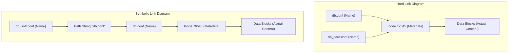

# Week 1 — Linux Basics, Navigation, and File Operations

| Course | Operating System (Linux Essentials) |
|---|---|
| **Weekly Study Time** | 10 Hours |
| **Schedule** | Saturday: 8:00 AM - 12:00 PM (4h) & 2:00 PM - 4:00 PM (2h) <br> Sunday: 8:00 AM - 12:00 PM (4h) |
| **Syllabus CLOs** | CLO6: Understand OS Fundamentals & Linux Intro <br> CLO7: Navigate File System & Manage Files/Directories |

---

## 📅 Session 1: Linux CLI Introduction & Getting Help (Saturday Morning — 4 Hours)

### 1. OS Concepts
*   **Kernel, Shell, and Terminal:** The **Kernel** is the core engine managing physical hardware. The **Shell** is the command interpreter (typically `bash`). The **Terminal** is the wrapper window showing the text. You execute commands in the Terminal; the Shell parses them and instructs the Kernel.
*   **Directory Trees:** Linux uses a unified hierarchical file system starting at root `/`. There are no drive letters (like `C:`). Each user gets a home space at `/home/<username>` (referred to as `~`).
*   **Pathing:** **Absolute paths** start at root `/` (e.g. `/var/log`). **Relative paths** start from your current folder (e.g. `var/log` if you are in `/`).
*   **Getting Help:** Linux includes local documentation. You do not need internet access to find options:
    *   `man`: Detailed manual pages.
    *   `info`: Hypertext-linked menu guides.
    *   `whatis`: Single-sentence tool descriptions.
    *   `--help` or `-h`: Inline application flags.

### 2. Command Reference

| Command | Option | Description | Example |
| :--- | :--- | :--- | :--- |
| `pwd` | None | Print Working Directory - displays current absolute path | `pwd` |
| `ls` | None | Lists directory contents | `ls` |
| | `-l` | Long listing (permissions, owner, size, date) | `ls -l` |
| | `-a` | Show all files, including hidden files (starting with `.`) | `ls -a` |
| | `-lh` | Combined long format with human-readable sizes (KB, MB, GB) | `ls -lh` |
| | `-t` | Sort files by modification date (newest first) | `ls -lt` |
| | `-S` | Sort files by size (largest first) | `ls -lS` |
| `cd` | `[path]` | Change directory to target path | `cd /var/log` |
| | `..` | Go up to the parent directory | `cd ..` |
| | `~` | Go to user home directory | `cd ~` |
| | `-` | Toggle to the previous working directory | `cd -` |
| `man` | `[command]`| Open manual page (press `q` to quit, `/` to search) | `man ls` |
| `info` | `[command]`| Open interactive hypertext info guide | `info coreutils` |
| `whatis`| `[command]`| Show quick single-line command description | `whatis pwd` |
| `uname` | `-a` | Print complete system and kernel metadata | `uname -a` |
| | `-r` | Print kernel release version | `uname -r` |
| `clear` | None | Clears terminal screen buffer | `clear` |
| `history`| `[n]` | List command history (optionally showing last `n` items) | `history 10` |

### 3. Session 1 Exercises (To Do)
Run these commands and record the inputs/outputs in your report:
1. Navigate to `/usr/share/doc` and list its contents sorted by size.
2. Go straight back to your home directory in a single command.
3. List your home directory showing hidden configuration files (e.g. `.bashrc`).
4. Run `whatis` on `mkdir`, `rm`, `cp`, and `mv`, and redirect the output to `whatis_summary.txt`.
5. Display the last 15 items in your command history and save it to `history_list.txt`.

---

## 📅 Session 2: Directory and File Management (Saturday Afternoon — 2 Hours)

### 1. OS Concepts
Managing storage space requires basic CRUD operations (Create, Read, Update, Delete) on folders and files. File systems keep files organized inside directory nodes. 

### 2. Command Reference

| Command | Option | Description | Example |
| :--- | :--- | :--- | :--- |
| `mkdir` | None | Create a new empty directory | `mkdir sandbox` |
| | `-p` | Parent flag - creates nested paths automatically | `mkdir -p a/b/c` |
| `rmdir` | None | Remove empty directories only | `rmdir sandbox` |
| `touch` | None | Create empty file or update timestamps | `touch draft.txt` |
| `cp` | None | Copy file from source to destination | `cp file1 file2` |
| | `-r` | Recursive copy (required for folders) | `cp -r dir1 dir2` |
| `mv` | None | Move or rename files and directories | `mv old.txt new.txt` |
| `rm` | None | Remove/delete files | `rm draft.txt` |
| | `-r` | Recursive remove (required for folders) | `rm -r old_dir` |
| | `-f` | Force remove (ignores warnings, deletes silently) | `rm -rf temp` |

### 3. Session 2 Exercises (To Do)
Run these commands and record the inputs/outputs in your report:
1. Create a directory structure: `sandbox/archive/` and `sandbox/workspace/`.
2. Inside `sandbox/workspace/`, create 5 text files: `test1.txt`, `test2.txt`, `test3.txt`, `sample1.txt`, and `sample2.txt`.
3. Copy all files starting with `test` from `workspace/` to `archive/` in a single command.
4. Move all files starting with `sample` to `archive/` in a single command.
5. Clean up the `sandbox/workspace` folder by removing it and its contents recursively.

---

## 📅 Session 3: Advanced File Management, Search, and Links (Sunday Morning — 4 Hours)

### 1. OS Concepts

*   **OS Concept 1: Inodes, Names, and Directory Entries**
    In Linux, a file is not identified by its name. Instead, the OS assigns a unique number called an **Inode** (index node) to every file.
    - The **Inode** contains metadata (file size, permissions, owner, type, pointers to data blocks).
    - The **File Name** is simply a label stored in a directory entry pointing to that Inode.
    - Multiple names can point to the same Inode. This is known as **Linking**.

*   **OS Concept 2: Hard Links vs. Soft (Symbolic) Links**
    You can create connections between files using links:
    - **Hard Link (`ln`):** Creates a new directory entry pointing to the **exact same Inode** as the source file. If you delete the original file, the hard link still works and contains the data. It cannot span across different filesystems or link directories.
    - **Symbolic/Soft Link (`ln -s`):** Creates a small special file containing the **path** to the original file (like a Windows shortcut). If you delete the original file, the soft link breaks ("dangling link"). It can span filesystems and link directories.




*   **OS Concept 3: Shell Wildcards (Globbing)**
    When working with large numbers of files, typing individual filenames is inefficient. The shell interprets wildcards before executing a command:
    - **`*` (Asterisk):** Matches zero or more characters. E.g., `*.txt` matches all text files.
    - **`?` (Question Mark):** Matches exactly one character. E.g., `file?.txt` matches `file1.txt` but not `file12.txt`.
    - **`[]` (Square Brackets):** Matches any character inside the brackets. E.g., `file[A-C].txt` matches `fileA.txt`, `fileB.txt`, `fileC.txt`.

*   **OS Concept 4: File Searching Utilities**
    Administrators need to search for configurations, binaries, or logs across filesystems. Linux provides three main tools:
    - **`which`:** Scans directories listed in your user's shell environmental variable `$PATH` to identify which executable binary is run when you type a command.
    - **`locate`:** Scans a pre-indexed system database file (`/var/lib/mlocate/mlocate.db`) containing filenames. It is extremely fast, but requires the database to be updated using `sudo updatedb` to find newly created files.
    - **`find`:** Scans the live filesystem directory tree recursively in real-time. It is slower than `locate` but highly powerful, allowing filters based on name, size, modification time, owner, or permissions.

---

### 2. Part 3 — Links and Searching Files

#### A. Introducing Commands

| Command | Option/Args | Description | Example |
| :--- | :--- | :--- | :--- |
| `ln` | None | Create a hard link pointing to target inode | `ln db.conf db_hard.conf` |
| | `-s` | Create a symbolic (soft) link | `ln -s db.conf db_soft.lnk` |
| `which` | `[command]` | Search environmental `$PATH` for executable bin path | `which tar` |
| `locate` | `[query]` | Search pre-indexed filename database (fast) | `locate system.conf` |
| `find` | `[path] -name` | Search files by name recursively | `find /etc -name "*.conf"` |
| | `[path] -size` | Search files by size criteria (+ larger, - smaller) | `find . -size +10M` |
| | `[path] -type` | Search files by type (`f` for files, `d` for directories) | `find /var/log -type f` |

#### B. Hands-on Examples

**1. Inspecting Inodes & Link Behavior:**
```bash
# Create a test file
echo "Database configuration string" > db.conf

# Create a hard link and a soft link
ln db.conf db_hard.conf
ln -s db.conf db_soft.conf

# List file inodes (notice db.conf and db_hard.conf share the same inode number)
ls -i db.conf db_hard.conf db_soft.conf
# Output:
# 1234567 db.conf
# 1234567 db_hard.conf
# 7654321 db_soft.conf
```

**2. Locating Command Paths with `which`:**
```bash
which ls
# Output: /usr/bin/ls
which man
# Output: /usr/bin/man
```

**3. Database Search with `locate`:**
```bash
# Create a new configuration file
touch local_test.conf

# Try to find it (will return nothing because the db is not updated)
locate local_test.conf

# Update database (requires administrator privileges)
sudo updatedb

# Run locate again (now it finds it instantly)
locate local_test.conf
# Output: /home/student/sandbox/local_test.conf
```

**4. Real-time Traversal with `find`:**
```bash
# Find all files ending in .txt in current directory and subdirectories
find . -name "*.txt"

# Find all files larger than 5MB inside /var/log
find /var/log -type f -size +5M

# Find all empty directories in the current folder
find . -type d -empty
```

### 3. Session 3 Exercises (To Do)
Run these commands and record the inputs/outputs in your report:
1. Create a file named `important.dat` in `sandbox/archive/`.
2. Create a symbolic link to `important.dat` in the parent directory named `shortcut.lnk`.
3. Locate the binary path of the `tar` and `gzip` commands using `which`.
4. Run `find` to list all `.conf` files located directly within the `/etc` directory.
5. Delete the original `important.dat` file. Try to view the contents of `shortcut.lnk`. Record your observation and explain what happened.

---

## 🧩 Week 1 Challenge Scenario: "Audit and Server Structure Reorganization"

### Background
You have been hired as a DevOps Engineer at **Apex Systems**. The staging server has become messy, and your supervisor requests two things:
1. Audit the machine's kernel configurations and find a security audit log.
2. Build and clean up the server directory workspace for the new project code "Apollo".

### Mission Steps
1.  **Simulate Staging Mess:** Setup the simulation directory by running:
    ```bash
    # Part A: Audit Setup
    sudo mkdir -p /var/tmp/apex_audit
    sudo touch /var/tmp/apex_audit/config_audit.log
    sudo touch /var/tmp/apex_audit/security_audit.log
    sudo dd if=/dev/zero of=/var/tmp/apex_audit/database_audit.db bs=1024 count=100
    sudo chmod -R 777 /var/tmp/apex_audit

    # Part B: Project Apollo Setup
    mkdir -p apollo_temp
    cd apollo_temp
    touch system.conf network.conf db.conf run_app.sh deploy.sh test.sh
    touch draft1.tmp draft2.tmp older_draft.txt config_draft.conf temp_file.tmp
    cd ..
    ```
2.  **Audit the Server:**
    *   Locate `/var/tmp/apex_audit/`. List all files inside, sorted by size (largest first).
    *   Write the system kernel release version and the file list output to `audit_report.txt`.
3.  **Organize Project Apollo:**
    *   Create the structured folder layout: `apollo/production/config/`, `apollo/production/bin/`, and `apollo/backups/`.
    *   Move all active system configuration files (`.conf`) from `apollo_temp/` to `apollo/production/config/`.
    *   Move all active script files (`.sh`) from `apollo_temp/` to `apollo/production/bin/`.
    *   Create a **Hard Link** of `apollo/production/config/system.conf` inside `apollo/backups/` named `system_conf.bak`.
    *   Create a **Symbolic Link** to the production script `apollo/production/bin/run_app.sh` directly in the `apollo/` root directory named `quick_run.sh`.
    *   **Delete** all draft and temporary files (`.tmp` files and any files containing the word `draft` in their name) from `apollo_temp/` in a single command using wildcards.
    *   List the recursive file structure of `apollo` using `ls -R apollo` and save it to `apollo_structure.txt`. Remove any remaining temporary setup folders.

---

## 📝 Submission Checklist & Folder Structure
Your week submission folder `linux-essentials-<YourStudentID>/week1/` must look like this:

```
linux-essentials-<YourStudentID>/
└── week1/
    ├── README.md (Weekly lab report)
    ├── images/
    │   ├── audit_scenario.png (Screenshot showing audit tasks)
    │   └── apollo_organization.png (Screenshot showing apollo structure and links)
    ├── audit_report.txt
    ├── whatis_summary.txt
    ├── history_list.txt
    ├── apollo_structure.txt
    └── apollo/
        ├── production/
        │   ├── bin/
        │   └── config/
        └── backups/
```
