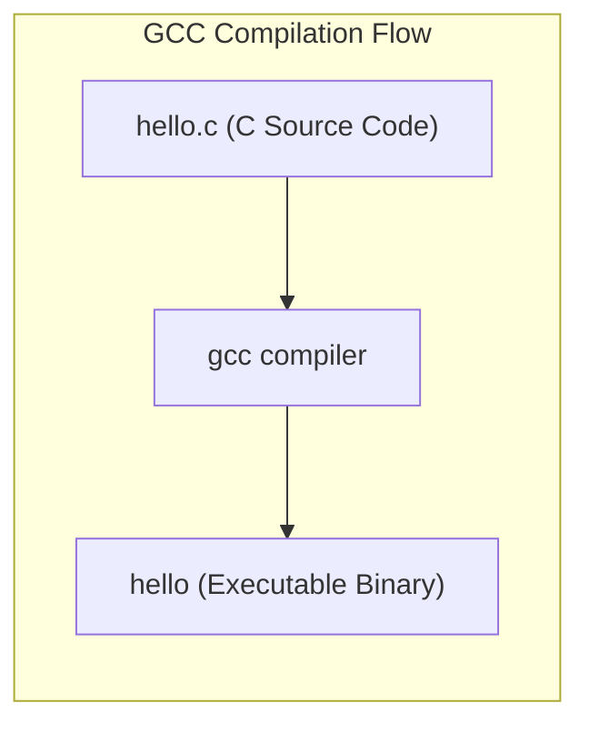
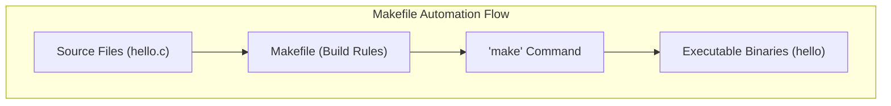

# Week 2 — Redirection, Pipelines, and Package Management

| Course | Operating System (Linux Essentials) |
|---|---|
| **Weekly Study Time** | 10 Hours |
| **Schedule** | Saturday: 8:00 AM - 12:00 PM (4h) & 2:00 PM - 4:00 PM (2h) <br> Sunday: 8:00 AM - 12:00 PM (4h) |
| **Syllabus CLOs** | CLO7: Navigate File System & Manage Files/Directories (Redirection & Pipelines) <br> CLO10: Install and Manage Software Packages in Linux |

---

## 📅 Session 4: I/O Streams and Redirection (Saturday Morning — 4 Hours)

### 1. OS Concepts
*   **Standard Streams:** When a program runs, the OS provides three standard streams mapped to numeric file descriptors (FDs):
    1.  **Standard Input (stdin - FD 0):** Input data stream. Default is the keyboard.
    2.  **Standard Output (stdout - FD 1):** Normal output text stream. Default is the terminal screen.
    3.  **Standard Error (stderr - FD 2):** Error message text stream. Default is the screen, but FDs allow separation from stdout.
*   **Redirection Operators:** 
    *   `>`: Overwrites standard output to a file.
    *   `>>`: Appends standard output to a file.
    *   `<`: Redirects standard input to read from a file.
    *   `2>`: Overwrites standard error to a file.
    *   `2>&1`: Merges stderr and stdout to the same location.
    *   `/dev/null`: Virtual black hole. Writing here discards the data.

### 2. Command Reference

| Command | Option | Description | Example |
| :--- | :--- | :--- | :--- |
| `cat` | None | Read file and print to stdout | `cat /etc/passwd` |
| `echo` | None | Print string to stdout | `echo "Hello World"` |
| `head` | `-n [num]`| Display first `n` lines of a stream (default 10) | `head -n 5 file.txt` |
| `tail` | `-n [num]`| Display last `n` lines of a stream (default 10) | `tail -n 5 file.txt` |
| | `-f` | Follow mode - prints new lines in real-time | `tail -f /var/log/syslog` |
| `wc` | `-l` | Display count of lines in a stream | `wc -l /etc/services` |
| | `-w` | Display count of words in a stream | `wc -w file.txt` |
| | `-c` | Display count of bytes/characters in a stream | `wc -c file.txt` |

### 3. Session 4 Exercises (To Do)
1. Use `cat` with output redirection to write a file named `os_list.txt` directly from your console containing the names: `Ubuntu`, `Debian`, `CentOS`, `Fedora`, and `Arch`.
2. Append `RedHat` and `Alpine` to `os_list.txt` in separate commands and verify the file content.
3. Attempt to run `ls /dummy_folder_test` (which does not exist) and redirect the stderr message into `stderr_log.txt`.
4. Extract lines 20 to 25 of `/etc/services` using a pipeline of `head` and `tail`, and write the output to `services_range.txt`.
5. Use `wc` to count lines in `/etc/services` and append the number to `services_range.txt`.

---

## 📅 Session 5: Text Processing & Filter Pipelines (Saturday Afternoon — 2 Hours)

### 1. OS Concepts
*   **Pipes (`|`):** Connects the stdout of the left command directly to the stdin of the right command. Allows complex data filters without generating intermediate temporary files.
*   **Filters:** Tools that parse streams line-by-line:
    *   `grep`: Filters for lines matching regular expressions/strings.
    *   `sort`: Arranges lines alphabetically or numerically.
    *   `uniq`: Removes duplicate lines. 
    > [!WARNING]
    > `uniq` only detects duplicate lines if they are **adjacent** (next to each other). You MUST sort the lines using `sort` before calling `uniq` to reliably clean duplicate records.

### 2. Command Reference

| Command | Option | Description | Example |
| :--- | :--- | :--- | :--- |
| `grep` | None | Filter lines matching the string pattern | `grep "student" /etc/passwd` |
| | `-i` | Case-insensitive search | `grep -i "ssh" /etc/services` |
| | `-n` | Print line numbers with matches | `grep -n "bash" /etc/passwd` |
| | `-v` | Invert search - prints non-matching lines | `grep -v "nologin" /etc/passwd` |
| | `-c` | Display total number of matching lines | `grep -c "bash" /etc/passwd` |
| `sort` | None | Sort lines alphabetically | `sort names.txt` |
| | `-n` | Sort lines numerically | `sort -n numbers.txt` |
| | `-r` | Reverse sort order | `sort -r names.txt` |
| `uniq` | None | Deduplicate adjacent repeated lines | `sort names.txt | uniq` |
| | `-c` | Count frequency occurrences for each line | `sort names.txt | uniq -c` |
| | `-d` | Display only duplicate lines | `sort names.txt | uniq -d` |

### 3. Session 5 Exercises (To Do)
1. Search for "ssh" (case-insensitive) in `/etc/services` showing line numbers, and redirect to `port_services.txt`.
2. Create a file named `guests.txt` containing the names: `John`, `Alice`, `John`, `Bob`, `Alice`, `Alice`, and `David`.
3. Write a pipeline using `sort` and `uniq` to count the occurrences of each name, sorting them numerically from highest frequency to lowest. Redirect the output to `guest_counts.txt`.

---

## 📅 Session 6: Software Package Management & Archiving (Sunday Morning — 4 Hours)

### 1. OS Concepts

*   **Package Management Ecosystems:**
    Linux distributions distribute pre-built software compiled for specific CPU architectures using **Package Managers** that pull from central software **Repositories**.
    *   **Debian/Ubuntu Family:** Uses `.deb` package binaries. Low-level installer is `dpkg`, while the high-level frontend is APT (`apt`/`apt-get`), which automatically resolves and installs dependencies.
    *   **RedHat/Fedora/CentOS Family:** Uses `.rpm` package binaries. High-level frontends include YUM (`yum`) or the newer DNF (`dnf`).
    *   **SUSE Family:** Uses `.rpm` packages managed by the high-level tool Zypper (`zypper`).
*   **Universal Packaging Formats:**
    To solve the "dependency hell" and let developers distribute one package for all Linux distros, universal formats run in containerized sandboxes:
    *   **Snap:** Designed by Canonical. Snaps package an application and all its required libraries in a read-only compressed file system, running inside an AppArmor sandbox.
    *   **Flatpak:** A community-driven sandbox packaging tool primarily focused on desktop applications, using Bubbleswrap for isolation.
*   **Source Compilation (`gcc` & `make`):**
    Before package managers, all software had to be compiled from source. Compilation is the process of translating human-readable source code (e.g. written in C) into binary machine code.
    *   **GCC (GNU Compiler Collection):** The primary compiler used in Linux systems.
    *   **Make & Makefile:** Large codebases contain hundreds of files. Running `gcc` manually on each is impossible. The `make` tool reads rules from a configuration file called `Makefile` to compile and link only the changed source files automatically.





*   **Archiving vs. Compression:**
    *   *Archiving (`tar`):* Bundling multiple files/folders into a single file (tarball) without changing size.
    *   *Compression (`gzip`):* Reducing storage size using mathematical algorithms. Linux typically chains these steps to produce `.tar.gz` files.

### 2. Command Reference

| Command | Option/Args | Description | Example |
| :--- | :--- | :--- | :--- |
| `apt-get update` | None | Refresh local database metadata cache of packages | `sudo apt-get update` |
| `apt-get install`| `[pkg]` | Download and install package with dependencies | `sudo apt-get install tmux` |
| `dpkg -i` | `[file.deb]` | Install local Debian package binary file | `sudo dpkg -i app.deb` |
| `dpkg -L` | `[pkg]` | List all files installed by target package | `dpkg -L nano` |
| `dnf` / `yum` | `install [pkg]` | Install package on RedHat-based systems | `sudo dnf install httpd` |
| `zypper` | `in [pkg]` | Install package on SUSE-based systems | `sudo zypper in tmux` |
| `snap` | `install [pkg]` | Install a universal sandboxed Snap package | `sudo snap install vlc` |
| `flatpak` | `install [pkg]` | Install a universal sandboxed Flatpak package | `flatpak install flathub org.gimp.GIMP` |
| `gcc` | `-o [bin] [src]`| Compile a C source file into an executable binary | `gcc -o hello hello.c` |
| `make` | None | Automate project compilation using a Makefile | `make` |
| `tar` | `-czvf` | Create a gzip-compressed archive | `tar -czvf backup.tar.gz src/` |
| | `-xzvf` | Extract gzip-compressed archive contents | `tar -xzvf backup.tar.gz` |
| `gzip` / `gunzip`| None | Compress / Decompress a single file | `gzip data.txt` |
| `zip` / `unzip` | None | Zip / Unzip directories recursively | `zip -r web.zip html/` |

### 3. Part 6 — Hands-on Examples

#### A. Compiling from Source with GCC and Make
**1. Manual Compilation with GCC:**
Create a simple C source file `hello.c`:
```c
#include <stdio.h>
int main() {
    printf("Hello from compiled C program!\n");
    return 0;
}
```
Compile the code and execute the output binary:
```bash
# Compile hello.c into a binary named 'hello'
gcc -o hello hello.c

# Run the compiled binary
./hello
# Output: Hello from compiled C program!
```

**2. Automated Builds with Make:**
For larger programs, create a file named `Makefile` in the same directory:
```makefile
hello: hello.c
	gcc -o hello hello.c

clean:
	rm -f hello
```
> [!IMPORTANT]
> Makefile recipe lines (e.g. `gcc -o hello hello.c`) **MUST** start with a real Tab character, not spaces, or the `make` utility will throw a syntax error.

Now run the build system:
```bash
# Build the application
make
# Output: gcc -o hello hello.c

# Run the program
./hello

# Clean the workspace
make clean
# Output: rm -f hello
```

#### B. Querying and Installing Packages
Here are equivalent operations across package systems:
```bash
# Debian/Ubuntu (APT)
sudo apt-get install tmux

# RedHat/Fedora (DNF)
sudo dnf install tmux

# openSUSE (Zypper)
sudo zypper install tmux

# Universal Snap (Snapd)
sudo snap install tmux
```

---

### 4. Session 6 Exercises (To Do)
1. Search and install the locomotive package `sl` using your package manager.
2. List all files installed by `sl` and redirect the file list to `locomotive_files.txt`.
3. Create a directory named `sandbox_deploy/` containing a `hello.c` file and a `Makefile`. 
4. Run `make` to compile the application and execute the binary. Record your output.
5. Create a plain tarball (`backup.tar`) and a compressed tarball (`backup.tar.gz`) of the `sandbox_deploy` folder. Compare the file sizes using `ls -lh` and redirect the size comparison output to `size_comparison.txt`.

---

## 🧩 Week 2 Challenge Scenario: "Security Log Audit and Web App Deployment"

### Background
You are a DevOps Engineer at **Apex Systems**. The staging server has been slow, and the security team suspects an intrusion. Your supervisor assigns you to:
1. Audit the server's web access logs for security threats.
2. Bundle the company's Node.js API code and install a custom logging utility package.

### Mission Steps
1.  **Simulate Logs & API Folders:** Setup the simulation environments:
    ```bash
    # Part A: Log Setup
    sudo mkdir -p /var/tmp/apex_logs
    cat << 'EOF' | sudo tee /var/tmp/apex_logs/web_access.log
    192.168.1.15 - - [27/May/2026:10:01:02] "GET /index.html HTTP/1.1" 200 1024
    192.168.1.100 - - [27/May/2026:10:01:05] "GET /login.php HTTP/1.1" 401 320
    192.168.1.20 - - [27/May/2026:10:02:10] "GET /about.html HTTP/1.1" 200 450
    192.168.1.100 - - [27/May/2026:10:02:12] "POST /login.php HTTP/1.1" 401 320
    192.168.1.15 - - [27/May/2026:10:02:15] "GET /style.css HTTP/1.1" 200 2340
    192.168.1.100 - - [27/May/2026:10:02:18] "POST /login.php HTTP/1.1" 401 320
    192.168.1.30 - - [27/May/2026:10:03:01] "GET /index.html HTTP/1.1" 200 1024
    192.168.1.100 - - [27/May/2026:10:03:05] "GET /admin/config.php HTTP/1.1" 404 150
    192.168.1.20 - - [27/May/2026:10:03:22] "GET /contact.html HTTP/1.1" 200 680
    192.168.1.100 - - [27/May/2026:10:03:45] "GET /etc/passwd HTTP/1.1" 404 150
    192.168.1.15 - - [27/May/2026:10:04:10] "GET /index.html HTTP/1.1" 200 1024
    192.168.1.100 - - [27/May/2026:10:04:12] "POST /login.php HTTP/1.1" 200 1800
    192.168.1.45 - - [27/May/2026:10:05:00] "GET /images/logo.png HTTP/1.1" 200 4500
    EOF
    sudo chmod 644 /var/tmp/apex_logs/web_access.log

    # Part B: Node.js API Setup
    mkdir -p apollo_app/src/routes
    mkdir -p apollo_app/config
    echo "console.log('App running');" > apollo_app/src/index.js
    echo "module.exports = {};" > apollo_app/src/routes/users.js
    echo "port: 3000" > apollo_app/config/settings.yml

    # Part C: Debian Package Setup
    mkdir -p apex-logger-pkg/DEBIAN
    mkdir -p apex-logger-pkg/usr/bin
    cat << 'EOF' > apex-logger-pkg/DEBIAN/control
    Package: apex-logger
    Version: 1.0
    Section: custom
    Priority: optional
    Architecture: all
    Maintainer: Apex Systems <admin@apex.com>
    Description: Simple simulated logger utility for Apex Systems labs.
    EOF
    cat << 'EOF' > apex-logger-pkg/usr/bin/apex-logger
    #!/bin/bash
    echo "[$(date)] APEX LOGGER ACTIVE: $@"
    EOF
    chmod 755 apex-logger-pkg/usr/bin/apex-logger
    dpkg-deb --build apex-logger-pkg apex-logger.deb
    rm -rf apex-logger-pkg
    ```
2.  **Audit Staging Web Logs:**
    *   Count the total logs in `/var/tmp/apex_logs/web_access.log`.
    *   Filter out failed requests (HTTP status codes `401` or `404`) and write them to `failed_attempts.txt`.
    *   Search for files containing signature matches for `/etc/passwd` and save matching lines to `attack_signatures.txt`.
    *   Extract the URL requested (the 7th space-separated field in the log). Count the occurrences of each URL, sort them from highest hit frequency to lowest, and write the list to `frequent_targets.txt`.
3.  **Deploy and Archive Application:**
    *   Archive and compress `apollo_app/` into `apollo_backup.tar.gz`.
    *   Install the local package `apex-logger.deb` (requires `sudo dpkg -i`).
    *   Verify the installation by running `apex-logger "Deployment complete"` and redirecting output to `deployment_status.txt`.
    *   Query the metadata info details of `apex-logger` using `dpkg -s` and save the output to `logger_info.txt`.
    *   Clean up by deleting the source folder `apollo_app` and `apex-logger.deb`.

---

## 📝 Submission Checklist & Folder Structure
Your week submission folder `linux-essentials-<YourStudentID>/week2/` must look like this:

```
linux-essentials-<YourStudentID>/
└── week2/
    ├── README.md (Weekly report)
    ├── images/
    │   ├── log_analysis.png (Screenshot showing log diagnostics)
    │   └── package_deploy.png (Screenshot showing final clean folder structure)
    ├── failed_attempts.txt
    ├── attack_signatures.txt
    ├── frequent_targets.txt
    ├── apollo_backup.tar.gz
    ├── deployment_status.txt
    └── logger_info.txt
```
