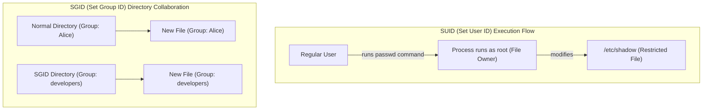
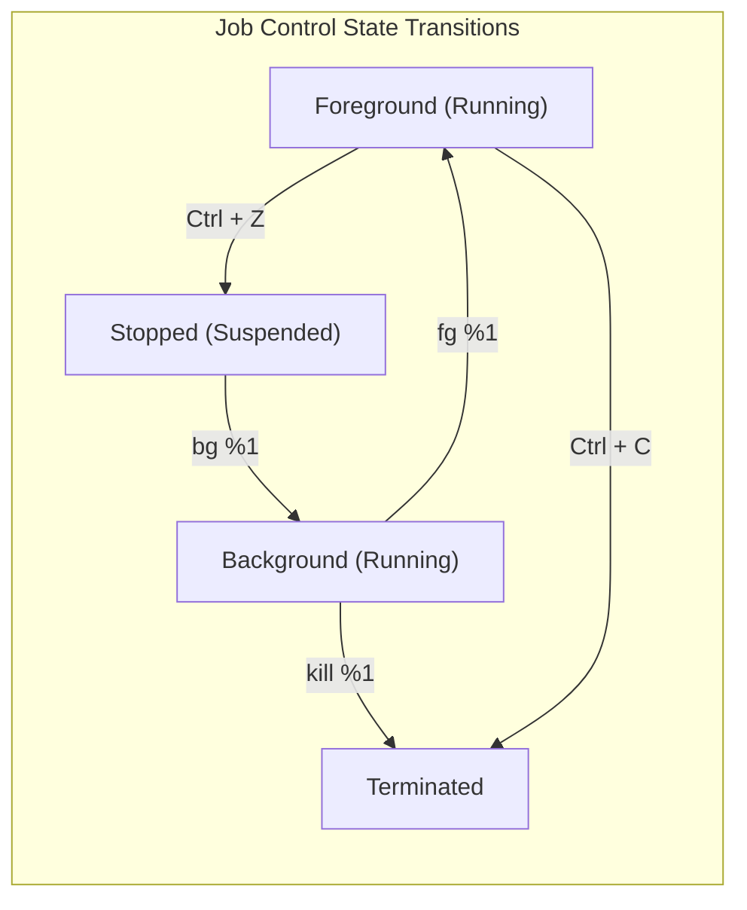

# Week 3 — Security Permissions, Processes, and Services

| Course | Operating System (Linux Essentials) |
|---|---|
| **Weekly Study Time** | 10 Hours |
| **Schedule** | Saturday: 8:00 AM - 12:00 PM (4h) & 2:00 PM - 4:00 PM (2h) <br> Sunday: 8:00 AM - 12:00 PM (4h) |
| **Syllabus CLOs** | CLO8: Manage Users, Groups, and File Permissions in Linux <br> CLO9: Understand Linux Process Management and System Monitoring |

---

## 📅 Session 7: Account Administration (Saturday Morning — 4 Hours)

### 1. OS Concepts
*   **Multi-User Architecture:** Linux isolates users to ensure stability and security.
    *   **User IDs (UIDs):** Unique numbers identifying accounts. Root is always `0`. System services use UIDs `1-999`. Human users start at `1000`.
    *   **Group IDs (GIDs):** Group identifiers used to manage access permission for sets of users.
*   **System Databases:**
    *   `/etc/passwd`: Publicly readable list of accounts, home directories, and default login shells.
    *   `/etc/shadow`: Protected file containing encrypted passwords. Only readable by root.
    *   `/etc/group`: List of groups and their associated user memberships.
*   **Privilege Escalation:**
    *   `su`: Switch User. Changes shell context to another user (requires their password).
    *   `sudo`: SuperUser Do. Runs a single command with root privileges (requires current user's password, if authorized in `/etc/sudoers`).

### 2. Command Reference

| Command | Option | Description | Example |
| :--- | :--- | :--- | :--- |
| `groupadd` | None | Create a new system group | `sudo groupadd developers` |
| `useradd` | `-m` | Create user and generate default home directory | `sudo useradd -m alice` |
| | `-g` | Set user's primary group | `sudo useradd -m -g devs bob` |
| `usermod` | `-aG` | Append user to secondary/supplementary group | `sudo usermod -aG devs alice` |
| `passwd` | None | Set or change user's login password | `sudo passwd alice` |
| `userdel` | `-r` | Delete user and remove their home folder | `sudo userdel -r alice` |
| `groupdel` | None | Delete group from database | `sudo groupdel developers` |
| `id` | None | Show current UID, GID, and groups for a user | `id student` |
| `groups` | None | List groups a user is a member of | `groups student` |
| `su` | `-` | Switch shell context (defaults to root user) | `su -` |
| `sudo` | None | Execute target command with root privileges | `sudo cat /etc/shadow` |
| `whoami` | None | Show current active username | `whoami` |

### 3. Session 7 Exercises (To Do)
1. Inspect the first 5 entries of `/etc/passwd` and save the list to `passwd_head.txt`.
2. Create a group named `study_group` and a user named `learner` with `study_group` as their primary group.
3. Verify GID and group settings of `learner` using `id` and redirect the output to `learner_id.txt`.
4. Delete the user `learner` and group `study_group` from the system using cleanup commands.

---

## 📅 Session 8: File Permissions & Access Control (Saturday Afternoon — 2 Hours)

### 1. OS Concepts
*   **Permissions Bits (`rwx`):**
    *   `r` (Read = 4): View file contents / list directory files.
    *   `w` (Write = 2): Modify file contents / create or delete files in a directory.
    *   `x` (Execute = 1): Run file as binary/script / enter directory using `cd`.
*   **Representation Schemes:**
    *   *Symbolic Mode:* Modify bits using symbols (e.g. `chmod u+x,g-w file.txt`).
    *   *Octal Mode:* Assign absolute values from sums (e.g. `chmod 755 file.txt` -> Owner: rwx (7), Group: r-x (5), Others: r-x (5)).
*   **Special Permissions:**
    *   **SUID (Set User ID - Octal 4):** Indicated by `s` in the owner execute field (e.g. `-rws------`). The program runs with the privileges of the file *owner* (typically root).
    *   **SGID (Set Group ID - Octal 2):** Indicated by `s` in the group execute field. For directories, files created inside inherit the parent directory's group instead of the creator's primary group.
    *   **Sticky Bit (Octal 1):** Indicated by `t` in the other execute field. For directories (e.g. `/tmp`), only the file owner, directory owner, or root can delete/rename files inside.



### 2. Command Reference

| Command | Usage | Description | Example |
| :--- | :--- | :--- | :--- |
| `chmod` | `chmod [mode] [file]` | Modify file/directory permissions | `chmod 755 script.sh` |
| | `chmod u+s [file]` | Add SUID special permission bit | `sudo chmod u+s tool` |
| | `chmod g+s [dir]` | Add SGID group inheritance bit to directory | `sudo chmod g+s shared/` |
| | `chmod +t [dir]` | Add Sticky Bit directory delete restriction | `sudo chmod +t shared/` |
| `chown` | `chown [owner] [file]`| Change file owner | `sudo chown root file.conf` |
| | `chown [owner]:[group]`| Change both owner and group in one command | `sudo chown root:devs index.js` |
| `chgrp` | `chgrp [group] [file]`| Change group ownership | `sudo chgrp devs file.txt` |

### 3. Part 8 — Hands-on Examples

#### A. SUID (Set User ID) Behavior
Find a standard system command that has SUID enabled:
```bash
# Locate the passwd binary and list its permissions
ls -l /usr/bin/passwd
# Output: -rwsr-xr-x 1 root root 68208 May 27 2026 /usr/bin/passwd
# Note the 's' in the owner's execute field. This indicates SUID.
# When a regular user executes 'passwd', the process runs with root permissions, allowing it to modify '/etc/shadow'.
```

#### B. SGID (Set Group ID) for Collaborative Directories
Create a collaborative directory where newly created files automatically inherit the parent directory's group:
```bash
# Create a test directory
mkdir project_share

# Assign group ownership to a group you belong to (e.g. 'sudo' or 'developers')
sudo chgrp sudo project_share

# Enable SGID on the directory
chmod g+s project_share
# Or chmod 2770 project_share (Owner & Group get full rwx, others get none, SGID bit set)

# Check directory permissions (note the 's' in the group's execute field)
ls -ld project_share
# Output: drwxrws--- 2 student sudo 4096 May 27 2026 project_share

# Create a file inside as a normal user
touch project_share/new_doc.txt
ls -l project_share/new_doc.txt
# Output: -rw-r----- 1 student sudo 0 May 27 2026 new_doc.txt
# The file automatically inherited the group 'sudo' instead of 'student'.
```

#### C. Sticky Bit for Shared Temporary Folders
Demonstrate that the sticky bit prevents users from deleting each other's files:
```bash
# List /tmp folder permissions (note the 't' at the end)
ls -ld /tmp
# Output: drwxrwxrwt 12 root root 4096 May 27 2026 /tmp

# Create a custom directory with the Sticky Bit enabled
mkdir /var/tmp/sticky_dir
chmod +t /var/tmp/sticky_dir
# Or chmod 1777 /var/tmp/sticky_dir

ls -ld /var/tmp/sticky_dir
# Output: drwxrwxrwt 2 student student 4096 May 27 2026 /var/tmp/sticky_dir
# Any user can create files here, but only the owner of a file (or root) can delete it.
```

---

### 4. Session 8 Exercises (To Do)
1. Create a file named `shared_notes.txt`. View its default permission bits and metadata.
2. Change the group ownership of `shared_notes.txt` to `sudo` (or any available group on your machine).
3. Modify permissions of `shared_notes.txt` using octal mode so that the owner has read & write (`rw-`), the group has read-only (`r--`), and others have no permissions (`---`).
4. Run `ls -l shared_notes.txt` and redirect the command output to `permissions_check.txt`.

---

## 📅 Session 9: Processes, Resource Monitoring & Systemd Services (Sunday Morning — 4 Hours)

### 1. OS Concepts
*   **Processes:** Running instances of program binaries in memory, identified by a **Process ID (PID)**.
    *   *States:* Running (R), Sleeping (S), Stopped (T), Zombie (Z).
*   **Job Control:** Commands run in the foreground by default. Background job management frees the terminal prompt:
    *   `&`: Appended to commands to run them in the background.
    *   `Ctrl+C`: Terminates foreground processes.
    *   `Ctrl+Z`: Suspends/pauses foreground processes.
    *   `jobs`: Lists jobs managed by the current shell session.
    *   `fg` / `bg`: Moves jobs to the foreground or resumes them in the background.



*   **Signals:** Sent to communicate with processes (e.g. `SIGTERM` 15 asks to save state, `SIGKILL` 9 forces shutdown).
*   **Resource Monitoring:** Sysadmins track CPU/RAM/Disk metrics to prevent system crashes.
*   **Systemd Services:** Daemon processes managed centrally via `systemctl`.
*   **Cron Daemon:** Schedule tasks to run automatically at configured times.

### 2. Command Reference

| Command | Option/Args | Description | Example |
| :--- | :--- | :--- | :--- |
| `ps` | `aux` | List all running processes on the system (BSD style) | `ps aux` |
| | `-ef` | List all running processes with full details (SysV style) | `ps -ef` |
| `jobs` | None | List active shell job numbers and statuses | `jobs` |
| `fg` / `bg` | `%[job_id]` | Bring job to foreground / run in background | `fg %1` |
| `kill` | `[PID]` | Send default SIGTERM (15) to PID | `kill 5829` |
| | `-9 [PID]` | Send SIGKILL (9) to force kill a process | `kill -9 5829` |
| `free` | `-h` | Display RAM memory and swap utilization metrics | `free -h` |
| `df` | `-h` | Display disk storage capacity of mounted filesystems | `df -h` |
| `du` | `-sh` | Display disk space capacity of target directory | `du -sh /var/log` |
| `systemctl`| `start` / `stop` | Start or stop a Systemd service | `sudo systemctl stop nginx` |
| | `status` | View status and logs of Systemd service | `systemctl status sshd` |
| | `enable` / `disable`| Configure service to auto-start on system boot | `sudo systemctl enable sshd` |
| `ip` | `a` or `addr` | List network adapter interfaces and IP addresses | `ip a` |
| `ping` | `-c [num]` | Send packets to verify host connectivity | `ping -c 4 8.8.8.8` |
| `ss` | `-tulpn` | Display active listening ports and sockets | `sudo ss -tulpn` |

### 3. Part 9 — Hands-on Examples

#### A. Process and Job Control
Control background and foreground processes using shell jobs:
```bash
# Start a sleep task in the background
sleep 600 &
# Output: [1] 23456 (Job ID is 1, Process ID is 23456)

# List running jobs in the shell
jobs
# Output: [1]+  Running                 sleep 600 &

# Bring the background job to the foreground
fg %1
# The terminal is now blocked by the sleep process.

# Suspend/pause the foreground process
# Press Ctrl+Z
# Output: [1]+  Stopped                 sleep 600

# Resume the process in the background
bg %1
# Output: [1]+ sleep 600 &

# Terminate the job using kill and its PID
kill 23456
# Or kill %1
```

#### B. Systemd Services and Logging
Manage and monitor system services:
```bash
# Check status of the cron/ssh service
systemctl status cron
# Output displays if the service is loaded, active (running), and recent logs.

# Stop the service (requires administrator rights)
sudo systemctl stop cron

# Check status again (will show inactive/dead)
systemctl status cron

# Start the service again
sudo systemctl start cron

# Query logs specific to this service using journalctl
journalctl -u cron --no-pager -n 10
# Shows the last 10 lines of system logs generated by the cron daemon.
```

---

### 4. Session 9 Exercises (To Do)
1. Start two background tasks: `sleep 450 &` and `sleep 550 &`.
2. Run `jobs` and redirect the output list to `jobs_list.txt`.
3. Terminate both sleep processes using their PIDs.
4. Save human-readable RAM utilization to `memory_status.txt` and disk filesystem statistics to `disk_status.txt`.
5. Ping the local loopback address `127.0.0.1` 4 times and save the output to `ping_localhost.txt`.

---

## 🧩 Week 3 Challenge Scenario: "Security Collaboration and Rogue Service Recovery"

### Background
You are a Systems Administrator at **Apex Systems**. The management office requires a secure, collaborative workspace for Project **"Mercury"**. In addition, the staging web server has slowed down, and developers suspect a runaway script loop is hogging ports.

### Mission Steps
1.  **Simulate Setup Environments:** Run the following preparation script:
    ```bash
    # Part A: Project Mercury Accounts
    sudo groupadd -f mercury_team
    sudo id -u engineer_alice &>/dev/null || sudo useradd -m -g mercury_team engineer_alice
    sudo id -u engineer_bob &>/dev/null || sudo useradd -m -g mercury_team engineer_bob
    sudo mkdir -p /var/tmp/mercury_dev
    sudo chmod 777 /var/tmp/mercury_dev

    # Part B: Rogue Process Setup
    cat << 'EOF' > rogue_loop.sh
    #!/bin/bash
    while true; do
        sleep 2
    done
    EOF
    chmod +x rogue_loop.sh
    ./rogue_loop.sh &
    ```
2.  **Configure Project Mercury Collaborative Workspace:**
    *   The folder `/var/tmp/mercury_dev` must be configured for the group `mercury_team`.
    *   Set the folder owner to `engineer_alice` and group to `mercury_team`.
    *   Modify permissions of `/var/tmp/mercury_dev` using octal mode so that:
        *   The owner has read, write, and execute (`rwx` = 7).
        *   The group has read, write, and execute (`rwx` = 7).
        *   Others have no permissions (`---` = 0).
        *   Add **SGID** (Set Group ID) to the folder (octal `2` prefix, e.g. `2770`), ensuring that any files created inside by Bob or Alice inherit the `mercury_team` group ownership automatically.
    *   Verify the folder permissions and group ownership using `ls -ld` and redirect output to `mercury_permissions.txt`.
    *   List group memberships of Alice and Bob and write them to `mercury_team_members.txt`.
3.  **Diagnose and Recover Rogue Server:**
    *   Use `ps aux` to locate the rogue background script named `./rogue_loop.sh` and identify its PID.
    *   Kill the runaway process using `kill` (use force kill `-9` if necessary).
    *   Verify the process is gone. Check system memory availability and write the output status to `system_recovery.txt`.
    *   Confirm port connections. Run `ss` to check active listening ports and write the output to `port_check.txt`.
    *   Verify connectivity. Ping the server gateway (`8.8.8.8`) 4 times and append the results to `system_recovery.txt`.
    *   Clean up by deleting `rogue_loop.sh` from your directory.

---

## 📝 Submission Checklist & Folder Structure
Your week submission folder `linux-essentials-<YourStudentID>/week3/` must look like this:

```
linux-essentials-<YourStudentID>/
└── week3/
    ├── README.md (Weekly report)
    ├── images/
    │   ├── permissions_setup.png (Screenshot showing ls -ld of mercury_dev)
    │   └── system_monitoring.png (Screenshot showing ps output after process kill)
    ├── passwd_head.txt
    ├── learner_id.txt
    ├── permissions_check.txt
    ├── mercury_permissions.txt
    ├── mercury_team_members.txt
    ├── jobs_list.txt
    ├── memory_status.txt
    ├── disk_status.txt
    ├── ping_localhost.txt
    ├── system_recovery.txt
    └── port_check.txt
```
Approved! Proceed to submit.
