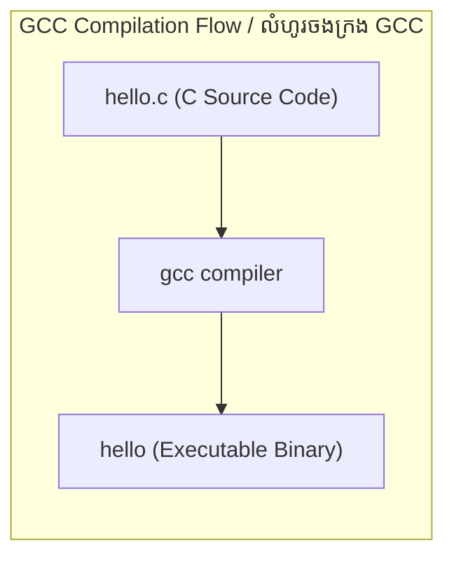
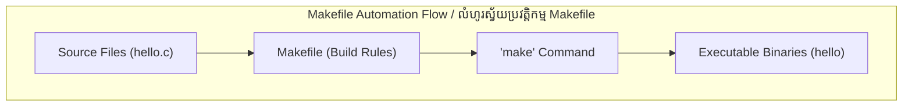

# Week 2 — Streams, Pipelines, Scripting, and Packages / ចរន្តទិន្នន័យ, បំពង់បញ្ជូន, ស្គ្រីប និងកញ្ចប់កម្មវិធី

| Course / វគ្គសិក្សា | Operating System (Linux Essentials) / ប្រព័ន្ធប្រតិបត្តិការ (មូលដ្ឋានគ្រឹះ Linux) |
|---|---|
| **Weekly Study Time / រយៈពេលសិក្សាប្រចាំសប្តាហ៍** | 10 Hours / ១០ ម៉ោង |
| **Schedule / កាលវិភាគ** | Saturday: 8:00 AM - 12:00 PM (4h) & 2:00 PM - 4:00 PM (2h) <br> Sunday: 8:00 AM - 12:00 PM (4h) |
| **Syllabus CLOs / សញ្ញាបត្រ CLO** | CLO7: Navigate File System & Manage Files/Directories (Streams & Pipelines) <br> CLO10: Install and Manage Software Packages in Linux |

---

## 📅 Session 4: I/O Streams, Redirection & Archiving (Saturday Morning — 4 Hours) / ផ្នែកទី៤៖ ចរន្ត I/O Streams, ការបង្វែរទិន្នន័យ & ការចងក្រងឯកសារ (ថ្ងៃសៅរ៍ ព្រឹក — ៤ ម៉ោង)

### 1. OS Concepts / គោលគំនិតប្រព័ន្ធប្រតិបត្តិការ
*   **Standard Streams / ចរន្តស្តង់ដារ:**
    When a program runs, the OS provides three standard streams mapped to numeric file descriptors (FDs):
    នៅពេលកម្មវិធីដំណើរការ ប្រព័ន្ធប្រតិបត្តិការផ្តល់ចរន្តទិន្នន័យស្តង់ដារចំនួនបីដែលភ្ជាប់ជាមួយសូចនាករឯកសារ (File Descriptors - FDs)៖
    1.  **Standard Input (stdin - FD 0):** Input data stream. Default is the keyboard.
        **ទិន្នន័យបញ្ចូលស្តង់ដារ (stdin - FD 0):** ចរន្តទិន្នន័យអានចូល។ លំនាំដើមគឺក្តារចុច។
    2.  **Standard Output (stdout - FD 1):** Normal output text stream. Default is the terminal screen.
        **លទ្ធផលស្តង់ដារ (stdout - FD 1):** ចរន្តលទ្ធផលអត្ថបទធម្មតា។ លំនាំដើមគឺអេក្រង់ terminal។
    3.  **Standard Error (stderr - FD 2):** Error message text stream. Default is the screen, but FDs allow separation from stdout.
        **សារកំហុសស្តង់ដារ (stderr - FD 2):** ចរន្តបង្ហាញសារកំហុស។ លំនាំដើមគឺលើអេក្រង់ដែរ ប៉ុន្តែវាដាច់ដោយឡែកពី stdout។
*   **Redirection Operators / សញ្ញាប្រតិបត្តិការបង្វែរទិន្នន័យ:**
    *   `>`: Overwrites standard output to a file (សរសេរបញ្ចូលលទ្ធផលជាន់លើឯកសារចាស់).
    *   `>>`: Appends standard output to a file (សរសេរបញ្ចូលលទ្ធផលបន្ថែមពីលើឯកសារចាស់).
    *   `<`: Redirects standard input to read from a file (បង្វែរទិន្នន័យបញ្ចូលឱ្យអានពីឯកសារជំនួសឱ្យក្តារចុច).
    *   `2>`: Overwrites standard error to a file (បង្វែរសារកំហុសជាន់លើទៅក្នុងឯកសារ).
    *   `2>&1`: Merges stderr and stdout to the same location (លាយបញ្ចូលគ្នារវាងសារកំហុស និងលទ្ធផលទៅកាន់ទីតាំងតែមួយ).
    *   `/dev/null`: Virtual black hole. Writing here discards the data (ឧបករណ៍ទទេសម្រាប់បោះទិន្នន័យចោល).
*   **Pipes (`|`) / បំពង់បញ្ជូន:**
    Connects the stdout of the left command directly to the stdin of the right command. Allows complex data filters without generating intermediate temporary files.
    ភ្ជាប់លទ្ធផល stdout នៃបញ្ជាខាងឆ្វេងទៅកាន់ទិន្នន័យបញ្ចូល stdin នៃបញ្ជាខាងស្តាំដោយផ្ទាល់។ វាអនុញ្ញាតឱ្យបង្កើតការចម្រោះទិន្នន័យស្មុគស្មាញដោយមិនបាច់បង្កើតឯកសារបណ្តោះអាសន្ន។
*   **Archiving vs. Compression / ការចងក្រង ប្រៀបធៀបនឹងការបង្រួមទំហំ:**
    *   *Archiving (`tar`):* Bundling multiple files/folders into a single file (tarball) without changing size (ការចងក្រងឯកសារ ឬថតទិន្នន័យជាច្រើនបញ្ចូលគ្នាដោយមិនប្តូរទំហំ).
    *   *Compression (`gzip`):* Reducing storage size using mathematical algorithms (ការបង្រួមទំហំឯកសារដោយប្រើក្បួនដោះស្រាយគណិតវិទ្យា). Linux typically chains these steps to produce `.tar.gz` files.

### 2. Command Reference / ឯកសារយោងពាក្យបញ្ជា

| Command / បញ្ជា | Option / ជម្រើស | Description (English) | សេចក្តីពិពណ៌នា (ភាសាខ្មែរ) | Example / ឧទាហរណ៍ |
| :--- | :--- | :--- | :--- | :--- |
| `cat` | None | Read file and print to stdout | អានឯកសារ និងបង្ហាញនៅលើ stdout | `cat /etc/passwd` |
| `echo` | None | Print string to stdout | បង្ហាញខ្សែអក្សរនៅលើ stdout | `echo "Hello World"` |
| `head` | `-n [num]`| Display first `n` lines of a stream (default 10) | បង្ហាញបន្ទាត់ `n` ដំបូងគេនៃចរន្តទិន្នន័យ | `head -n 5 file.txt` |
| `tail` | `-n [num]`| Display last `n` lines of a stream (default 10) | បង្ហាញបន្ទាត់ `n` ចុងក្រោយនៃចរន្តទិន្នន័យ | `tail -n 5 file.txt` |
| `wc` | `-l` | Display count of lines in a stream | បង្ហាញចំនួនបន្ទាត់សរុប | `wc -l /etc/services` |
| `grep` | `-i` | Case-insensitive search of matching lines | ស្វែងរកបន្ទាត់ដែលត្រូវនឹងលំនាំអត្ថបទដោយមិនគិតតួអក្សរធំ/តូច | `grep -i "ssh" /etc/services` |
| `sort` | `-n` / `-r` | Sort lines numerically / in reverse order | តម្រៀបបន្ទាត់តាមលំដាប់លេខ / បញ្ច្រាសលំដាប់ | `sort -n numbers.txt` |
| `uniq` | `-c` | Deduplicate adjacent repeated lines & show counts | លុបបន្ទាត់ជាប់គ្នាដែលស្ទួនចេញ និងបង្ហាញចំនួនដង | `sort names.txt | uniq -c` |
| `tar` | `-czvf` | Create a gzip-compressed archive | បង្កើតឯកសារចងក្រងបង្រួមដោយ gzip (ចេញជា `.tar.gz`) | `tar -czvf backup.tar.gz src/` |
| | `-xzvf` | Extract gzip-compressed archive contents | ពន្លា និងទាញមាតិកាចេញពីឯកសារ `.tar.gz` | `tar -xzvf backup.tar.gz` |
| `zip` / `unzip` | `-r` | Zip / Unzip directories recursively | ចងក្រង និងបង្រួម/ពន្លា ថតទិន្នន័យជាឯកសារ `.zip` | `zip -r web.zip html/` |

### 3. Session 4 Exercises (To Do) / លំហាត់អនុវត្តផ្នែកទី៤ (ត្រូវធ្វើ)
1. Use `cat` with output redirection to write a file named `os_list.txt` directly from your console containing the names: `Ubuntu`, `Debian`, `CentOS`, `Fedora`, and `Arch`.
   (ប្រើ `cat` ជាមួយការបង្វែរលទ្ធផលដើម្បីបង្កើតឯកសារ `os_list.txt` ផ្ទាល់ពី console ដែលមានឈ្មោះ៖ `Ubuntu`, `Debian`, `CentOS`, `Fedora`, និង `Arch`)
2. Append `RedHat` and `Alpine` to `os_list.txt` in separate commands and verify the file content.
   (សរសេរបន្ថែម `RedHat` និង `Alpine` ទៅក្នុង `os_list.txt` ដោយបញ្ជាផ្សេងគ្នា រួចផ្ទៀងផ្ទាត់មាតិកាឯកសារ)
3. Extract lines 20 to 25 of `/etc/services` using a pipeline of `head` and `tail`, and write the output to `services_range.txt`.
   (ទាញយកបន្ទាត់ទី ២០ ដល់ ២៥ នៃ `/etc/services` ដោយប្រើ pipeline របស់ `head` និង `tail` រួចសរសេរទៅកាន់ `services_range.txt`)
4. Create a folder named `backup_test/` and copy `os_list.txt` inside it. Create a compressed archive named `backup.tar.gz` of this folder.
   (បង្កើតថតឈ្មោះ `backup_test/` រួចចម្លង `os_list.txt` ទៅក្នុងនោះ។ បង្កើតឯកសារចងក្រងបង្រួម `backup.tar.gz` នៃថតនេះ)
5. List the contents of `backup.tar.gz` without extracting it.
   (បង្ហាញបញ្ជីឯកសារនៅក្នុង `backup.tar.gz` ដោយមិនបាច់ពន្លាវាចេញ)

---

## 📅 Session 5: Basic Shell Scripting (Saturday Afternoon — 2 Hours) / ផ្នែកទី៥៖ មូលដ្ឋានគ្រឹះនៃការសរសេរស្គ្រីប Shell (ថ្ងៃសៅរ៍ រសៀល — ២ ម៉ោង)

### 1. OS Concepts / គោលគំនិតប្រព័ន្ធប្រតិបត្តិការ
*   **Shell Scripts / ស្គ្រីប Shell:**
    A shell script is a text file containing a sequence of commands executed by the shell interpreter. It is used to automate repetitive administrative tasks.
    ស្គ្រីប Shell គឺជាឯកសារអត្ថបទដែលមានផ្ទុកនូវលំដាប់ពាក្យបញ្ជាជាបន្តបន្ទាប់ដែលដំណើរការដោយកម្មវិធីបកប្រែភាសា shell (shell interpreter)។ វាត្រូវបានប្រើដើម្បីធ្វើស្វ័យប្រវត្តិតែកិច្ចការគ្រប់គ្រងដែលដដែលៗ។
*   **The Shebang (`#!/bin/bash`) / Shebang:**
    Placed on the very first line of a script. It tells the kernel which shell interpreter to spawn to execute the script commands.
    ស្ថិតនៅបន្ទាត់ដំបូងបង្អស់នៃស្គ្រីប។ វាប្រាប់ kernel ឱ្យដឹងថាត្រូវហៅកម្មវិធីបកប្រែភាសា shell ណាមួយមកដំណើរការបញ្ជានៅក្នុងស្គ្រីបនោះ។
*   **Script Permissions / សិទ្ធិដំណើរការស្គ្រីប:**
    By default, new files do not have execute permissions. You must modify the file using `chmod +x script.sh` to allow direct execution (`./script.sh`).
    តាមលំនាំដើម ឯកសារដែលទើបបង្កើតថ្មីមិនមានសិទ្ធិដំណើរការ (execute permissions) ឡើយ។ អ្នកត្រូវតែកែប្រែឯកសារដោយប្រើ `chmod +x script.sh` ដើម្បីអនុញ្ញាតឱ្យដំណើរការវាដោយផ្ទាល់បាន (`./script.sh`)។
*   **Variables / អថេរ (Variables):**
    Used to store data. In bash, no spaces are allowed around the assignment operator (e.g. `NAME="Alice"`). Access variables using the `$` prefix (e.g. `$NAME`).
    ប្រើសម្រាប់រក្សាទុកទិន្នន័យ។ នៅក្នុង bash មិនអនុញ្ញាតឱ្យមានដកឃ្លានៅសងខាងសញ្ញាស្មើឡើយ (ឧទាហរណ៍៖ `NAME="Alice"`)។ ហៅប្រើប្រាស់អថេរដោយបន្ថែមនិមិត្តសញ្ញា `$` នៅខាងមុខ (ឧទាហរណ៍៖ `$NAME`)។
*   **User Input (`read`) / ធាតុចូលរបស់អ្នកប្រើប្រាស់:**
    Pauses execution and waits for the user to type input from standard input, saving it to a variable.
    ផ្អាកការដំណើរការជាបណ្តោះអាសន្ន និងរង់ចាំអ្នកប្រើប្រាស់វាយបញ្ចូលទិន្នន័យពី standard input រួចរក្សាទុកវាទៅក្នុងអថេរ។
*   **Conditionals (`if-else`) / លក្ខខណ្ឌ (if-else):**
    Executes commands based on test evaluations. Syntax uses square brackets `[ ]` which must contain spaces around the arguments.
    ដំណើរការបញ្ជាផ្សេងៗគ្នាផ្អែកលើការវាយតម្លៃលក្ខខណ្ឌ។ វាក្យសម្ពន្ធប្រើប្រាស់វង់ក្រចកការ៉េ `[ ]` ដែលត្រូវតែមានដកឃ្លានៅសងខាងអាគុយម៉ង់ជានិច្ច។
*   **Loops (`for` & `while`) / រង្វិលជុំ (Loops):**
    Repeats a set of commands. `for` loops iterate over a predefined list; `while` loops run as long as a condition evaluates to true.
    ធ្វើបញ្ជាដដែលៗ។ រង្វិលជុំ `for` រត់ទៅលើបញ្ជីធាតុដែលបានកំណត់ទុកជាមុន ខណៈដែលរង្វិលជុំ `while` រត់ដរាបណាត្រួតពិនិត្យលក្ខខណ្ឌឃើញថាពិត (true)។
*   **Exit Status / ស្ថានភាពចាកចេញ:**
    Every command returns an integer status from `0` (success) to `255` (error) when it finishes. In scripts, you can specify exit status using `exit <number>`. Read the last exit code using the special variable `$?`.
    រាល់ពាក្យបញ្ជាទាំងអស់តែងតែបញ្ជូនត្រឡប់មកវិញនូវស្ថានភាពជាលេខគត់ចាប់ពី `0` (ជោគជ័យ) ដល់ `255` (មានកំហុស) នៅពេលដំណើរការចប់។ នៅក្នុងស្គ្រីប អ្នកអាចកំណត់ស្ថានភាពចាកចេញដោយប្រើ `exit <លេខ>`។ អានលេខកូដចាកចេញចុងក្រោយតាមរយៈអថេរពិសេស `$?`។

### 2. Command Reference / ឯកសារយោងពាក្យបញ្ជា

| Command/Syntax / បញ្ជា-វាក្យសម្ពន្ធ | Option/Arg / ជម្រើស | Description (English) | សេចក្តីពិពណ៌នា (ភាសាខ្មែរ) | Example / ឧទាហរណ៍ |
| :--- | :--- | :--- | :--- | :--- |
| `chmod +x` | `[file]` | Add execution permission to script file | បន្ថែមសិទ្ធិដំណើរការទៅឱ្យឯកសារស្គ្រីប | `chmod +x backup.sh` |
| `read` | `[var]` | Read input from stdin and store in variable | អានធាតុចូលពី stdin និងរក្សាទុកក្នុងអថេរ | `read username` |
| `exit` | `[code]` | Terminate script and return integer status | បញ្ឈប់ដំណើរការស្គ្រីប និងបញ្ជូនស្ថានភាពត្រឡប់ជាលេខគត់ | `exit 0` |
| `$?` | None | Shell variable storing last command's exit status | អថេរពិសេសរក្សាទុកស្ថានភាពចាកចេញចុងក្រោយ | `echo $?` |
| `if [ cond ]; then` | None | Multi-branch conditional logic test block | ប្លុកសាកល្បងលក្ខខណ្ឌតក្កវិទ្យា | *See Examples* |
| `for var in list` | None | Loop that iterates over a list of items | រង្វិលជុំរត់លើបញ្ជីធាតុដែលកំណត់ | *See Examples* |
| `while [ cond ]` | None | Loop that runs while condition remains true | រង្វិលជុំរត់ដរាបណាលក្ខខណ្ឌនៅតែពិត | *See Examples* |

### 3. Part 5 — Hands-on Examples / ឧទាហរណ៍អនុវត្តផ្ទាល់ផ្នែកទី៥

#### A. Interactive Shell Script with Conditionals / ស្គ្រីប Shell បែបអន្តរកម្មជាមួយលក្ខខណ្ឌ
Create a script named `sys_audit.sh`:
(បង្កើតស្គ្រីបឈ្មោះ `sys_audit.sh`៖)
```bash
#!/bin/bash
# Sys Audit Script

echo "=== System Audit Panel ==="
echo "Enter your access username: "
read username

if [ "$username" == "admin" ]; then
    echo "[SUCCESS] Access granted to administrator."
    echo "Current system release info:"
    uname -r
    exit 0
else
    echo "[WARNING] Access denied: normal user '$username' cannot perform audit."
    exit 1
fi
```
Execute and test the exit statuses:
(ដំណើរការ និងសាកល្បងស្ថានភាពចាកចេញ៖)
```bash
# Make script executable
chmod +x sys_audit.sh

# Run as normal user
./sys_audit.sh
# Enter: guest
# Output: [WARNING] Access denied...
echo $?
# Output: 1

# Run as admin
./sys_audit.sh
# Enter: admin
# Output: [SUCCESS] ...
echo $?
# Output: 0
```

#### B. Loops in Action / ដំណើរការរង្វិលជុំ
Create a loop script named `batch_create.sh` to generate files:
(បង្កើតស្គ្រីបប្រើរង្វិលជុំឈ្មោះ `batch_create.sh` ដើម្បីបង្កើតថត៖)
```bash
#!/bin/bash
# Batch file generator

echo "Generating workspace directories..."
for folder in docs assets logs; do
    mkdir -p "project_$folder"
    echo "Created: project_$folder/"
done
```
Run the script to verify directory creation:
(ដំណើរការស្គ្រីបដើម្បីផ្ទៀងផ្ទាត់ការបង្កើតថតទិន្នន័យ៖)
```bash
chmod +x batch_create.sh
./batch_create.sh
```

---

### 4. Session 5 Exercises (To Do) / លំហាត់អនុវត្តផ្នែកទី៥ (ត្រូវធ្វើ)
1. Write a shell script named `check_file.sh` that prompts the user to enter a filename.
   (សរសេរស្គ្រីប shell ឈ្មោះ `check_file.sh` ដែលសួរឱ្យអ្នកប្រើប្រាស់វាយបញ្ចូលឈ្មោះឯកសារ)
2. The script must check if that file exists in the current directory. (Use the condition `if [ -f "$filename" ]; then` to check file existence).
   (ស្គ្រីបត្រូវតែពិនិត្យមើលថាតើឯកសារនោះមាននៅក្នុងថតបច្ចុប្បន្នដែរឬទេ។ ប្រើលក្ខខណ្ឌ `if [ -f "$filename" ]; then` ដើម្បីពិនិត្យវត្តមានឯកសារ)
3. If it exists, print "File exists. Size info: " and run `ls -lh $filename`.
   (ប្រសិនបើវាមានពិតប្រាកដ បង្ហាញពាក្យ "File exists. Size info: " និងដំណើរការបញ្ជា `ls -lh $filename`)
4. If it does not exist, print "File not found. Creating empty file..." and use `touch` to create it.
   (ប្រសិនបើគ្មានទេ បង្ហាញពាក្យ "File not found. Creating empty file..." រួចប្រើ `touch` ដើម្បីបង្កើតវា)
5. Make the script executable, run it twice (once for an existing file, once for a non-existing file), and record the inputs/outputs.
   (កំណត់ឱ្យស្គ្រីបដំណើរការបាន រត់វាពីរដង (ម្តងសម្រាប់ឯកសារដែលមានស្រាប់ ម្តងសម្រាប់ឯកសារដែលមិនទាន់មាន) រួចកត់ត្រាធាតុចូល/លទ្ធផល)

---

## 📅 Session 6: Software Package Management & Compilation (Sunday Morning — 4 Hours) / ផ្នែកទី៦៖ ការគ្រប់គ្រងកញ្ចប់កម្មវិធី និងការចងក្រងកូដប្រភព (ថ្ងៃអាទិត្យ ព្រឹក — ៤ ម៉ោង)

### 1. OS Concepts / គោលគំនិតប្រព័ន្ធប្រតិបត្តិការ

*   **Package Management Ecosystems / ប្រព័ន្ធគ្រប់គ្រងកញ្ចប់កម្មវិធី:**
    Linux distributions distribute pre-built software compiled for specific CPU architectures using **Package Managers** that pull from central software **Repositories**.
    ការចែកចាយលីនុច (Linux distributions) ចែកចាយកម្មវិធីដែលបានបង្កើតរួច (pre-built software) ចងក្រងសម្រាប់ស្ថាបត្យកម្ម CPU ជាក់លាក់ ដោយប្រើប្រាស់ **កម្មវិធីគ្រប់គ្រងកញ្ចប់កម្មវិធី (Package Managers)** ដែលទាញយកពី **ឃ្លាំងស្តុកកម្មវិធីកណ្តាល (Repositories)**។
    *   **Debian/Ubuntu Family / ក្រុមគ្រសួារ Debian/Ubuntu:** Uses `.deb` package binaries. Low-level installer is `dpkg`, while the high-level frontend is APT (`apt`/`apt-get`), which automatically resolves and installs dependencies.
        ប្រើប្រាស់ឯកសារកញ្ចប់កម្មវិធី binary `.deb`។ កម្មវិធីដំឡើងកម្រិតទាបគឺ `dpkg` ខណៈពេលដែលកម្មវិធីគ្រប់គ្រងកម្រិតខ្ពស់គឺ APT (`apt`/`apt-get`) ដែលដោះស្រាយ និងដំឡើងភាពអាស្រ័យ (dependencies) ដោយស្វ័យប្រវត្តិ។
    *   **RedHat/Fedora/CentOS Family / ក្រុមគ្រួសារ RedHat/Fedora/CentOS:** Uses `.rpm` package binaries. High-level frontends include YUM (`yum`) or the newer DNF (`dnf`).
        ប្រើប្រាស់ឯកសារកញ្ចប់កម្មវិធី binary `.rpm`។ កម្មវិធីគ្រប់គ្រងកម្រិតខ្ពស់រួមមាន YUM (`yum`) ឬជំនាន់ថ្មី DNF (`dnf`)។
    *   **SUSE Family / ក្រុមគ្រួសារ SUSE:** Uses `.rpm` packages managed by the high-level tool Zypper (`zypper`).
        ប្រើប្រាស់កញ្ចប់កម្មវិធី `.rpm` គ្រប់គ្រងដោយកម្មវិធីកម្រិតខ្ពស់ Zypper (`zypper`)។
*   **Universal Packaging Formats / ទម្រង់កញ្ចប់កម្មវិធីសកល:**
    To solve the "dependency hell" and let developers distribute one package for all Linux distros, universal formats run in containerized sandboxes:
    ដើម្បីដោះស្រាយបញ្ហា "ជម្លោះភាពអាស្រ័យ (dependency hell)" និងអនុញ្ញាតឱ្យអ្នកអភិវឌ្ឍន៍ចែកចាយកញ្ចប់កម្មវិធីតែមួយសម្រាប់គ្រប់ Linux distributions ទម្រង់កញ្ចប់សកលរត់ក្នុងប្រអប់ខ្សាច់កុងតឺន័រ (containerized sandboxes)៖
    *   **Snap:** Designed by Canonical. Snaps package an application and all its required libraries in a read-only compressed file system, running inside an AppArmor sandbox.
        រចនាឡើងដោយក្រុមហ៊ុន Canonical។ Snaps ចងក្រងកម្មវិធី និងបណ្ណាល័យ (libraries) ចាំបាច់ទាំងអស់របស់វាទៅជាប្រព័ន្ធឯកសារបង្រួមអានបានតែមួយគត់ (read-only) ដោយដំណើរការក្នុងប្រអប់ខ្សាច់ AppArmor។
    *   **Flatpak:** A community-driven sandbox packaging tool primarily focused on desktop applications, using Bubbleswrap for isolation.
        ឧបករណ៍ចងក្រងកញ្ចប់ប្រអប់ខ្សាច់ដែលដឹកនាំដោយសហគមន៍ ដោយផ្ដោតសំខាន់លើកម្មវិធីលើផ្ទៃតុ (desktop applications) ដោយប្រើ Bubbleswrap សម្រាប់ភាពឯកោ (isolation)។
*   **Source Compilation (`gcc` & `make`) / ការចងក្រងកូដប្រភព:**
    Before package managers, all software had to be compiled from source. Compilation is the process of translating human-readable source code (e.g. written in C) into binary machine code.
    មុនពេលមានកម្មវិធីគ្រប់គ្រងកញ្ចប់ កម្មវិធីទាំងអស់ត្រូវតែចងក្រងពីកូដប្រភព (source code)។ ការចងក្រង (Compilation) គឺជាដំណើរការនៃការបកប្រែកូដប្រភពដែលមនុស្សអាចអានបាន (ឧទាហរណ៍៖ សរសេរជាភាសា C) ទៅជាកូដម៉ាស៊ីន binary machine code។
    *   **GCC (GNU Compiler Collection):** The primary compiler used in Linux systems (កម្មវិធីបម្លែងកូដចម្បងដែលប្រើក្នុងប្រព័ន្ធ Linux)។
    *   **Make & Makefile:** Large codebases contain hundreds of files. Running `gcc` manually on each is impossible. The `make` tool reads rules from a configuration file called `Makefile` to compile and link only the changed source files automatically.
        គម្រោងកូដធំៗមានឯកសាររាប់រយ។ ការរត់ `gcc` ដោយដៃលើឯកសារនីមួយៗគឺមិនអាចទៅរួចទេ។ ឧបករណ៍ `make` អានវិធានពីឯកសារកំណត់រចនាសម្ព័ន្ធហៅថា `Makefile` ដើម្បីចងក្រង និងតភ្ជាប់តែឯកសារប្រភពដែលបានកែប្រែដោយស្វ័យប្រវត្តិ។





*   **Archiving vs. Compression / ការចងក្រង ប្រៀបធៀបនឹងការបង្រួមទំហំ:**
    *   *Archiving (`tar`):* Bundling multiple files/folders into a single file (tarball) without changing size.
        (ការចងក្រងឯកសារ ឬថតទិន្នន័យជាច្រើនបញ្ចូលគ្នាដោយមិនប្តូរទំហំ)
    *   *Compression (`gzip`):* Reducing storage size using mathematical algorithms. Linux typically chains these steps to produce `.tar.gz` files.
        (ការបង្រួមទំហំឯកសារដោយប្រើក្បួនដោះស្រាយគណិតវិទ្យា។ ជាទូទៅ Linux ភ្ជាប់ជំហានទាំងនេះដើម្បីបង្កើតឯកសារ `.tar.gz`)

### 2. Command Reference / ឯកសារយោងពាក្យបញ្ជា

| Command / បញ្ជា | Option/Args / ជម្រើស | Description (English) | សេចក្តីពិពណ៌នា (ភាសាខ្មែរ) | Example / ឧទាហរណ៍ |
| :--- | :--- | :--- | :--- | :--- |
| `apt-get update` | None | Refresh local database metadata cache of packages | ធ្វើបច្ចុប្បន្នភាពបញ្ជីកញ្ចប់កម្មវិធីពីឃ្លាំងស្តុក | `sudo apt-get update` |
| `apt-get install`| `[pkg]` | Download and install package with dependencies | ទាញយក និងដំឡើងកញ្ចប់កម្មវិធីរួមទាំង dependencies | `sudo apt-get install tmux` |
| `dpkg -i` | `[file.deb]` | Install local Debian package binary file | ដំឡើងឯកសារកញ្ចប់កម្មវិធី `.deb` ក្នុងស្រុក | `sudo dpkg -i app.deb` |
| `dpkg -L` | `[pkg]` | List all files installed by target package | បង្ហាញបញ្ជីឯកសារទាំងអស់ដែលត្រូវបានបង្កើតដោយកម្មវិធី | `dpkg -L nano` |
| `dnf` / `yum` | `install [pkg]` | Install package on RedHat-based systems | ដំឡើងកញ្ចប់កម្មវិធីលើប្រព័ន្ធក្រុម RedHat | `sudo dnf install httpd` |
| `zypper` | `in [pkg]` | Install package on SUSE-based systems | ដំឡើងកញ្ចប់កម្មវិធីលើប្រព័ន្ធក្រុម SUSE | `sudo zypper in tmux` |
| `snap` | `install [pkg]` | Install a universal sandboxed Snap package | ដំឡើងកញ្ចប់កម្មវិធីសកល Snap ក្នុងប្រអប់ខ្សាច់ | `sudo snap install vlc` |
| `flatpak` | `install [pkg]` | Install a universal sandboxed Flatpak package | ដំឡើងកញ្ចប់កម្មវិធីសកល Flatpak | `flatpak install flathub org.gimp.GIMP` |
| `gcc` | `-o [bin] [src]`| Compile a C source file into an executable binary | ចងក្រងឯកសារប្រភព C ទៅជាឯកសារ binary ដំណើរការបាន | `gcc -o hello hello.c` |
| `make` | None | Automate project compilation using a Makefile | ដំណើរការដំឡើងគម្រោងស្វ័យប្រវត្តិតាម Makefile | `make` |

### 3. Part 6 — Hands-on Examples / ឧទាហរណ៍អនុវត្តផ្ទាល់ផ្នែកទី៦

#### A. Compiling from Source with GCC and Make / ការចងក្រងពីប្រភពជាមួយ GCC និង Make
**1. Manual Compilation with GCC / ការចងក្រងដោយដៃជាមួយ GCC:**
Create a simple C source file `hello.c`:
(បង្កើតឯកសារប្រភព C ធម្មតាមួយឈ្មោះ `hello.c`៖)
```c
#include <stdio.h>
int main() {
    printf("Hello from compiled C program!\n");
    return 0;
}
```
Compile the code and execute the output binary:
(ចងក្រងកូដ និងដំណើរការឯកសារ binary លទ្ធផល៖)
```bash
# Compile hello.c into a binary named 'hello'
gcc -o hello hello.c

# Run the compiled binary
./hello
# Output: Hello from compiled C program!
```

**2. Automated Builds with Make / ការបង្កើតឡើងដោយស្វ័យប្រវត្តិជាមួយ Make:**
Create a file named `Makefile` in the same directory:
(បង្កើតឯកសារឈ្មោះ `Makefile` ក្នុងថតតែមួយ៖)
```makefile
hello: hello.c
	gcc -o hello hello.c

clean:
	rm -f hello
```
> [!IMPORTANT]
> Makefile recipe lines (e.g. `gcc -o hello hello.c`) **MUST** start with a real Tab character, not spaces, or the `make` utility will throw a syntax error.
> បន្ទាត់រូបមន្តក្នុង Makefile (ឧទាហរណ៍៖ `gcc -o hello hello.c`) **ត្រូវតែ** ចាប់ផ្តើមដោយប៊ូតុង Tab ពិតប្រាកដ មិនមែនដកឃ្លា (spaces) ទេ បើមិនដូច្នោះទេ ឧបករណ៍ `make` នឹងបង្ហាញកំហុសវាក្យសម្ពន្ធ។

Now run the build system:
(ឥឡូវនេះដំណើរការប្រព័ន្ធ build៖)
```bash
# Build the application
make

# Run the program
./hello

# Clean the workspace
make clean
```

#### B. Querying and Installing Packages / ការស្វែងរក និងដំឡើងកញ្ចប់កម្មវិធី
Here are equivalent operations across package systems:
(នេះជាប្រតិបត្តិការសមមូលគ្នានៅលើប្រព័ន្ធកញ្ចប់កម្មវិធីផ្សេងៗគ្នា៖)
```bash
# Debian/Ubuntu (APT)
sudo apt-get install tmux

# RedHat/Fedora (DNF)
sudo dnf install tmux

# openSUSE (Zypper)
sudo zypper install tmux

# Universal Snap (Snapd)
sudo snap install tmux
```

---

### 4. Session 6 Exercises (To Do) / លំហាត់អនុវត្តផ្នែកទី៦ (ត្រូវធ្វើ)
1. Search and install the locomotive package `sl` using your package manager.
   (ស្វែងរក និងដំឡើងកញ្ចប់កម្មវិធី locomotive `sl` ដោយប្រើកម្មវិធីគ្រប់គ្រងកញ្ចប់)
2. List all files installed by `sl` and redirect the file list to `locomotive_files.txt`.
   (បង្ហាញបញ្ជីឯកសារដែលដំឡើងដោយ `sl` រួចបង្វែរវាទៅកាន់ `locomotive_files.txt`)
3. Create a directory named `sandbox_deploy/` containing a `hello.c` file and a `Makefile`.
   (បង្កើតថតឈ្មោះ `sandbox_deploy/` ដែលមានឯកសារ `hello.c` និង `Makefile`)
4. Run `make` to compile the application and execute the binary. Record your output.
   (រត់ `make` ដើម្បីចងក្រងកម្មវិធី និងដំណើរការ binary។ កត់ត្រាលទ្ធផលរបស់អ្នក)
5. Create a plain tarball (`backup.tar`) and a compressed tarball (`backup.tar.gz`) of the `sandbox_deploy` folder. Compare the file sizes using `ls -lh` and redirect the size comparison output to `size_comparison.txt`.
   (បង្កើតឯកសារ tar ធម្មតា `backup.tar` និងបង្រួម `backup.tar.gz` នៃថត `sandbox_deploy`។ ប្រៀបធៀបទំហំឯកសារដោយប្រើ `ls -lh` រួចបង្វែរលទ្ធផលទៅកាន់ `size_comparison.txt`)

---

## 🧩 Week 2 Challenge Scenario: "Automated Log Rotation & App Builder Script" / សេណារីយ៉ូអនុវត្តប្រចាំសប្តាហ៍ទី២៖ "ការបង្វិល Log ដោយស្វ័យប្រវត្តិ និងស្គ្រីបបង្កើតកម្មវិធី"

### Background / ផ្ទៃរឿង
You are a DevOps Engineer at **Apex Systems**. The production server has been slow, and the security team suspects malicious requests are filling up logs. Your supervisor assigns you to:
1. Audit the server's web access logs for security threats.
2. Write an automated deployment bash script that compiles their C program, backups the files, and creates logs of the deployment action.
អ្នកគឺជា DevOps Engineer នៅក្រុមហ៊ុន **Apex Systems**។ ម៉ាស៊ីនមេផលិតកម្មបានដំណើរការយឺត ហើយក្រុមការងារសន្តិសុខសង្ស័យថាមានសំណើមិនល្អកំពុងបំពេញបន្ថែម logs។ ប្រធានរបស់អ្នកចាត់ចែងភារកិច្ចឱ្យអ្នក៖
1. ធ្វើសវនកម្មលើ logs access គេហទំព័ររបស់ម៉ាស៊ីនមេដើម្បីស្វែងរកការគំរាមកំហែងសន្តិសុខ។
2. សរសេរស្គ្រីប bash ដាក់ពង្រាយដោយស្វ័យប្រវត្តិ ដែលចងក្រងកម្មវិធីភាសា C របស់ពួកគេ ចងក្រងឯកសារទុក និងបង្កើតកំណត់ត្រា logs នៃសកម្មភាពដាក់ពង្រាយ។

### Mission Steps / ជំហានបេសកកម្ម
1. **Simulate Logs & Workspace / បង្កើតស្ថានភាពគំរូ៖** Setup the simulation environments:
   ```bash
   # Part A: Log Setup
   sudo mkdir -p /var/tmp/apex_logs
   cat << 'EOF' | sudo tee /var/tmp/apex_logs/web_access.log
   192.168.1.15 - - [27/May/2026:10:01:02] "GET /index.html HTTP/1.1" 200 1024
   192.168.1.100 - - [27/May/2026:10:01:05] "GET /login.php HTTP/1.1" 401 320
   192.168.1.20 - - [27/May/2026:10:02:10] "GET /about.html HTTP/1.1" 200 450
   192.168.1.100 - - [27/May/2026:10:02:12] "POST /login.php HTTP/1.1" 401 320
   192.168.1.15 - - [27/May/2026:10:02:15] "GET /style.css HTTP/1.1" 200 2340
   192.168.1.100 - - [27/May/2026:10:02:18] "POST /login.php HTTP/1.1" 401 320
   192.168.1.30 - - [27/May/2026:10:03:01] "GET /index.html HTTP/1.1" 200 1024
   192.168.1.100 - - [27/May/2026:10:03:05] "GET /admin/config.php HTTP/1.1" 404 150
   192.168.1.20 - - [27/May/2026:10:03:22] "GET /contact.html HTTP/1.1" 200 680
   192.168.1.100 - - [27/May/2026:10:03:45] "GET /etc/passwd HTTP/1.1" 404 150
   192.168.1.15 - - [27/May/2026:10:04:10] "GET /index.html HTTP/1.1" 200 1024
   192.168.1.100 - - [27/May/2026:10:04:12] "POST /login.php HTTP/1.1" 200 1800
   192.168.1.45 - - [27/May/2026:10:05:00] "GET /images/logo.png HTTP/1.1" 200 4500
   EOF
   sudo chmod 644 /var/tmp/apex_logs/web_access.log

   # Part B: Debian Package Setup
   mkdir -p apex-logger-pkg/DEBIAN
   mkdir -p apex-logger-pkg/usr/bin
   cat << 'EOF' > apex-logger-pkg/DEBIAN/control
   Package: apex-logger
   Version: 1.0
   Section: custom
   Priority: optional
   Architecture: all
   Maintainer: Apex Systems <admin@apex.com>
   Description: Simple simulated logger utility for Apex Systems labs.
   EOF
   cat << 'EOF' > apex-logger-pkg/usr/bin/apex-logger
   #!/bin/bash
   echo "[$(date)] APEX LOGGER ACTIVE: $@"
   EOF
   chmod 755 apex-logger-pkg/usr/bin/apex-logger
   dpkg-deb --build apex-logger-pkg apex-logger.deb
   rm -rf apex-logger-pkg
   ```
2. **Audit Staging Web Logs / វិភាគកំណត់ត្រា Log គេហទំព័រ៖**
   * Count the total logs in `/var/tmp/apex_logs/web_access.log`.
     (រាប់ចំនួនកំណត់ត្រា log សរុបដែលមាននៅក្នុងឯកសារ log access)
   * Filter out failed requests (HTTP status codes `401` or `404`) and write them to `failed_attempts.txt`.
     (ចម្រោះយកសំណើបរាជ័យ (status code 401 ឬ 404) រួចសរសេរទៅក្នុង `failed_attempts.txt`)
   * Search for files containing signature matches for `/etc/passwd` and save matching lines to `attack_signatures.txt`.
     (ស្វែងរកការព្យាយាមចូលទៅកាន់ឯកសារ `/etc/passwd` រួចសរសេរបន្ទាត់ទាំងនោះទៅក្នុង `attack_signatures.txt`)
3. **Write the Automated Deployment Script / សរសេរស្គ្រីបដាក់ពង្រាយស្វ័យប្រវត្តិ៖**
   Create a bash script named `auto_deploy.sh`. The script must perform the following actions sequentially:
   (បង្កើតស្គ្រីប bash ឈ្មោះ `auto_deploy.sh`។ ស្គ្រីបត្រូវតែដំណើរការសកម្មភាពខាងក្រោមតាមលំដាប់លំដោយ៖)
   * Create a workspace directory named `build_area/`. (បង្កើតថតការងារឈ្មោះ `build_area/`)
   * Generate a `hello.c` file and a `Makefile` automatically using `cat << 'EOF' > build_area/hello.c` and `cat << 'EOF' > build_area/Makefile`.
     (បង្កើតឯកសារ `hello.c` និង `Makefile` ដោយស្វ័យប្រវត្តិតាមរយៈ `cat`។ ប្រើប្រាស់កូដ C និងវិធាន Makefile ពីផ្នែកទី៦)
   * Navigate into `build_area/`, run `make` to compile the binary, and verify that the binary runs successfully.
     (ចូលទៅក្នុង `build_area/` រត់ `make` ដើម្បីចងក្រង binary និងផ្ទៀងផ្ទាត់ការរត់កម្មវិធីនោះឱ្យបានជោគជ័យ)
   * Navigate back, and compress the entire `build_area/` directory into `build_release.tar.gz`.
     (ចាកចេញមកក្រៅវិញ រួចចងក្រងថត `build_area/` ទាំងមូលទៅជា `build_release.tar.gz`)
   * Install the custom package `apex-logger.deb` (requires `sudo dpkg -i`).
     (ដំឡើងកញ្ចប់កម្មវិធីក្នុងស្រុក `apex-logger.deb` ដោយប្រើ `sudo dpkg -i`)
   * Log a success message to a log file `deploy.log` by running the newly installed `apex-logger "Deployment successful on $(date)"` and appending stdout/stderr.
     (កត់ត្រាសារជោគជ័យទៅក្នុងឯកសារ `deploy.log` ដោយរត់ `apex-logger "Deployment successful on $(date)"` និងបង្វែរលទ្ធផលទៅក្នុងនោះ)
   * Clean up by deleting the `build_area/` directory and `apex-logger.deb` package.
     (សម្អាតប្រព័ន្ធដោយលុបថត `build_area/` និងកញ្ចប់ `apex-logger.deb` ចេញពីថតការងារ)
4. **Execute the Script / ដំណើរការស្គ្រីប៖** Make `auto_deploy.sh` executable and run it using `./auto_deploy.sh`.
   (កំណត់ឱ្យ `auto_deploy.sh` ដំណើរការបាន រួចរត់វាដោយប្រើ `./auto_deploy.sh`)

---

## 📝 Submission Checklist & Folder Structure / បញ្ជីផ្ទៀងផ្ទាត់ និងរចនាសម្ព័ន្ធថតត្រូវផ្ញើ
Your week submission folder `linux-essentials-<YourStudentID>/week2/` must look like this:
នៅចុងបញ្ចប់នៃសប្តាហ៍នេះ ថតកិច្ចការរបស់អ្នក `linux-essentials-<YourStudentID>/week2/` ត្រូវតែមានទម្រង់ដូចខាងក្រោម៖

```
linux-essentials-<YourStudentID>/
└── week2/
    ├── README.md (Weekly Report / របាយការណ៍ប្រចាំសប្តាហ៍)
    ├── images/
    │   ├── log_analysis.png (Screenshot showing log diagnostics / រូបថតអេក្រង់ការវិភាគ log)
    │   └── script_execution.png (Screenshot showing successful run / រូបថតអេក្រង់ដំណើរការស្គ្រីប)
    ├── failed_attempts.txt
    ├── attack_signatures.txt
    ├── build_release.tar.gz
    ├── deploy.log
    └── auto_deploy.sh
```
