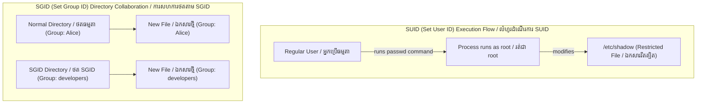
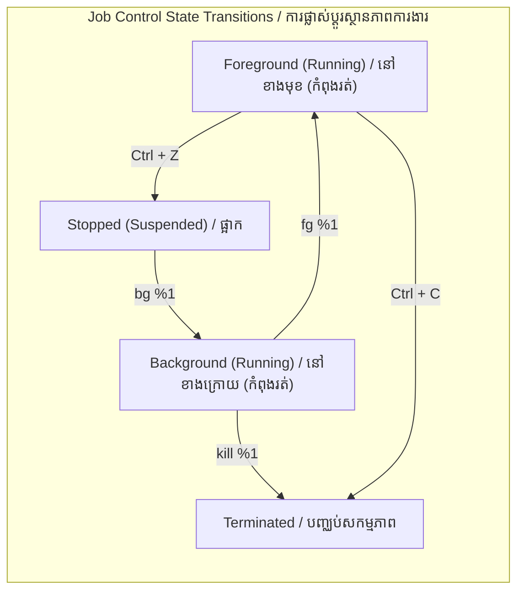

# Week 3 — Hardware, Networking, Security, Permissions, and Services / ផ្នែករឹង, បណ្តាញ, សន្តិសុខ, សិទ្ធិប្រើប្រាស់ និងសេវាកម្ម

| Course / វគ្គសិក្សា | Operating System (Linux Essentials) / ប្រព័ន្ធប្រតិបត្តិការ (មូលដ្ឋានគ្រឹះ Linux) |
|---|---|
| **Weekly Study Time / រយៈពេលសិក្សាប្រចាំសប្តាហ៍** | 10 Hours / ១០ ម៉ោង |
| **Schedule / កាលវិភាគ** | Saturday: 8:00 AM - 12:00 PM (4h) & 2:00 PM - 4:00 PM (2h) <br> Sunday: 8:00 AM - 12:00 PM (4h) |
| **Syllabus CLOs / សញ្ញាបត្រ CLO** | CLO8: Manage Users, Groups, and File Permissions in Linux <br> CLO9: Understand Linux Process Management and System Monitoring |

---

## 📅 Session 7: Computer Hardware & Network Configuration (Saturday Morning — 4 Hours) / ផ្នែកទី៧៖ ផ្នែករឹងកុំព្យូទ័រ និងការកំណត់រចនាសម្ព័ន្ធបណ្តាញ (ថ្ងៃសៅរ៍ ព្រឹក — ៤ ម៉ោង)

### 1. OS Concepts / គោលគំនិតប្រព័ន្ធប្រតិបត្តិការ
*   **Linux and Hardware / ប្រព័ន្ធ Linux និងផ្នែករឹង:**
    The Linux kernel detects and manages physical hardware components. Information is stored in virtual filesystems (e.g. `/proc` and `/sys`) and can be queried using standard utilities:
    Kernel របស់ Linux រាវរក និងគ្រប់គ្រងសមាសភាគផ្នែករឹងរូបវន្ត។ ព័ត៌មានផ្នែករឹងត្រូវបានរក្សាទុកក្នុងប្រព័ន្ធឯកសារនិម្មិត (ដូចជា `/proc` និង `/sys`) ហើយអាចត្រូវបានសាកសួរតាមរយៈឧបករណ៍ប្រើប្រាស់ស្តង់ដារ៖
    *   *CPU:* The central processor executing machine instructions.
        **CPU (អង្គគណនាចំណុចកណ្តាល):** ខួរក្បាលចម្បងសម្រាប់ដំណើរការ និងអនុវត្តការណែនាំពាក្យបញ្ជា។
    *   *RAM:* Volatile main memory used by running processes.
        **RAM (អង្គចងចាំបណ្តោះអាសន្ន):** អង្គចងចាំចម្បងដែលប្រើប្រាស់ដោយដំណើរការកំពុងរត់។
    *   *Storage Devices:* Disk drives and partitions. Disks are represented as files in `/dev/` (e.g. `/dev/sda` or `/dev/nvme0n1`).
        **ឧបករណ៍ផ្ទុកទិន្នន័យ (Storage Devices):** ថាសរឹង និងភាគថាស (partitions)។ ថាសរឹងត្រូវបានតំណាងជាឯកសារនៅក្នុងថត `/dev/` (ឧទាហរណ៍៖ `/dev/sda` ឬ `/dev/nvme0n1`)។
    *   *Buses (PCI & USB):* Connectivity channels for internal cards and external peripherals.
        **Buses (PCI & USB):** ច្រកតភ្ជាប់សម្រាប់កាតខាងក្នុង និងឧបករណ៍ភ្ជាប់ខាងក្រៅ។
*   **Basic Networking Concepts / គោលគំនិតបណ្តាញមូលដ្ឋាន:**
    *   *IP Address:* A unique numerical label assigned to each device connected to a computer network (e.g., `192.168.1.5`).
        **អាសយដ្ឋាន IP (IP Address):** ស្លាកលេខសម្គាល់តែមួយគត់ដែលត្រូវបានចាត់ចែងឱ្យទៅឧបករណ៍នីមួយៗដែលបានភ្ជាប់ទៅបណ្តាញកុំព្យូទ័រ (ឧទាហរណ៍៖ `192.168.1.5`)។
    *   *Routing:* Deciding the path for network packets to travel from the local host to a remote gateway.
        **ការកំណត់ផ្លូវ (Routing):** ការសម្រេចចិត្តជ្រើសរើសផ្លូវសម្រាប់កញ្ចប់ទិន្នន័យបណ្តាញ (network packets) ធ្វើដំណើរពីម៉ាស៊ីនក្នុងស្រុកទៅកាន់ gateway ពីចម្ងាយ។
    *   *DNS (Domain Name System):* Translates human-readable domain names (e.g., `google.com`) into IP addresses.
        **DNS (Domain Name System):** បកប្រែឈ្មោះដែនដែលមនុស្សអាចអានបាន (ឧទាហរណ៍៖ `google.com`) ទៅជាអាសយដ្ឋាន IP។
    *   *Port Sockets:* Numerical endpoints mapping network traffic to specific software applications (e.g. HTTP on port 80, SSH on port 22).
        **រន្ធ Socket (Port Sockets):** ច្រកលេខកូដចុងក្រោយដែលភ្ជាប់ចរាចរណ៍បណ្តាញទៅកាន់កម្មវិធីជាក់លាក់ (ឧទាហរណ៍៖ HTTP ប្រើរន្ធ 80, SSH ប្រើរន្ធ 22)។

### 2. Command Reference / ឯកសារយោងពាក្យបញ្ជា

| Command / បញ្ជា | Option/Args / ជម្រើស | Description (English) | សេចក្តីពិពណ៌នា (ភាសាខ្មែរ) | Example / ឧទាហរណ៍ |
| :--- | :--- | :--- | :--- | :--- |
| `lscpu` | None | Display detailed information about the CPU architecture | បង្ហាញព័ត៌មានលម្អិតអំពីស្ថាបត្យកម្ម CPU | `lscpu` |
| `lsblk` | None | List block storage devices (hard drives, partitions) | បង្ហាញបញ្ជីឧបករណ៍ផ្ទុកទិន្នន័យ block (ថាសរឹង, ភាគថាស) | `lsblk` |
| `free` | `-h` | Display RAM memory and swap utilization metrics | បង្ហាញព័ត៌មាន RAM និង Swap space | `free -h` |
| `lshw` | `-short` | Show a brief listing of overall system hardware layout | បង្ហាញប្លង់ផ្នែករឹងសង្ខេបរបស់ប្រព័ន្ធទាំងមូល | `sudo lshw -short` |
| `lspci` | None | List all PCI buses and connected PCI devices | បង្ហាញបញ្ជីឧបករណ៍ភ្ជាប់តាមរន្ធ PCI ទាំងអស់ | `lspci` |
| `lsusb` | None | List all USB controllers and connected USB devices | បង្ហាញបញ្ជីឧបករណ៍ភ្ជាប់តាមរន្ធ USB ទាំងអស់ | `lsusb` |
| `ip` | `addr` / `route` | Show network interfaces, IP addresses, or routing table | បង្ហាញ Interface បណ្តាញ, អាសយដ្ឋាន IP ឬតារាងកំណត់ផ្លូវ | `ip addr` |
| `ping` | `-c [num]` | Send packets to verify host connectivity | ផ្ញើកញ្ចប់ទិន្នន័យដើម្បីផ្ទៀងផ្ទាត់ការតភ្ជាប់ជាមួយម៉ាស៊ីនគោលដៅ | `ping -c 4 8.8.8.8` |
| `ss` | `-tulpn` | Display active listening ports, sockets, and processes | បង្ហាញរន្ធបណ្តាញដែលកំពុង listening សកម្ម និងដំណើរការរបស់វា | `sudo ss -tulpn` |
| `nslookup` / `dig`| `[domain]` | Query DNS servers to translate name to IP address | សាកសួរម៉ាស៊ីនមេ DNS ដើម្បីបកប្រែឈ្មោះដែនជា IP | `nslookup google.com` |
| `traceroute` | `[host]` | Trace the path/hops network packets take to a host | តាមដានផ្លូវដែលកញ្ចប់ទិន្នន័យបណ្តាញឆ្លងកាត់ទៅ host គោលដៅ | `traceroute 8.8.8.8` |
| `ssh` | `[user]@[host]`| Connect to a remote host securely via SSH protocol | ភ្ជាប់ទៅកាន់ម៉ាស៊ីនពីចម្ងាយដោយសុវត្ថិភាពតាមពិធីការ SSH | `ssh student@192.168.1.10` |
| `scp` | `[src] [dest]` | Securely copy files between local and remote hosts | ចម្លងឯកសារដោយសុវត្ថិភាពរវាងម៉ាស៊ីនក្នុងស្រុក និងពីចម្ងាយ | `scp file.txt admin@192.168.1.10:/tmp` |

### 3. Part 7 — Hands-on Examples / ឧទាហរណ៍អនុវត្តផ្ទាល់ផ្នែកទី៧

#### A. Auditing System Hardware / ការធ្វើសវនកម្មផ្នែករឹងប្រព័ន្ធ
We can query hardware configurations directly from the terminal:
(យើងអាចសាកសួរការកំណត់រចនាសម្ព័ន្ធផ្នែករឹងផ្ទាល់ពី terminal៖)
```bash
# Display CPU architecture and core details
lscpu

# View RAM details in human-readable format
free -h

# List hard drive block layout
lsblk
```

#### B. Network Configuration and Diagnostics / ការកំណត់រចនាសម្ព័ន្ធ និងការវិភាគបណ្តាញ
Verify interface configurations and diagnose network routing:
(ផ្ទៀងផ្ទាត់ការកំណត់រចនាសម្ព័ន្ធ interface និងវិភាគការកំណត់ផ្លូវបណ្តាញ៖)
```bash
# Check your IP address
ip addr

# Verify DNS name resolution
nslookup google.com

# Test network roundtrip connectivity
ping -c 3 8.8.8.8

# Check active listening network ports
sudo ss -tulpn
```

---

### 4. Session 7 Exercises (To Do) / លំហាត់អនុវត្តផ្នែកទី៧ (ត្រូវធ្វើ)
1. Run `lscpu` and extract the CPU Model Name. Write it to `hw_audit.txt`. *(Hint: Use `lscpu | grep "Model name" > hw_audit.txt`)*
   (រត់ `lscpu` និងទាញយកឈ្មោះម៉ូដែល CPU (CPU Model Name)។ សរសេរវាទៅក្នុង `hw_audit.txt`។ *(ជំនួយ៖ ប្រើប្រាស់ `lscpu | grep "Model name" > hw_audit.txt`)*)
2. Append the total RAM size (from `free -h`) and block storage devices (from `lsblk`) to `hw_audit.txt`. *(Hint: Use `free -h >> hw_audit.txt` and `lsblk >> hw_audit.txt`)*
   (សរសេរបន្ថែមទំហំ RAM សរុប (ពី `free -h`) និងឧបករណ៍ផ្ទុកទិន្នន័យ block (ពី `lsblk`) ទៅក្នុង `hw_audit.txt`។ *(ជំនួយ៖ ប្រើប្រាស់ `free -h >> hw_audit.txt` និង `lsblk >> hw_audit.txt`)*)
3. Check your system routing table using `ip route` and append the default gateway IP to `hw_audit.txt`. *(Hint: Use `ip route | grep default >> hw_audit.txt`)*
   (ពិនិត្យមើលតារាងកំណត់ផ្លូវប្រព័ន្ធដោយប្រើ `ip route` រួចសរសេរបន្ថែម IP Gateway លំនាំដើមទៅក្នុង `hw_audit.txt`។ *(ជំនួយ៖ ប្រើប្រាស់ `ip route | grep default >> hw_audit.txt`)*)
4. Perform DNS lookup on `itc.edu.kh` (or any university domain) using `nslookup` and redirect output to `dns_audit.txt`. *(Hint: Use `nslookup itc.edu.kh > dns_audit.txt`)*
   (ធ្វើការស្វែងរក DNS លើដែន `itc.edu.kh` ដោយប្រើ `nslookup` រួចបង្វែរលទ្ធផលទៅកាន់ `dns_audit.txt`។ *(ជំនួយ៖ ប្រើប្រាស់ `nslookup itc.edu.kh > dns_audit.txt`)*)
5. Ping the loopback address `127.0.0.1` 4 times and append output to `dns_audit.txt`. *(Hint: Use `ping -c 4 127.0.0.1 >> dns_audit.txt`)*
   (Ping ទៅកាន់អាសយដ្ឋាន loopback `127.0.0.1` ចំនួន ៤ ដង រួចសរសេរបន្ថែមលទ្ធផលទៅក្នុង `dns_audit.txt`។ *(ជំនួយ៖ ប្រើប្រាស់ `ping -c 4 127.0.0.1 >> dns_audit.txt`)*)

---

## 📅 Session 8: Account Administration & User Security (Saturday Afternoon — 2 Hours) / ផ្នែកទី៨៖ ការគ្រប់គ្រងគណនីប្រព័ន្ធ និងសន្តិសុខអ្នកប្រើប្រាស់ (ថ្ងៃសៅរ៍ រសៀល — ២ ម៉ោង)

### 1. OS Concepts / គោលគំនិតប្រព័ន្ធប្រតិបត្តិការ
*   **Multi-User Architecture / រចនាសម្ព័ន្ធពហុអ្នកប្រើប្រាស់:**
    Linux isolates users to ensure stability and security.
    Linux បំបែកគណនីអ្នកប្រើប្រាស់ពីគ្នាដើម្បីធានាស្ថិរភាព និងសន្តិសុខប្រព័ន្ធ។
    *   **User IDs (UIDs):** Unique numbers identifying accounts. Root is always `0`. System services use UIDs `1-999`. Human users start at `1000`.
        **User ID (UID):** លេខសម្គាល់ពិសេសរបស់គណនី។ root គឺលេខ 0 ជានិច្ច។ សេវាកម្មប្រព័ន្ធប្រើ UID ពី ១ ដល់ ៩៩៩។ មនុស្សទូទៅមាន UID ចាប់ពី ១០០០ ឡើងទៅ។
    *   **Group IDs (GIDs):** Group identifiers used to manage access permission for sets of users.
        **Group ID (GID):** លេខសម្គាល់ក្រុម ដែលប្រើសម្រាប់គ្រប់គ្រងសិទ្ធិដំណើរការរួមរបស់គណនីជាច្រើន។
*   **System Databases / មូលដ្ឋានទិន្នន័យប្រព័ន្ធ:**
    *   `/etc/passwd`: Publicly readable list of accounts, UIDs, GIDs, home directories, and login shells.
        (ឯកសារបញ្ជីគណនី UIDs, GIDs, ថតផ្ទាល់ខ្លួន និង shell លុកចូល ដែលអាចអានជាសាធារណៈ)
    *   `/etc/shadow`: Protected file containing encrypted passwords. Only readable by root.
        (ឯកសារសម្ងាត់ផ្ទុកលេខសម្ងាត់កូដនីយកម្ម ដែលអានបានតែ root ប៉ុណ្ណោះ)
    *   `/etc/group`: List of groups and their associated user memberships.
        (បញ្ជីឈ្មោះក្រុម និងសមាជិកដែលស្ថិតក្នុងក្រុមនីមួយៗ)
*   **Privilege Escalation / ការដំឡើងសិទ្ធិគ្រប់គ្រង:**
    *   `su`: Switch User. Changes shell context to another user (requires their password).
        (ប្តូរបរិបទ shell ទៅកាន់គណនីផ្សេងទៀត ដោយទាមទារលេខសម្ងាត់គណនីនោះ)
    *   `sudo`: SuperUser Do. Runs a command with root privileges (requires current user's password).
        (ដំណើរការបញ្ជាក្រោមសិទ្ធិជា root ដោយទាមទារលេខសម្ងាត់គណនីបច្ចុប្បន្ន)

### 2. Command Reference / ឯកសារយោងពាក្យបញ្ជា

| Command / បញ្ជា | Option / ជម្រើស | Description (English) | សេចក្តីពិពណ៌នា (ភាសាខ្មែរ) | Example / ឧទាហរណ៍ |
| :--- | :--- | :--- | :--- | :--- |
| `groupadd` | None | Create a new system group | បង្កើតក្រុមប្រព័ន្ធថ្មី | `sudo groupadd developers` |
| `useradd` | `-m` | Create user and generate default home directory | បង្កើតអ្នកប្រើប្រាស់ និងបង្កើតថតផ្ទាល់ខ្លួន Home ឱ្យពួកគេ | `sudo useradd -m alice` |
| | `-g` | Set user's primary group | កំណត់ក្រុមចម្បង (primary group) របស់គណនី | `sudo useradd -m -g devs bob` |
| `usermod` | `-aG` | Append user to secondary/supplementary group | បន្ថែមគណនីទៅកាន់ក្រុមបន្ទាប់បន្សំ | `sudo usermod -aG devs alice` |
| `passwd` | None | Set or change user's login password | កំណត់ ឬកែប្រែលេខសម្ងាត់គណនី | `sudo passwd alice` |
| `userdel` | `-r` | Delete user and remove their home folder | លុបគណនី និងលុបទាំងថតផ្ទាល់ខ្លួន Home ចោល | `sudo userdel -r alice` |
| `groupdel` | None | Delete group from database | លុបក្រុមចេញពីប្រព័ន្ធ | `sudo groupdel developers` |
| `id` | None | Show current UID, GID, and groups for a user | បង្ហាញ UID, GID និងក្រុមរបស់គណនី | `id student` |
| `su` | `-` | Switch shell context (defaults to root user) | ប្តូរបរិបទការងារទៅ root ឬគណនីផ្សេង | `su -` |
| `sudo` | None | Execute target command with root privileges | ដំណើរការបញ្ជាក្រោមសិទ្ធិជា root | `sudo cat /etc/shadow` |
| `whoami` | None | Show current active username | បង្ហាញឈ្មោះគណនីកំពុងសកម្ម | `whoami` |

---

### 3. Session 8 Exercises (To Do) / លំហាត់អនុវត្តផ្នែកទី៨ (ត្រូវធ្វើ)
1. Inspect the first 5 entries of `/etc/passwd` and save the list to `passwd_head.txt`. *(Hint: Use `head -n 5 /etc/passwd > passwd_head.txt`)*
   (ពិនិត្យមើលគណនី ៥ ដំបូងក្នុង `/etc/passwd` រួចរក្សាទុកក្នុង `passwd_head.txt`។ *(ជំនួយ៖ ប្រើប្រាស់ `head -n 5 /etc/passwd > passwd_head.txt`)*)
2. Create a group named `study_group` and a user named `learner` with `study_group` as their primary group.
   (បង្កើតក្រុមឈ្មោះ `study_group` និងអ្នកប្រើប្រាស់ `learner` ដោយកំណត់ក្រុមចម្បងរបស់ពួកគេជា `study_group`)
3. Verify GID and group settings of `learner` using `id` and redirect the output to `learner_id.txt`. *(Hint: Use `id learner > learner_id.txt`)*
   (ផ្ទៀងផ្ទាត់ការកំណត់ GID និងក្រុមរបស់ `learner` ដោយប្រើ `id` រួចបង្វែរលទ្ធផលទៅ `learner_id.txt`។ *(ជំនួយ៖ ប្រើប្រាស់ `id learner > learner_id.txt`)*)
4. Delete the user `learner` and group `study_group` from the system using cleanup commands.
   (លុបអ្នកប្រើប្រាស់ `learner` និងក្រុម `study_group` ចេញពីប្រព័ន្ធវិញដោយប្រើបញ្ជាសម្អាត)

---

## 📅 Session 9: File Permissions, SUID/SGID & Process Monitoring (Sunday Morning — 4 Hours) / ផ្នែកទី៩៖ សិទ្ធិប្រើប្រាស់ឯកសារ, SUID/SGID & ការត្រួតពិនិត្យដំណើរការ (ថ្ងៃអាទិត្យ ព្រឹក — ៤ ម៉ោង)

### 1. OS Concepts / គោលគំនិតប្រព័ន្ធប្រតិបត្តិការ
*   **Permissions Bits (`rwx`) / ប៊ីតសិទ្ធិប្រើប្រាស់:**
    *   `r` (Read = 4): View file contents / list directory files.
    *   `w` (Write = 2): Modify file contents / create or delete files in a directory.
    *   `x` (Execute = 1): Run file as binary/script / enter directory using `cd`.
*   **Representation Schemes / របៀបតំណាងសិទ្ធិប្រើប្រាស់:**
    *   *Symbolic Mode:* Modify bits using symbols (e.g. `chmod u+x,g-w file.txt`).
    *   *Octal Mode:* Assign absolute values from sums (e.g. `chmod 755 file.txt` -> Owner: rwx (7), Group: r-x (5), Others: r-x (5)).
*   **Special Permissions / សិទ្ធិពិសេស:**
    *   **SUID (Set User ID - Octal 4):** Indicated by `s` in the owner execute field. The program runs with the privileges of the file *owner* (typically root).
        **SUID:** បង្ហាញដោយអក្សរ `s` នៅវាល execute របស់ម្ចាស់។ កម្មវិធីដំណើរការក្រោមសិទ្ធិរបស់ **ម្ចាស់ឯកសារ** (ជាទូទៅគឺ root) ទោះបីជាអ្នកប្រើធម្មតារត់វាក៏ដោយ។
    *   **SGID (Set Group ID - Octal 2):** Indicated by `s` in the group execute field. For directories, files created inside inherit the parent directory's group instead of the creator's primary group.
        **SGID:** បង្ហាញដោយអក្សរ `s` នៅវាល execute របស់ក្រុម។ សម្រាប់ថតឯកសារ រាល់ឯកសារថ្មីៗដែលបង្កើតក្នុងថតនោះ នឹងទទួលបានក្រុមកាន់កាប់ពី **ថតមេ** របស់វាដោយស្វ័យប្រវត្តិ។
    *   **Sticky Bit (Octal 1):** Indicated by `t` in the other execute field. For directories (e.g. `/tmp`), only the file owner, directory owner, or root can delete/rename files inside.
        **Sticky Bit:** បង្ហាញដោយអក្សរ `t` នៅវាល execute របស់អ្នកដទៃ។ សម្រាប់ថតឯកសារ មានតែម្ចាស់ឯកសារ ម្ចាស់ថត ឬ root ប៉ុណ្ណោះដែលអាចលុប ឬប្តូរឈ្មោះឯកសារខាងក្នុងបាន (ទប់ស្កាត់ការលុបឯកសារគ្នាទៅវិញទៅមក)។



*   **Processes / ដំណើរការ:**
    Running instances of program binaries in memory, identified by a **Process ID (PID)**.
    គំរូសកម្មនៃកម្មវិធីនៅក្នុង memory សម្គាល់ដោយ **Process ID (PID)**។
    *   *States:* Running (R), Sleeping (S), Stopped (T), Zombie (Z).
*   **Job Control / ការគ្រប់គ្រងការងារ:**
    Background job management frees the terminal prompt:
    ការគ្រប់គ្រងការងារនៅ background ជួយដោះលែង terminal ឱ្យទំនេរ៖
    *   `&`: Run command in the background (រត់បញ្ជានៅ background ភ្លាមៗ).
    *   `Ctrl+C`: Terminates foreground process (សម្លាប់ចោលនូវដំណើរការនៅខាងមុខ).
    *   `Ctrl+Z`: Suspends foreground process (ផ្អាកបណ្តោះអាសន្ននូវដំណើរការនៅខាងមុខ).
    *   `jobs`: Lists jobs managed by the current shell (បង្ហាញបញ្ជីការងាររបស់ shell បច្ចុប្បន្ន).
    *   `fg` / `bg`: Moves jobs to the foreground / resumes in background (នាំការងារមកខាងមុខ / ដំណើរការឡើងវិញនៅ background).



*   **Systemd Services / សេវាកម្ម Systemd:**
    Daemon processes managed centrally via `systemctl` (ដំណើរការសេវាកម្មខាងក្រោយដែលគ្រប់គ្រងដោយ `systemctl`)។
*   **Cron Daemon:** Schedule tasks to run automatically at configured times (កំណត់កាលវិភាគការងារឱ្យរត់ស្វ័យប្រវត្តិតាមពេលកំណត់)។

### 2. Command Reference / ឯកសារយោងពាក្យបញ្ជា

| Command / បញ្ជា | Usage / របៀបប្រើប្រាស់ | Description (English) | សេចក្តីពិពណ៌នា (ភាសាខ្មែរ) | Example / ឧទាហរណ៍ |
| :--- | :--- | :--- | :--- | :--- |
| `chmod` | `chmod [mode] [file]` | Modify file/directory permissions | កែប្រែសិទ្ធិឯកសារ ឬថត | `chmod 755 script.sh` |
| | `chmod u+s [file]` | Add SUID special permission bit | បន្ថែមសិទ្ធិពិសេស SUID លើឯកសារ | `sudo chmod u+s tool` |
| | `chmod g+s [dir]` | Add SGID group inheritance bit to directory | បន្ថែមសិទ្ធិ SGID លើថតទិន្នន័យ | `sudo chmod g+s shared/` |
| | `chmod +t [dir]` | Add Sticky Bit directory delete restriction | បន្ថែមសិទ្ធិ Sticky Bit លើថតទិន្នន័យ | `sudo chmod +t shared/` |
| `chown` | `chown [owner] [file]`| Change file owner | ផ្លាស់ប្តូរម្ចាស់ឯកសារ | `sudo chown root file.conf` |
| `chgrp` | `chgrp [group] [file]`| Change group ownership | ផ្លាស់ប្តូរក្រុមកាន់កាប់របស់ឯកសារ | `sudo chgrp devs file.txt` |
| `ps` | `aux` | List all running processes on the system (BSD style) | បង្ហាញបញ្ជីដំណើរការកំពុងរត់ទាំងអស់ក្នុងប្រព័ន្ធ | `ps aux` |
| `jobs` | None | List active shell job numbers and statuses | បង្ហាញស្ថានភាពការងារនៅក្នុង shell session | `jobs` |
| `fg` / `bg` | `%[job_id]` | Bring job to foreground / run in background | នាំការងារមកខាងមុខ / ដំណើរការនៅ background | `fg %1` |
| `kill` | `[PID]` / `-9 [PID]` | Send default SIGTERM / SIGKILL to PID | ផ្ញើសញ្ញា SIGTERM / SIGKILL ទៅកាន់ PID | `kill -9 5829` |
| `systemctl`| `status` / `start` | View status or start a Systemd service daemon | ពិនិត្យមើលស្ថានភាព ឬចាប់ផ្តើមសេវាកម្ម Systemd | `systemctl status sshd` |

### 3. Part 9 — Hands-on Examples / ឧទាហរណ៍អនុវត្តផ្ទាល់ផ្នែកទី៩

#### A. SUID (Set User ID) Behavior / ដំណើរការរបស់ SUID (Set User ID)
Find a standard system command that has SUID enabled:
(ស្វែងរកពាក្យបញ្ជាប្រព័ន្ធស្តង់ដារដែលមានបើកដំណើរការ SUID៖)
```bash
# Locate the passwd binary and list its permissions
ls -l /usr/bin/passwd
# Output: -rwsr-xr-x 1 root root 68208 May 27 2026 /usr/bin/passwd
# Note the 's' in the owner's execute field. This indicates SUID.
```

#### B. SGID (Set Group ID) for Collaborative Directories / SGID (Set Group ID) សម្រាប់ថតសហការគ្នា
Create a collaborative directory where newly created files automatically inherit the parent directory's group:
(បង្កើតថតសហការគ្នាមួយ ដែលរាល់ឯកសារបង្កើតថ្មីៗនឹងទទួលបានក្រុមកាន់កាប់ពីថតមេដោយស្វ័យប្រវត្តិ៖)
```bash
# Create a test directory
mkdir project_share

# Assign group ownership to a group you belong to (e.g. 'sudo' or 'developers')
sudo chgrp sudo project_share

# Enable SGID on the directory
chmod g+s project_share

# Check directory permissions (note the 's' in the group's execute field)
ls -ld project_share
# Output: drwxrws--- 2 student sudo 4096 May 27 2026 project_share

# Create a file inside as a normal user
touch project_share/new_doc.txt
ls -l project_share/new_doc.txt
# Output: -rw-r----- 1 student sudo 0 May 27 2026 new_doc.txt
```

#### C. Sticky Bit for Shared Temporary Folders / Sticky Bit សម្រាប់ថតបណ្តោះអាសន្នរួមគ្នា
Demonstrate that the sticky bit prevents users from deleting each other's files:
(បង្ហាញថា sticky bit ការពារអ្នកប្រើប្រាស់មិនឱ្យលុបឯកសាររបស់គ្នាទៅវិញទៅមក៖)
```bash
# List /tmp folder permissions (note the 't' at the end)
ls -ld /tmp
# Output: drwxrwxrwt 12 root root 4096 May 27 2026 /tmp
```

#### D. Process and Job Control / การគ្រប់គ្រងដំណើរការ និងការងារ
Control background and foreground processes using shell jobs:
(គ្រប់គ្រងដំណើរការ background និង foreground ដោយប្រើ shell jobs៖)
```bash
# Start a sleep task in the background
sleep 600 &
# Output: [1] 23456 (Job ID is 1, Process ID is 23456)

# List running jobs in the shell
jobs

# Bring the background job to the foreground
fg %1

# Suspend/pause the foreground process
# Press Ctrl+Z
# Output: [1]+  Stopped                 sleep 600

# Resume the process in the background
bg %1

# Terminate the job using kill
kill %1
```

---

### 4. Session 9 Exercises (To Do) / លំហាត់អនុវត្តផ្នែកទី៩ (ត្រូវធ្វើ)
1. Start two background tasks: `sleep 450 &` and `sleep 550 &`.
   (ចាប់ផ្តើមការងារ background ពីរ៖ `sleep 450 &` និង `sleep 550 &`)
2. Run `jobs` and redirect the output list to `jobs_list.txt`. *(Hint: Use `jobs > jobs_list.txt`)*
   (ដំណើរការ `jobs` រួចបង្វែរលទ្ធផលទៅកាន់ `jobs_list.txt`)
3. Terminate both sleep processes using their PIDs.
   (បញ្ឈប់ដំណើរការ sleep ទាំងពីរដោយប្រើប្រាស់លេខ PID របស់ពួកវា)
4. Create a directory named `shared_workspace/` and assign SUID and SGID to it. Run `ls -ld shared_workspace` and redirect output to `permissions_check.txt`. *(Hint: Use `ls -ld shared_workspace > permissions_check.txt`)*
   (បង្កើតថតឈ្មោះ `shared_workspace/` និងកំណត់សិទ្ធិពិសេស SUID និង SGID លើវា។ រត់ `ls -ld shared_workspace` រួចបង្វែរលទ្ធផលទៅកាន់ `permissions_check.txt`)
5. Check Systemd service status of the cron daemon (`systemctl status cron`) and redirect it to `cron_status.txt`. *(Hint: Use `systemctl status cron > cron_status.txt`)*
   (ពិនិត្យស្ថានភាពសេវាកម្ម Systemd របស់កម្មវិធី cron (`systemctl status cron`) រួចបង្វែរលទ្ធផលទៅកាន់ `cron_status.txt`។ *(ជំនួយ៖ ប្រើប្រាស់ `systemctl status cron > cron_status.txt`)*)

---

## 🧩 Week 3 Challenge Scenario: "Collaborative Server Provisioning & Rogue Network Service Recovery" / សេណារីយ៉ូអនុវត្តប្រចាំសប្តាហ៍ទី៣៖ "ការសហការរៀបចំម៉ាស៊ីនមេ និងការស្ដារប្រព័ន្ធពីសេវាកម្មរំខានបណ្តាញ"

### Background / ផ្ទៃរឿង
You are a Systems Administrator at **Apex Systems**. The management office requires a secure, collaborative workspace for Project **"Mercury"**. In addition, the staging web server has slowed down, and developers suspect a runaway script loop is hogging network resources and ports.
អ្នកគឺជាអភិបាលប្រព័ន្ធ (Systems Administrator) នៅក្រុមហ៊ុន **Apex Systems**។ ការិយាល័យគ្រប់គ្រងបានស្នើសុំបង្កើតកន្លែងការងាររួមគ្នាប្រកបដោយសុវត្ថិភាពសម្រាប់គម្រោង **"Mercury"**។ បន្ថែមលើនេះ ម៉ាស៊ីនមេសម្រាប់ដំឡើងបណ្តោះអាសន្នដំណើរការយឺតខ្លាំង ហើយក្រុមអភិវឌ្ឍន៍សង្ស័យថាមានស្គ្រីបរត់រង្វិលជុំឥតឈប់កំពុងស៊ីធនធានបណ្តាញ និងរន្ធដោត។

### Mission Steps / ជំហានបេសកកម្ម
1. **Simulate Setup Environments / បង្កើតស្ថានភាពគំរូ៖** Run the following preparation script:
   (បង្កើតស្ថានភាពគំរូដោយដំណើរការ៖)
   ```bash
   # Part A: Project Mercury Accounts
   sudo groupadd -f mercury_team
   sudo id -u engineer_alice &>/dev/null || sudo useradd -m -g mercury_team engineer_alice
   sudo id -u engineer_bob &>/dev/null || sudo useradd -m -g mercury_team engineer_bob
   sudo mkdir -p /var/tmp/mercury_dev
   sudo chmod 777 /var/tmp/mercury_dev

   # Part B: Rogue Process Setup
   cat << 'EOF' > rogue_loop.sh
   #!/bin/bash
   while true; do
       sleep 2
   done
   EOF
   chmod +x rogue_loop.sh
   ./rogue_loop.sh &
   ```
2. **Audit Hardware Specifications / ធ្វើសវនកម្មលក្ខណៈបច្ចេកទេសផ្នែករឹង៖**
   * Audit the machine's hardware to report specifications. Inspect CPU cores, total memory, and block storage devices.
     (ធ្វើសវនកម្មផ្នែករឹងម៉ាស៊ីន ដើម្បីរាយការណ៍ពីលក្ខណៈបច្ចេកទេស។ ពិនិត្យមើលស្នូល CPU, អង្គចងចាំសរុប RAM និងឧបករណ៍ផ្ទុកទិន្នន័យ block)
   * Write the hardware specs summary to `sys_spec.txt`. *(Hint: Use `lscpu > sys_spec.txt`)*
     (សរសេរសេចក្តីសង្ខេបផ្នែករឹងទៅកាន់ឯកសារ `sys_spec.txt`។ *(ជំនួយ៖ ប្រើប្រាស់ `lscpu > sys_spec.txt`)*)
3. **Check Open Port Bindings / ពិនិត្យមើលរន្ធដោតបណ្តាញកំពុងបើក៖**
   * Locate active open listening network sockets and ports on the machine.
     (ស្វែងរកទីតាំងរន្ធតភ្ជាប់បណ្តាញ និងរន្ធដែលកំពុង listening សកម្មលើម៉ាស៊ីន)
   * Write the open port socket listing to `ports_active.txt`. *(Hint: Use `ss -lntu > ports_active.txt`)*
     (សរសេរបញ្ជីរន្ធបណ្តាញដែលកំពុងបើកទៅកាន់ឯកសារ `ports_active.txt`។ *(ជំនួយ៖ ប្រើប្រាស់ `ss -lntu > ports_active.txt`)*)
4. **Configure Project Mercury Collaborative Workspace / កំណត់រចនាសម្ព័ន្ធកន្លែងការងាររួមគ្នា Mercury៖**
   * The folder `/var/tmp/mercury_dev` must be configured for the group `mercury_team`.
     (ថត `/var/tmp/mercury_dev` ត្រូវតែកំណត់សិទ្ធិឱ្យក្រុម `mercury_team`)
   * Set the folder owner to `engineer_alice` and group to `mercury_team`.
     (កំណត់ម្ចាស់ថតទៅឱ្យ `engineer_alice` និងក្រុមកាន់កាប់ទៅឱ្យ `mercury_team`)
   * Modify permissions of `/var/tmp/mercury_dev` using octal mode so that:
     (កែប្រែសិទ្ធិនៃថត `/var/tmp/mercury_dev` ដោយប្រើរបៀបលេខប្រព័ន្ធ ៨ ដើម្បីឱ្យ៖)
     * The owner has read, write, and execute (`rwx` = 7). (ម្ចាស់មានសិទ្ធិពេញលេញ `rwx` = 7)
     * The group has read, write, and execute (`rwx` = 7). (ក្រុមមានសិទ្ធិពេញលេញ `rwx` = 7)
     * Others have no permissions (`---` = 0). (អ្នកផ្សេងទៀតគ្មានសិទ្ធិអ្វីទាំងអស់ `---` = 0)
     * Add **SGID** (Set Group ID) to the folder (using octal `2` prefix, e.g. `2770`), ensuring that any files created inside by Bob or Alice inherit the `mercury_team` group ownership automatically.
       (បន្ថែមសិទ្ធិ **SGID** លើថតនោះ (ប្រើបុព្វបទលេខ `2` ឧទាហរណ៍៖ `2770`) ដើម្បីធានាថាឯកសារទាំងឡាយដែលបង្កើតដោយ Bob ឬ Alice នឹងទទួលបានក្រុមកាន់កាប់ `mercury_team` ដោយស្វ័យប្រវត្ត)
   * Verify the folder permissions and group ownership using `ls -ld` and redirect output to `mercury_permissions.txt`. *(Hint: Use `ls -ld /var/tmp/mercury_dev > mercury_permissions.txt`)*
     (ផ្ទៀងផ្ទាត់សិទ្ធិថត និងក្រុមកាន់កាប់ដោយប្រើ `ls -ld` រួចបង្វែរលទ្ធផលទៅ `mercury_permissions.txt`។ *(ជំនួយ៖ ប្រើប្រាស់ `ls -ld /var/tmp/mercury_dev > mercury_permissions.txt`)*)
5. **Diagnose and Recover Rogue Server / ស្វែងរក និងស្ដារម៉ាស៊ីនមេឡើងវិញ៖**
   * Use `ps aux` to locate the rogue background script named `./rogue_loop.sh` and identify its PID.
     (ប្រើ `ps aux` ដើម្បីស្វែងរកដំណើរការស្គ្រីបខូចឈ្មោះ `./rogue_loop.sh` និងកំណត់អត្តសញ្ញាណលេខ PID របស់វា)
   * Kill the runaway process using `kill` (use force kill `-9` if necessary).
     (សម្លាប់ដំណើរការនោះចោលដោយប្រើ `kill` (ឬប្រើសញ្ញាបង្ខំលុប `-9` បើចាំបាច់))
   * Verify the process is gone. Check system memory availability and write the output status to `system_recovery.txt`. *(Hint: Use `free -h > system_recovery.txt`)*
     (ផ្ទៀងផ្ទាត់ថាដំណើរការនោះបាត់ឬនៅ ពិនិត្យទំហំ RAM ដែលទំនេរ រួចកត់ត្រាទៅក្នុង `system_recovery.txt`។ *(ជំនួយ៖ ប្រើប្រាស់ `free -h > system_recovery.txt`)*)
   * Verify loopback ping connectivity. Ping `127.0.0.1` 4 times and append the results to `system_recovery.txt`. *(Hint: Use `ping -c 4 127.0.0.1 >> system_recovery.txt`)*
     (ផ្ទៀងផ្ទាត់ការតភ្ជាប់បណ្តាញ ដោយរត់ ping ទៅកាន់ `127.0.0.1` ចំនួន ៤ ដង រួចសរសេរបន្ថែមក្នុង `system_recovery.txt`។ *(ជំនួយ៖ ប្រើប្រាស់ `ping -c 4 127.0.0.1 >> system_recovery.txt`)*)
   * Clean up by deleting `rogue_loop.sh` from your directory.
     (សម្អាតប្រព័ន្ធដោយលុបឯកសារស្គ្រីប `rogue_loop.sh` ចេញពីថតរបស់អ្នក)

---

## 📝 Submission Checklist & Folder Structure / បញ្ជីផ្ទៀងផ្ទាត់ និងរចនាសម្ព័ន្ធថតត្រូវផ្ញើ
Your week submission folder `linux-essentials-<YourStudentID>/week3/` must look like this:
នៅចុងបញ្ចប់នៃសប្តាហ៍នេះ ថតកិច្ចការរបស់អ្នក `linux-essentials-<YourStudentID>/week3/` ត្រូវតែមានទម្រង់ដូចខាងក្រោម៖

```
linux-essentials-<YourStudentID>/
└── week3/
    ├── README.md (Weekly Report / របាយការណ៍ប្រចាំសប្តាហ៍)
    ├── images/
    │   ├── permissions_setup.png (Screenshot showing ls -ld of mercury_dev / រូបថតអេក្រង់ ls -ld នៃ mercury_dev)
    │   └── system_monitoring.png (Screenshot showing ps output after process kill / រូបថតអេក្រង់ ps ក្រោយសម្លាប់ដំណើរការ)
    ├── passwd_head.txt
    ├── learner_id.txt
    ├── hw_audit.txt
    ├── dns_audit.txt
    ├── permissions_check.txt
    ├── cron_status.txt
    ├── sys_spec.txt
    ├── ports_active.txt
    ├── mercury_permissions.txt
    ├── jobs_list.txt
    └── system_recovery.txt
```
