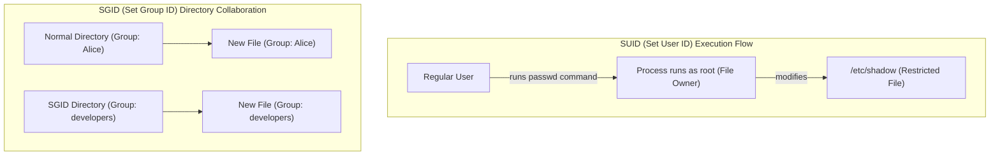
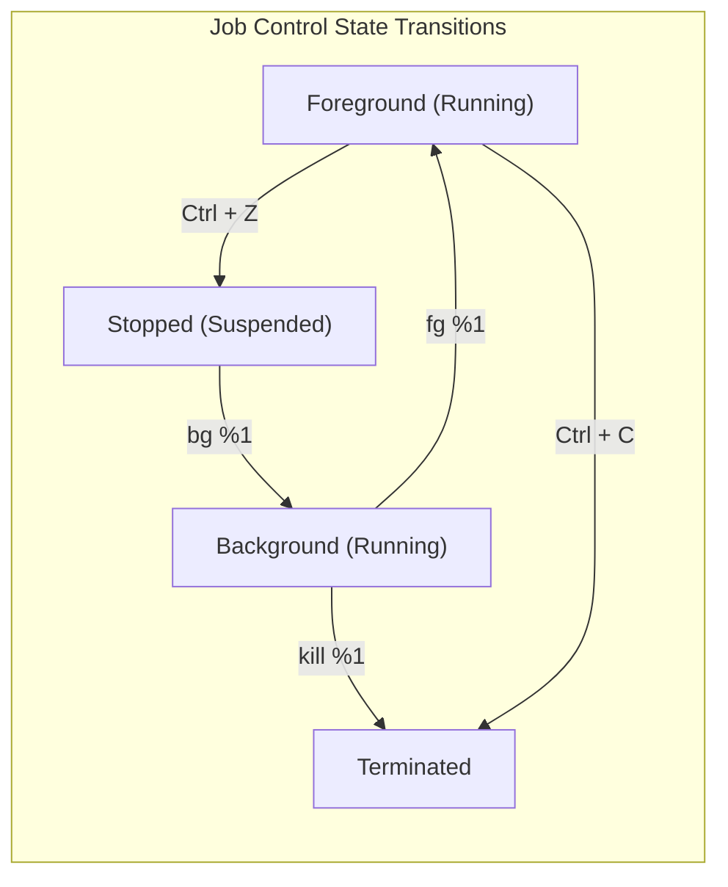

# Week 3 — Hardware, Networking, Security, Permissions, and Services

| Course | Operating System (Linux Essentials) |
|---|---|
| **Weekly Study Time** | 10 Hours |
| **Schedule** | Saturday: 8:00 AM - 12:00 PM (4h) & 2:00 PM - 4:00 PM (2h) <br> Sunday: 8:00 AM - 12:00 PM (4h) |
| **Syllabus CLOs** | CLO8: Manage Users, Groups, and File Permissions in Linux <br> CLO9: Understand Linux Process Management and System Monitoring |

---

## 📅 Session 7: Computer Hardware & Network Configuration (Saturday Morning — 4 Hours)

### 1. OS Concepts
*   **Linux and Hardware:** The Linux kernel detects and manages physical hardware components. Information is stored in virtual filesystems (e.g. `/proc` and `/sys`) and can be queried using standard utilities:
    *   *CPU:* The central processor executing machine instructions.
    *   *RAM:* Volatile main memory used by running processes.
    *   *Storage Devices:* Disk drives and partitions. Disks are represented as files in `/dev/` (e.g. `/dev/sda` or `/dev/nvme0n1`).
    *   *Buses (PCI & USB):* Connectivity channels for internal cards and external peripherals.
*   **Basic Networking Concepts:**
    *   *IP Address:* A unique numerical label assigned to each device connected to a computer network (e.g., `192.168.1.5`).
    *   *Routing:* Deciding the path for network packets to travel from the local host to a remote gateway.
    *   *DNS (Domain Name System):* Translates human-readable domain names (e.g., `google.com`) into IP addresses.
    *   *Port Sockets:* Numerical endpoints mapping network traffic to specific software applications (e.g. HTTP on port 80, SSH on port 22).

### 2. Command Reference

| Command | Option/Args | Description | Example |
| :--- | :--- | :--- | :--- |
| `lscpu` | None | Display detailed information about the CPU architecture | `lscpu` |
| `lsblk` | None | List block storage devices (hard drives, partitions) | `lsblk` |
| `free` | `-h` | Display RAM memory and swap utilization metrics | `free -h` |
| `lshw` | `-short` | Show a brief listing of overall system hardware layout | `sudo lshw -short` |
| `lspci` | None | List all PCI buses and connected PCI devices | `lspci` |
| `lsusb` | None | List all USB controllers and connected USB devices | `lsusb` |
| `ip` | `addr` / `route` | Show network interfaces, IP addresses, or routing table | `ip addr` |
| `ping` | `-c [num]` | Send packets to verify host connectivity | `ping -c 4 8.8.8.8` |
| `ss` | `-tulpn` | Display active listening ports, sockets, and processes | `sudo ss -tulpn` |
| `nslookup` / `dig`| `[domain]` | Query DNS servers to translate name to IP address | `nslookup google.com` |
| `traceroute` | `[host]` | Trace the path/hops network packets take to a host | `traceroute 8.8.8.8` |
| `ssh` | `[user]@[host]`| Connect to a remote host securely via SSH protocol | `ssh student@192.168.1.10` |
| `scp` | `[src] [dest]` | Securely copy files between local and remote hosts | `scp file.txt admin@192.168.1.10:/tmp` |

### 3. Part 7 — Hands-on Examples

#### A. Auditing System Hardware
We can query hardware configurations directly from the terminal:
```bash
# Display CPU architecture and core details
lscpu
# Output includes: Architecture: x86_64, CPU(s): 4, Model name: Intel...

# View RAM details in human-readable format
free -h
# Output showing total, used, free, and cached memory.

# List hard drive block layout
lsblk
# Output displays disk names (sda, nvme0), partition structure, and mountpoints.
```

#### B. Network Configuration and Diagnostics
Verify interface configurations and diagnose network routing:
```bash
# Check your IP address
ip addr
# Output displays network interfaces (lo, eth0, wlan0) and 'inet' IPv4 addresses.

# Verify DNS name resolution
nslookup google.com
# Output shows the DNS server IP and the resolved IP addresses for google.com.

# Test network roundtrip connectivity
ping -c 3 8.8.8.8
# Sends 3 packets to Google DNS. Verify packet loss and min/avg/max latency.

# Check active listening network ports
sudo ss -tulpn
# Lists open ports (e.g. port 22 for SSH, port 80 for HTTP) and the associated PIDs.
```

---

### 4. Session 7 Exercises (To Do)
1. Run `lscpu` and extract the CPU Model Name. Write it to `hw_audit.txt`.
2. Append the total RAM size (from `free -h`) and block storage devices (from `lsblk`) to `hw_audit.txt`.
3. Check your system routing table using `ip route` and append the default gateway IP to `hw_audit.txt`.
4. Perform DNS lookup on `itc.edu.kh` (or any university domain) using `nslookup` and redirect output to `dns_audit.txt`.
5. Ping the loopback address `127.0.0.1` 4 times and append output to `dns_audit.txt`.

---

## 📅 Session 8: Account Administration & User Security (Saturday Afternoon — 2 Hours)

### 1. OS Concepts
*   **Multi-User Architecture:** Linux isolates users to ensure stability and security.
    *   **User IDs (UIDs):** Unique numbers identifying accounts. Root is always `0`. System services use UIDs `1-999`. Human users start at `1000`.
    *   **Group IDs (GIDs):** Group identifiers used to manage access permission for sets of users.
*   **System Databases:**
    *   `/etc/passwd`: Publicly readable list of accounts, UIDs, GIDs, home directories, and login shells.
    *   `/etc/shadow`: Protected file containing encrypted passwords. Only readable by root.
    *   `/etc/group`: List of groups and their associated user memberships.
*   **Privilege Escalation:**
    *   `su`: Switch User. Changes shell context to another user (requires their password).
    *   `sudo`: SuperUser Do. Runs a single command with root privileges (requires current user's password, if authorized in `/etc/sudoers`).

### 2. Command Reference

| Command | Option | Description | Example |
| :--- | :--- | :--- | :--- |
| `groupadd` | None | Create a new system group | `sudo groupadd developers` |
| `useradd` | `-m` | Create user and generate default home directory | `sudo useradd -m alice` |
| | `-g` | Set user's primary group | `sudo useradd -m -g devs bob` |
| `usermod` | `-aG` | Append user to secondary/supplementary group | `sudo usermod -aG devs alice` |
| `passwd` | None | Set or change user's login password | `sudo passwd alice` |
| `userdel` | `-r` | Delete user and remove their home folder | `sudo userdel -r alice` |
| `groupdel` | None | Delete group from database | `sudo groupdel developers` |
| `id` | None | Show current UID, GID, and groups for a user | `id student` |
| `su` | `-` | Switch shell context (defaults to root user) | `su -` |
| `sudo` | None | Execute target command with root privileges | `sudo cat /etc/shadow` |
| `whoami` | None | Show current active username | `whoami` |

---

### 3. Session 8 Exercises (To Do)
1. Inspect the first 5 entries of `/etc/passwd` and save the list to `passwd_head.txt`.
2. Create a group named `study_group` and a user named `learner` with `study_group` as their primary group.
3. Verify GID and group settings of `learner` using `id` and redirect the output to `learner_id.txt`.
4. Delete the user `learner` and group `study_group` from the system using cleanup commands.

---

## 📅 Session 9: File Permissions, SUID/SGID & Process Monitoring (Sunday Morning — 4 Hours)

### 1. OS Concepts
*   **Permissions Bits (`rwx`):**
    *   `r` (Read = 4): View file contents / list directory files.
    *   `w` (Write = 2): Modify file contents / create or delete files in a directory.
    *   `x` (Execute = 1): Run file as binary/script / enter directory using `cd`.
*   **Representation Schemes:**
    *   *Symbolic Mode:* Modify bits using symbols (e.g. `chmod u+x,g-w file.txt`).
    *   *Octal Mode:* Assign absolute values from sums (e.g. `chmod 755 file.txt` -> Owner: rwx (7), Group: r-x (5), Others: r-x (5)).
*   **Special Permissions:**
    *   **SUID (Set User ID - Octal 4):** Indicated by `s` in the owner execute field (e.g. `-rws------`). The program runs with the privileges of the file *owner* (typically root).
    *   **SGID (Set Group ID - Octal 2):** Indicated by `s` in the group execute field. For directories, files created inside inherit the parent directory's group instead of the creator's primary group.
    *   **Sticky Bit (Octal 1):** Indicated by `t` in the other execute field. For directories (e.g. `/tmp`), only the file owner, directory owner, or root can delete/rename files inside.



*   **Processes:** Running instances of program binaries in memory, identified by a **Process ID (PID)**.
    *   *States:* Running (R), Sleeping (S), Stopped (T), Zombie (Z).
*   **Job Control:** Commands run in the foreground by default. Background job management frees the terminal prompt:
    *   `&`: Appended to commands to run them in the background.
    *   `Ctrl+C`: Terminates foreground processes.
    *   `Ctrl+Z`: Suspends/pauses foreground processes.
    *   `jobs`: Lists jobs managed by the current shell session.
    *   `fg` / `bg`: Moves jobs to the foreground or resumes them in the background.



*   **Systemd Services:** Daemon processes managed centrally via `systemctl`.
*   **Cron Daemon:** Schedule tasks to run automatically at configured times.

### 2. Command Reference

| Command | Usage | Description | Example |
| :--- | :--- | :--- | :--- |
| `chmod` | `chmod [mode] [file]` | Modify file/directory permissions | `chmod 755 script.sh` |
| | `chmod u+s [file]` | Add SUID special permission bit | `sudo chmod u+s tool` |
| | `chmod g+s [dir]` | Add SGID group inheritance bit to directory | `sudo chmod g+s shared/` |
| | `chmod +t [dir]` | Add Sticky Bit directory delete restriction | `sudo chmod +t shared/` |
| `chown` | `chown [owner] [file]`| Change file owner | `sudo chown root file.conf` |
| `chgrp` | `chgrp [group] [file]`| Change group ownership | `sudo chgrp devs file.txt` |
| `ps` | `aux` | List all running processes on the system (BSD style) | `ps aux` |
| `jobs` | None | List active shell job numbers and statuses | `jobs` |
| `fg` / `bg` | `%[job_id]` | Bring job to foreground / run in background | `fg %1` |
| `kill` | `[PID]` / `-9 [PID]` | Send default SIGTERM / SIGKILL to PID | `kill -9 5829` |
| `systemctl`| `status` / `start` | View status or start a Systemd service daemon | `systemctl status sshd` |

### 3. Part 9 — Hands-on Examples

#### A. SUID (Set User ID) Behavior
Find a standard system command that has SUID enabled:
```bash
# Locate the passwd binary and list its permissions
ls -l /usr/bin/passwd
# Output: -rwsr-xr-x 1 root root 68208 May 27 2026 /usr/bin/passwd
# Note the 's' in the owner's execute field. This indicates SUID.
```

#### B. SGID (Set Group ID) for Collaborative Directories
Create a collaborative directory where newly created files automatically inherit the parent directory's group:
```bash
# Create a test directory
mkdir project_share

# Assign group ownership to a group you belong to (e.g. 'sudo' or 'developers')
sudo chgrp sudo project_share

# Enable SGID on the directory
chmod g+s project_share

# Check directory permissions (note the 's' in the group's execute field)
ls -ld project_share
# Output: drwxrws--- 2 student sudo 4096 May 27 2026 project_share

# Create a file inside as a normal user
touch project_share/new_doc.txt
ls -l project_share/new_doc.txt
# Output: -rw-r----- 1 student sudo 0 May 27 2026 new_doc.txt
# The file automatically inherited the group 'sudo' instead of 'student'.
```

#### C. Sticky Bit for Shared Temporary Folders
Demonstrate that the sticky bit prevents users from deleting each other's files:
```bash
# List /tmp folder permissions (note the 't' at the end)
ls -ld /tmp
# Output: drwxrwxrwt 12 root root 4096 May 27 2026 /tmp
```

#### D. Process and Job Control
Control background and foreground processes using shell jobs:
```bash
# Start a sleep task in the background
sleep 600 &
# Output: [1] 23456 (Job ID is 1, Process ID is 23456)

# List running jobs in the shell
jobs

# Bring the background job to the foreground
fg %1

# Suspend/pause the foreground process
# Press Ctrl+Z
# Output: [1]+  Stopped                 sleep 600

# Resume the process in the background
bg %1

# Terminate the job using kill
kill %1
```

---

### 4. Session 9 Exercises (To Do)
1. Start two background tasks: `sleep 450 &` and `sleep 550 &`.
2. Run `jobs` and redirect the output list to `jobs_list.txt`.
3. Terminate both sleep processes using their PIDs.
4. Create a directory named `shared_workspace/` and assign SUID and SGID to it. Run `ls -ld shared_workspace` and redirect output to `permissions_check.txt`.
5. Check Systemd service status of the cron daemon (`systemctl status cron`) and redirect it to `cron_status.txt`.

---

## 🧩 Week 3 Challenge Scenario: "Collaborative Server Provisioning & Rogue Network Service Recovery"

### Background
You are a Systems Administrator at **Apex Systems**. The management office requires a secure, collaborative workspace for Project **"Mercury"**. In addition, the staging web server has slowed down, and developers suspect a runaway script loop is hogging network resources and ports.

### Mission Steps
1.  **Simulate Setup Environments:** Run the following preparation script:
    ```bash
    # Part A: Project Mercury Accounts
    sudo groupadd -f mercury_team
    sudo id -u engineer_alice &>/dev/null || sudo useradd -m -g mercury_team engineer_alice
    sudo id -u engineer_bob &>/dev/null || sudo useradd -m -g mercury_team engineer_bob
    sudo mkdir -p /var/tmp/mercury_dev
    sudo chmod 777 /var/tmp/mercury_dev

    # Part B: Rogue Process Setup
    cat << 'EOF' > rogue_loop.sh
    #!/bin/bash
    while true; do
        sleep 2
    done
    EOF
    chmod +x rogue_loop.sh
    ./rogue_loop.sh &
    ```
2.  **Audit Hardware Specifications:**
    *   Audit the machine's hardware to report specifications. Inspect CPU cores, total memory, and block storage devices.
    *   Write the hardware specs summary to `sys_spec.txt`.
3.  **Check Open Port Bindings:**
    *   Locate active open listening network sockets and ports on the machine.
    *   Write the open port socket listing to `ports_active.txt`.
4.  **Configure Project Mercury Collaborative Workspace:**
    *   The folder `/var/tmp/mercury_dev` must be configured for the group `mercury_team`.
    *   Set the folder owner to `engineer_alice` and group to `mercury_team`.
    *   Modify permissions of `/var/tmp/mercury_dev` using octal mode so that:
        *   The owner has read, write, and execute (`rwx` = 7).
        *   The group has read, write, and execute (`rwx` = 7).
        *   Others have no permissions (`---` = 0).
        *   Add **SGID** (Set Group ID) to the folder (using octal `2` prefix, e.g. `2770`), ensuring that any files created inside by Bob or Alice inherit the `mercury_team` group ownership automatically.
    *   Verify the folder permissions and group ownership using `ls -ld` and redirect output to `mercury_permissions.txt`.
5.  **Diagnose and Recover Rogue Server:**
    *   Use `ps aux` to locate the rogue background script named `./rogue_loop.sh` and identify its PID.
    *   Kill the runaway process using `kill` (use force kill `-9` if necessary).
    *   Verify the process is gone. Check system memory availability and write the output status to `system_recovery.txt`.
    *   Verify loopback ping connectivity. Ping `127.0.0.1` 4 times and append the results to `system_recovery.txt`.
    *   Clean up by deleting `rogue_loop.sh` from your directory.

---

## 📝 Submission Checklist & Folder Structure
Your week submission folder `linux-essentials-<YourStudentID>/week3/` must look like this:

```
linux-essentials-<YourStudentID>/
└── week3/
    ├── README.md (Weekly report)
    ├── images/
    │   ├── permissions_setup.png (Screenshot showing ls -ld of mercury_dev)
    │   └── system_monitoring.png (Screenshot showing ps output after process kill)
    ├── passwd_head.txt
    ├── learner_id.txt
    ├── hw_audit.txt
    ├── dns_audit.txt
    ├── permissions_check.txt
    ├── cron_status.txt
    ├── sys_spec.txt
    ├── ports_active.txt
    ├── mercury_permissions.txt
    ├── jobs_list.txt
    └── system_recovery.txt
```
