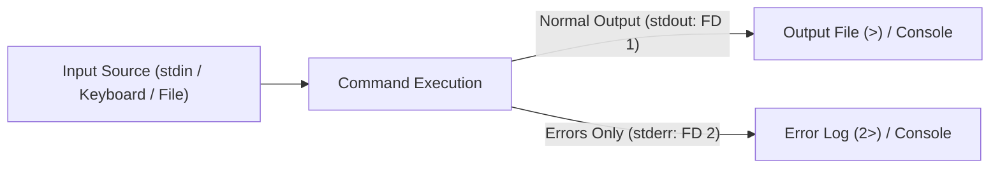
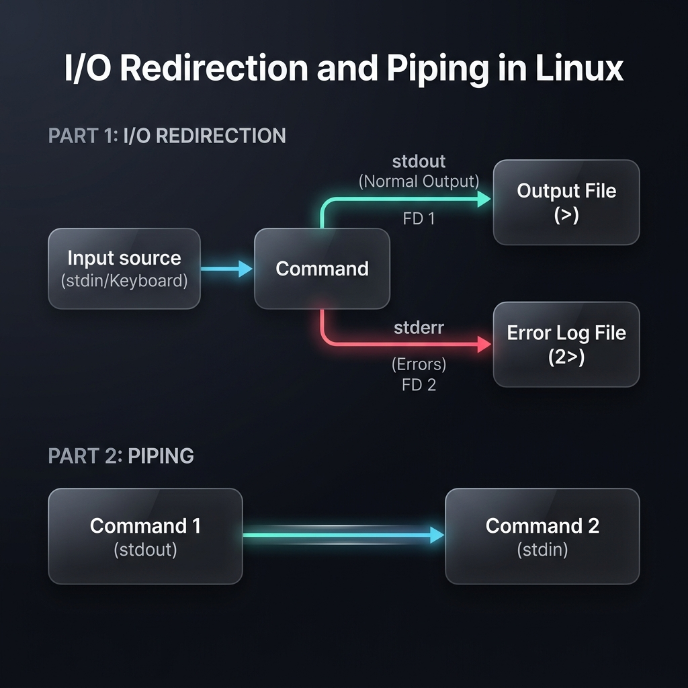
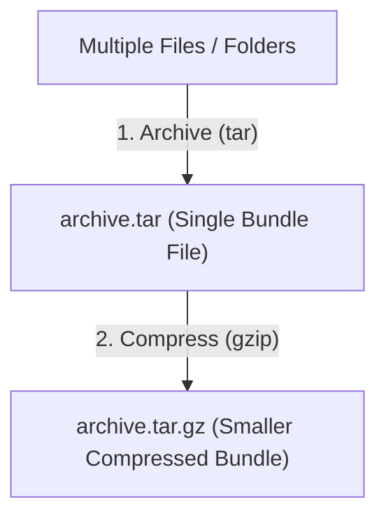
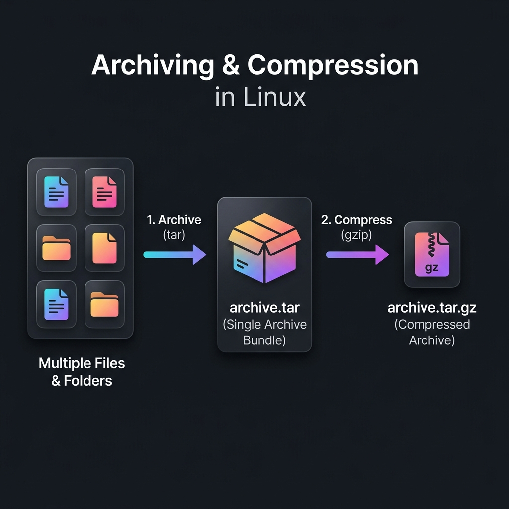

# Week 2 — Streams, Pipelines, Packages, and Basic Automation (Lighter Version) / ស្ទ្រីម, បំពង់បង្ហូរ, កញ្ចប់កម្មវិធី និងស្វ័យប្រវត្តិកម្មមូលដ្ឋាន (កំណែសម្រួល)

| Course / វគ្គសិក្សា | Operating System (Linux Essentials - Lighter Version) / ប្រព័ន្ធប្រតិបត្តិការ (មូលដ្ឋានគ្រឹះ Linux - កំណែសម្រួល) |
|---|---|
| **Weekly Study Time / រយៈពេលសិក្សាប្រចាំសប្តាហ៍** | 10 Hours / ១០ ម៉ោង |
| **Schedule / កាលវិភាគ** | Saturday: 8:00 AM - 12:00 PM (4h) & 2:00 PM - 4:00 PM (2h) <br> Sunday: 8:00 AM - 12:00 PM (4h) |
| **Syllabus CLOs / សញ្ញាបត្រ CLO** | CLO7: Navigate File System & Manage Files/Directories (Streams & Pipelines) <br> CLO10: Install and Manage Software Packages in Linux |

---

## 📅 Session 4: I/O Streams, Redirection & Pipelines (Saturday Morning — 4 Hours) / ផ្នែកទី៤៖ ចរន្តទិន្នន័យ I/O ការបង្វែរទិសដៅ និងបំពង់បង្ហូរ (ថ្ងៃសៅរ៍ ព្រឹក — ៤ ម៉ោង)

### 1. OS Concepts / គោលគំនិតប្រព័ន្ធប្រតិបត្តិការ
*   **Standard Streams / ចរន្តទិន្នន័យស្តង់ដារ (Standard Streams):**
    When a program runs, the OS provides three standard streams mapped to numeric file descriptors (FDs):
    នៅពេលកម្មវិធីដំណើរការ ប្រព័ន្ធប្រតិបត្តិការផ្តល់ចរន្តទិន្នន័យស្តង់ដារចំនួន ៣ ដែលភ្ជាប់ទៅនឹងលេខសម្គាល់ឯកសារ (File Descriptors - FDs)៖
    1.  **Standard Input (stdin - FD 0):** Input data stream. Default is the keyboard.
        **Standard Input (stdin - FD 0):** ចរន្តទិន្នន័យចូល។ លំនាំដើមគឺក្តារចុច (keyboard)។
    2.  **Standard Output (stdout - FD 1):** Normal output text stream. Default is the terminal screen.
        **Standard Output (stdout - FD 1):** ចរន្តទិន្នន័យចេញធម្មតា។ លំនាំដើមគឺអេក្រង់ terminal។
    3.  **Standard Error (stderr - FD 2):** Error message text stream. Default is the screen.
        **Standard Error (stderr - FD 2):** ចរន្តអត្ថបទសារកំហុស។ លំនាំដើមគឺអេក្រង់ terminal។
*   **Redirection Operators / និមិត្តសញ្ញាបង្វែរទិសដៅ:** 
    *   `>`: Overwrites standard output to a file (សរសេរជាន់លើលទ្ធផល stdout ទៅក្នុងឯកសារ).
    *   `>>`: Appends standard output to a file (សរសេរបន្ថែមលទ្ធផល stdout ទៅខាងចុងឯកសារ).
    *   `2>`: Overwrites standard error to a file (បង្វែរសារកំហុស stderr ទៅក្នុងឯកសារ).
    *   `/dev/null`: Virtual black hole. Writing here discards the data.
        `/dev/null` គឺជាធុងសម្រាមនិម្មិតរបស់ប្រព័ន្ធ។ រាល់ទិន្នន័យដែលសរសេរទៅទីនេះនឹងត្រូវលុបចោលទាំងស្រុង។
*   **Pipes (`|`) / បំពង់បង្ហូរ (Pipes):**
    Connects the stdout of the left command directly to the stdin of the right command.
    ភ្ជាប់ទិន្នន័យចេញ stdout នៃបញ្ជាខាងឆ្វេង ទៅកាន់ទិន្នន័យចូល stdin នៃបញ្ជាខាងស្តាំដោយផ្ទាល់។






### 2. Command Reference / ឯកសារយោងពាក្យបញ្ជា

| Command / បញ្ជា | Option / ជម្រើស | Description (English) | សេចក្តីពិពណ៌នា (ភាសាខ្មែរ) | Example / ឧទាហរណ៍ |
| :--- | :--- | :--- | :--- | :--- |
| `cat` | None | Read file and print to stdout | អានឯកសារ និងបង្ហាញនៅលើស្ទ្រីមចេញ stdout | `cat /etc/passwd` |
| `echo` | None | Print string to stdout | បង្ហាញអត្ថបទនៅលើស្ទ្រីមចេញ stdout | `echo "Hello World"` |
| `head` | `-n [num]`| Display first `n` lines of a stream (default 10) | បង្ហាញបន្ទាត់ចាប់ផ្តើម `n` ដំបូង (លំនាំដើម ១០) | `head -n 5 file.txt` |
| `tail` | `-n [num]`| Display last `n` lines of a stream (default 10) | បង្ហាញបន្ទាត់ខាងចុង `n` ចុងក្រោយ (លំនាំដើម ១០) | `tail -n 5 file.txt` |
| `wc` | `-l` | Display count of lines in a stream | រាប់ចំនួនបន្ទាត់សរុបក្នុងចរន្តទិន្នន័យ | `wc -l /etc/services` |
| `grep` | `-i` | Case-insensitive search of matching lines | ស្វែងរកបន្ទាត់ដែលមានពាក្យត្រូវគ្នា (មិនប្រកាន់អក្សរធំ/តូច) | `grep -i "ssh" /etc/services` |

### 3. Session 4 Exercises (To Do) / លំហាត់អនុវត្តផ្នែកទី៤ (ត្រូវធ្វើ)
1. Use `cat` with output redirection to write a file named `os_list.txt` directly from your console containing the names: `Ubuntu`, `Debian`, `CentOS`, `Fedora`, and `Arch`. *(Hint: Run `cat > os_list.txt`, type the operating systems line-by-line, then press `Ctrl+D` on a new line to save and close)*
   (ប្រើ `cat` ជាមួយការបង្វែរទិសដៅលទ្ធផល ដើម្បីសរសេរឯកសារឈ្មោះ `os_list.txt` ផ្ទាល់ពី console ដែលមានឈ្មោះ៖ `Ubuntu`, `Debian`, `CentOS`, `Fedora`, និង `Arch`។ *(ជំនួយ៖ រត់ `cat > os_list.txt` រួចវាយឈ្មោះប្រព័ន្ធប្រតិបត្តិការម្តងមួយជួរ រួចចុច `Ctrl+D` នៅលើជួរថ្មីដើម្បីរក្សាទុក និងបិទ)*)
2. Append `RedHat` and `Alpine` to `os_list.txt` in separate commands and verify the file content. *(Hint: Use the append operator `>>`. E.g., `echo "RedHat" >> os_list.txt` and `echo "Alpine" >> os_list.txt`)*
   (សរសេរបន្ថែម `RedHat` និង `Alpine` ទៅកាន់ `os_list.txt` ក្នុងបញ្ជាដាច់ដោយឡែកពីគ្នា រួចផ្ទៀងផ្ទាត់មាតិកាឯកសារ។ *(ជំនួយ៖ ប្រើប្រាស់សញ្ញាប្រតិបត្តិការ `>>` ដូចជា `echo "RedHat" >> os_list.txt` និង `echo "Alpine" >> os_list.txt`)*)
3. Extract lines 15 to 20 of `/etc/services` using a pipeline of `head` and `tail`, and write the output to `services_range.txt`. *(Hint: Use `head -n 20 /etc/services | tail -n 6 > services_range.txt`)*
   (ស្រង់យកបន្ទាត់ទី ១៥ ដល់ ២០ នៃឯកសារ `/etc/services` ដោយប្រើបំពង់បង្ហូរ `head` និង `tail` រួចសរសេរលទ្ធផលទៅ `services_range.txt`។ *(ជំនួយ៖ ប្រើប្រាស់ `head -n 20 /etc/services | tail -n 6 > services_range.txt`)*)
4. Count the number of lines in `/etc/passwd` containing the word `nologin` using `grep` and `wc -l` via a pipe, and record the command and result.
   (រាប់ចំនួនបន្ទាត់ក្នុង `/etc/passwd` ដែលមានផ្ទុកពាក្យ `nologin` ដោយប្រើ `grep` និង `wc -l` តាមរយៈបំពង់បង្ហូរ រួចកត់ត្រាបញ្ជានិងលទ្ធផល)

---

## 📅 Session 5: Package Management & Archiving (Saturday Afternoon — 2 Hours) / ផ្នែកទី៥៖ ការចាត់ចែងកញ្ចប់កម្មវិធី និងការរក្សាទុកឯកសារ (ថ្ងៃសៅរ៍ រសៀល — ២ ម៉ោង)

### 1. OS Concepts / គោលគំនិតប្រព័ន្ធប្រតិបត្តិការ
*   **Package Management / ការគ្រប់គ្រងកញ្ចប់កម្មវិធី:**
    Linux systems install pre-built software from online repositories using **Package Managers**.
    ប្រព័ន្ធ Linux ដំឡើងកម្មវិធីដែលបានបង្កើតស្រាប់ពីឃ្លាំងផ្ទុកអនឡាញ (repositories) ដោយប្រើ **កម្មវិធីគ្រប់គ្រងកញ្ចប់កម្មវិធី (Package Managers)**។
    - **APT (`apt`/`apt-get`):** The standard package frontend on Debian/Ubuntu systems.
      ជាកម្មវិធីគ្រប់គ្រងកញ្ចប់កម្មវិធីស្តង់ដារនៅលើប្រព័ន្ធ Debian/Ubuntu។
    - **Snap (`snap`):** A universal package manager that packages applications with dependencies inside sandboxed environments.
      ជាកម្មវិធីគ្រប់គ្រងកញ្ចប់កម្មវិធីសកលដែលខ្ចប់កម្មវិធីជាមួយបណ្ណាល័យជំនួយរបស់វាទាំងអស់ក្នុងបរិស្ថានសុវត្ថិភាព (sandbox)។
*   **Archiving vs. Compression / ការរក្សាទុកថតឯកសារ និងការបង្រួមទំហំ:**
    - *Archiving (`tar`):* Bundles multiple files and folders into a single file (tarball) without changing size.
      *Archiving (`tar`):* ប្រមូលផ្តុំឯកសារនិងថតជាច្រើនបញ្ចូលគ្នាទៅជាឯកសារតែមួយ (tarball) ដោយមិនផ្លាស់ប្តូរទំហំឡើយ។
    - *Compression (`gzip`):* Reduces storage size using mathematical algorithms. Linux typically combines these steps to produce compressed archive files (`.tar.gz`).
      *Compression (`gzip`):* បង្រួមទំហំផ្ទុកដោយប្រើក្បួនគណិតវិទ្យា។ Linux ជាទូទៅរួមបញ្ចូលគ្នាទាំងពីរនេះដើម្បីបង្កើតឯកសារបង្រួមប្រភេទ `.tar.gz`។
    - *Zip (`zip`/`unzip`):* A common compression format widely compatible across Windows and Linux systems.
      *Zip (`zip`/`unzip`):* ទម្រង់បង្រួមទិន្នន័យដ៏ពេញនិយមដែលមានភាពស៊ីគ្នាយ៉ាងទូលំទូលាយរវាង Windows និង Linux។





### 2. Command Reference / ឯកសារយោងពាក្យបញ្ជា

| Command / បញ្ជា | Option/Args / ជម្រើស | Description (English) | សេចក្តីពិពណ៌នា (ភាសាខ្មែរ) | Example / ឧទាហរណ៍ |
| :--- | :--- | :--- | :--- | :--- |
| `apt-get update` | None | Refresh local database cache of available packages | ធ្វើបច្ចុប្បន្នភាពបញ្ជីឈ្មោះកម្មវិធីដែលមាននៅក្នុងឃ្លាំង | `sudo apt-get update` |
| `apt-get install`| `[pkg]` | Download and install package with dependencies | ទាញយក និងដំឡើងកញ្ចប់កម្មវិធី រួមទាំងបណ្ណាល័យជំនួយ | `sudo apt-get install tmux` |
| `snap install` | `[pkg]` | Install a universal sandboxed Snap package | ដំឡើងកញ្ចប់កម្មវិធី Snap សកលក្នុង sandbox | `sudo snap install vlc` |
| `tar` | `-czvf` | Create a gzip-compressed archive | បង្កើតឯកសារបណ្ណសារបង្រួម gzip (tarball) | `tar -czvf archive.tar.gz src/` |
| | `-xzvf` | Extract gzip-compressed archive contents | ពន្លាឯកសារបណ្ណសារបង្រួម gzip | `tar -xzvf archive.tar.gz` |
| `zip` / `unzip` | `-r` | Zip / Unzip directories recursively | បង្រួម ឬពន្លាថតឯកសារជាទម្រង់ zip recursively | `zip -r web.zip html/` |

### 3. Session 5 Exercises (To Do) / លំហាត់អនុវត្តផ្នែកទី៥ (ត្រូវធ្វើ)
1. Search and install the locomotive package `sl` (or another simple package like `fortune`) using your package manager.
   (ស្វែងរក និងដំឡើងកញ្ចប់កម្មវិធីរថភ្លើង `sl` (ឬកញ្ចប់សាមញ្ញផ្សេងទៀតដូចជា `fortune`) ដោយប្រើកម្មវិធីគ្រប់គ្រងកញ្ចប់របស់អ្នក)
2. Create a folder named `backup_test/` and copy `os_list.txt` inside it.
   (បង្កើតថតមួយឈ្មោះ `backup_test/` រួចចម្លង `os_list.txt` ទៅក្នុងនោះ)
3. Create a compressed tarball named `backup.tar.gz` of the `backup_test/` folder.
   (បង្កើតឯកសារបង្រួម tarball ឈ្មោះ `backup.tar.gz` ចេញពីថត `backup_test/`)
4. Extract the contents of `backup.tar.gz` into a new folder named `extracted_backup/` and verify the file content.
   (ពន្លាមាតិកានៃ `backup.tar.gz` ទៅក្នុងថតថ្មីឈ្មោះ `extracted_backup/` រួចផ្ទៀងផ្ទាត់ឯកសារ)
5. Create a `backup.zip` file of the `backup_test/` folder and list its size compared to the `.tar.gz` file.
   (បង្កើតឯកសារ `backup.zip` ចេញពីថត `backup_test/` រួចបង្ហាញទំហំរបស់វាធៀបនឹងឯកសារ `.tar.gz`)

---

## 📅 Session 6: Basic Shell Scripting (Sunday Morning — 4 Hours) / ផ្នែកទី៦៖ ការសរសេរស្គ្រីប Shell មូលដ្ឋាន (ថ្ងៃអាទិត្យ ព្រឹក — ៤ ម៉ោង)

### 1. OS Concepts / គោលគំនិតប្រព័ន្ធប្រតិបត្តិការ
*   **Shell Scripts / ស្គ្រីប Shell:**
    A shell script is a text file containing a sequence of commands executed by the shell interpreter. It is used to automate repetitive administrative tasks.
    ស្គ្រីប Shell គឺជាឯកសារអត្ថបទដែលមានផ្ទុកនូវលំដាប់ពាក្យបញ្ជាសម្រាប់ដំណើរការដោយកម្មវិធីបកប្រែ shell។ វាត្រូវបានប្រើដើម្បីធ្វើស្វ័យប្រវត្តិកម្មលើការងាររដ្ឋបាលដដែលៗ។
*   **The Shebang (`#!/bin/bash`) / Shebang:**
    Placed on the very first line of a script. It tells the kernel to use the bash shell to execute the script commands.
    ស្ថិតនៅបន្ទាត់ដំបូងបង្អស់នៃស្គ្រីប។ វាប្រាប់ kernel ឱ្យប្រើប្រាស់កម្មវិធី bash shell ដើម្បីរត់ពាក្យបញ្ជានៅក្នុងស្គ្រីប។
*   **Script Permissions / សិទ្ធិដំណើរការស្គ្រីប:**
    By default, new files do not have execute permissions. You must modify the file using `chmod +x script.sh` to allow execution (`./script.sh`).
    តាមលំនាំដើម ឯកសារបង្កើតថ្មីមិនទាន់មានសិទ្ធិដំណើរការឡើយ។ អ្នកត្រូវតែកែប្រែវាដោយប្រើ `chmod +x script.sh` ដើម្បីអនុញ្ញាតឱ្យដំណើរការស្គ្រីបបាន (`./script.sh`)។
*   **Variables / អថេរ:**
    Used to store data. In bash, no spaces are allowed around the assignment operator (e.g. `NAME="Alice"`). Access variables using the `$` prefix (e.g. `$NAME`).
    ប្រើសម្រាប់រក្សាទុកទិន្នន័យ។ ក្នុង bash មិនត្រូវបានអនុញ្ញាតឱ្យមានចន្លោះ (space) នៅជុំវិញសញ្ញាប្រគល់តម្លៃឡើយ (ឧទាហរណ៍៖ `NAME="Alice"`)។ ទាញយកតម្លៃអថេរដោយប្រើសញ្ញា `$` នៅខាងមុខ (ឧទាហរណ៍៖ `$NAME`)។
*   **User Input (`read`) / ធាតុចូលរបស់អ្នកប្រើប្រាស់:**
    Pauses execution and waits for the user to type input from standard input, saving it to a variable.
    ផ្អាកការដំណើរការជាបណ្តោះអាសន្ន ដើម្បីរង់ចាំអ្នកប្រើប្រាស់វាយបញ្ចូលទិន្នន័យពី keyboard រួចរក្សាទុកវាទៅក្នុងអថេរ។
*   **Conditionals (`if-else`) / លក្ខខណ្ឌ (Conditionals):**
    Executes commands based on test evaluations. Syntax uses square brackets `[ ]` which must contain spaces around the arguments.
    ដំណើរការពាក្យបញ្ជាផ្អែកលើការវាយតម្លៃលក្ខខណ្ឌ។ ទ្រង់ទ្រាយបញ្ជាប្រើប្រាស់វង់ក្រចកការ៉េ `[ ]` ដែលត្រូវតែមានចន្លោះ (spaces) នៅសងខាងអាគុយម៉ង់។

### 2. Command/Syntax Reference / ឯកសារយោងពាក្យបញ្ជានិងទម្រង់ស្គ្រីប

| Command/Syntax | Description (English) | សេចក្តីពិពណ៌នា (ភាសាខ្មែរ) | Example / ឧទាហរណ៍ |
| :--- | :--- | :--- | :--- |
| `chmod +x [file]` | Add execution permission to script file | បន្ថែមសិទ្ធិដំណើរការ (execution permission) ទៅកាន់ឯកសារស្គ្រីប | `chmod +x audit.sh` |
| `read [var]` | Read input from stdin and store in variable | អានទិន្នន័យចូលពី stdin រក្សាទុកក្នុងអថេរ | `read server_name` |
| `if [ cond ]; then` | Conditional check block | ប្លុកត្រួតពិនិត្យលក្ខខណ្ឌ | *See Hands-on Examples / មើលឧទាហរណ៍* |

### 3. Hands-on Examples / ឧទាហរណ៍អនុវត្តផ្ទាល់

#### A. Interactive Shell Script with Conditionals / ស្គ្រីប Shell អន្តរកម្មជាមួយលក្ខខណ្ឌ
Create a script named `sys_check.sh` / បង្កើតស្គ្រីបឈ្មោះ `sys_check.sh`៖
```bash
#!/bin/bash
# Simple System Check Script

echo "=== System Check Panel ==="
echo "Enter your access username: "
read username

if [ "$username" == "admin" ]; then
    echo "[SUCCESS] Access granted to administrator."
    echo "Current system release info:"
    uname -r
else
    echo "[WARNING] Access denied: normal user '$username' cannot perform system checks."
fi
```
Execute and test / ដំណើរការនិងសាកល្បង៖
```bash
# Make script executable
chmod +x sys_check.sh

# Run the script
./sys_check.sh
```

#### B. Check File Existence / ការត្រួតពិនិត្យអត្ថិភាពឯកសារ
Create a script named `check_log.sh` / បង្កើតស្គ្រីបឈ្មោះ `check_log.sh`៖
```bash
#!/bin/bash
# Simple log check

echo "Checking if system audit log exists..."
if [ -f "/var/log/syslog" ]; then
    echo "[FOUND] Syslog file exists on this system."
else
    echo "[NOT FOUND] syslog not found in /var/log/."
fi
```

### 4. Session 6 Exercises (To Do) / លំហាត់អនុវត្តផ្នែកទី៦ (ត្រូវធ្វើ)
1. Write a shell script named `check_file.sh` that prompts the user to enter a filename.
   (សរសេរស្គ្រីប shell មួយឈ្មោះ `check_file.sh` ដែលសួរឱ្យអ្នកប្រើប្រាស់បញ្ចូលឈ្មោះឯកសារ)
2. The script must check if that file exists in the current directory.
   (ស្គ្រីបត្រូវតែពិនិត្យមើលថាតើឯកសារនោះមាននៅក្នុងថតបច្ចុប្បន្នដែរឬទេ)
   * *Tip / គន្លឹះ:* Use condition `if [ -f "$filename" ]; then` to check file existence.
3. If it exists, print "File exists." and run `ls -lh $filename`.
   (ប្រសិនបើវាមាន ពុម្ពអក្សរ "File exists." រួចរត់ `ls -lh $filename`)
4. If it does not exist, print "File not found. Creating empty file..." and use `touch` to create it.
   (ប្រសិនបើមិនមាន ពុម្ពអក្សរ "File not found. Creating empty file..." រួចប្រើ `touch` ដើម្បីបង្កើតវា)
5. Make the script executable, run it twice (once for a existing file, once for a non-existing file), and record the inputs/outputs.
   (ធ្វើឱ្យស្គ្រីបដំណើរការបាន រត់វាពីរដង (ម្តងសម្រាប់ឯកសារដែលមានស្រាប់ ម្តងទៀតសម្រាប់ឯកសារមិនទាន់មាន) រួចកត់ត្រាលទ្ធផល)

---

## 🧩 Week 2 Challenge Scenario: "Automated Log Rotation & Audit Script" / សេណារីយ៉ូអនុវត្តប្រចាំសប្តាហ៍ទី២៖ "ការធ្វើស្វ័យប្រវត្តិកំណត់ហេតុ និងស្គ្រីបសវនកម្ម"

### Background / ផ្ទៃរឿង
You are a Junior System Administrator at **Apex Systems**. The staging server access logs have grown, and your supervisor assigns you to:
1. Audit the server's web access logs for security threats.
2. Write a simple automated shell script that backs up configuration files, archives them, and logs the deployment actions.
អ្នកគឺជា Junior System Administrator នៅក្រុមហ៊ុន **Apex Systems**។ ឯកសារ logs នៃសកម្មភាពចូលប្រើប្រាស់ម៉ាស៊ីនមេបណ្តោះអាសន្នបានកើនឡើងយ៉ាងខ្លាំង ហើយប្រធានរបស់អ្នកបានចាត់ចែងអ្នកឱ្យ៖
1. ធ្វើសវនកម្មលើឯកសារ log នៃសកម្មភាពចូលប្រើប្រាស់ web server ដើម្បីស្វែងរកការគំរាមកំហែងសន្តិសុខ។
2. សរសេរស្គ្រីប shell ស្វ័យប្រវត្តិកម្រិតសាមញ្ញមួយ ដើម្បីចម្លងទុកឯកសារកំណត់រចនាសម្ព័ន្ធ បង្រួមវាទុក និងកត់ត្រាទុកនូវសកម្មភាពដំណើរការទាំងនោះ។

### Mission Steps / ជំហានបេសកកម្ម
1. **Simulate Logs Setup / បង្កើតស្ថានភាពគំរូ៖** Setup the simulation environments by running:
   (បង្កើតស្ថានភាព logs គំរូដោយដំណើរការ៖)
   ```bash
   # Part A: Log Setup
   sudo mkdir -p /var/tmp/apex_logs
   cat << 'EOF' | sudo tee /var/tmp/apex_logs/web_access.log
   192.168.1.15 - - [27/May/2026:10:01:02] "GET /index.html HTTP/1.1" 200 1024
   192.168.1.100 - - [27/May/2026:10:01:05] "GET /login.php HTTP/1.1" 401 320
   192.168.1.20 - - [27/May/2026:10:02:10] "GET /about.html HTTP/1.1" 200 450
   192.168.1.100 - - [27/May/2026:10:02:12] "POST /login.php HTTP/1.1" 401 320
   192.168.1.15 - - [27/May/2026:10:02:15] "GET /style.css HTTP/1.1" 200 2340
   192.168.1.100 - - [27/May/2026:10:02:18] "POST /login.php HTTP/1.1" 401 320
   192.168.1.30 - - [27/May/2026:10:03:01] "GET /index.html HTTP/1.1" 200 1024
   192.168.1.100 - - [27/May/2026:10:03:05] "GET /admin/config.php HTTP/1.1" 404 150
   192.168.1.20 - - [27/May/2026:10:03:22] "GET /contact.html HTTP/1.1" 200 680
   192.168.1.100 - - [27/May/2026:10:03:45] "GET /etc/passwd HTTP/1.1" 404 150
   192.168.1.15 - - [27/May/2026:10:04:10] "GET /index.html HTTP/1.1" 200 1024
   192.168.1.100 - - [27/May/2026:10:04:12] "POST /login.php HTTP/1.1" 200 1800
   192.168.1.45 - - [27/May/2026:10:05:00] "GET /images/logo.png HTTP/1.1" 200 4500
   EOF
   sudo chmod 644 /var/tmp/apex_logs/web_access.log
   ```
2. **Audit Staging Web Logs / ធ្វើសវនកម្មឯកសារ Logs ម៉ាស៊ីនមេ៖**
   * Count the total log entries in `/var/tmp/apex_logs/web_access.log`.
     (រាប់ចំនួនកំណត់ត្រា log សរុបនៅក្នុង `/var/tmp/apex_logs/web_access.log`)
   * Filter out all failed requests (HTTP status codes `401` or `404`) and write them to `failed_attempts.txt`. *(Hint: Use `grep -E "401|404" /var/tmp/apex_logs/web_access.log > failed_attempts.txt`)*
     (ចម្រាញ់យកសំណើដែលបរាជ័យទាំងអស់ (HTTP status codes `401` ឬ `404`) រួចសរសេរវាទៅកាន់ `failed_attempts.txt`។ *(ជំនួយ៖ ប្រើប្រាស់ `grep -E "401|404" /var/tmp/apex_logs/web_access.log > failed_attempts.txt`)*)
   * Search for lines containing search patterns for `/etc/passwd` and save matching lines to `attack_signatures.txt`. *(Hint: Use `grep "/etc/passwd" /var/tmp/apex_logs/web_access.log > attack_signatures.txt`)*
     (ស្វែងរកបន្ទាត់ដែលមានផ្ទុកលំនាំស្វែងរក `/etc/passwd` រួចរក្សាទុកបន្ទាត់ទាំងនោះក្នុង `attack_signatures.txt`។ *(ជំនួយ៖ ប្រើប្រាស់ `grep "/etc/passwd" /var/tmp/apex_logs/web_access.log > attack_signatures.txt`)*)
3. **Write the Automated Audit Script / សរសេរស្គ្រីបសវនកម្មស្វ័យប្រវត្តិ៖**
   Create a shell script named `auto_audit.sh`. The script must perform the following actions sequentially:
   (បង្កើតស្គ្រីប shell មួយឈ្មោះ `auto_audit.sh`។ ស្គ្រីបត្រូវតែដំណើរការសកម្មភាពខាងក្រោមជាលំដាប់៖)
   * Create a temporary workspace directory named `audit_area/`.
     (បង្កើតថតកន្លែងការងារបណ្តោះអាសន្នមួយឈ្មោះ `audit_area/`)
   * Copy `/var/tmp/apex_logs/web_access.log` to `audit_area/`.
     (ចម្លង `/var/tmp/apex_logs/web_access.log` ទៅកាន់ `audit_area/`)
   * Filter out the failed requests (containing `401` or `404`) from the copied log file and save them to `audit_area/failed_summary.txt`.
     (ចម្រាញ់យកសំណើដែលបរាជ័យ (មានផ្ទុក `401` ឬ `404`) ពីឯកសារ log ដែលបានចម្លងរួច រក្សាទុកក្នុង `audit_area/failed_summary.txt`)
   * Compress the entire `audit_area/` directory into a gzip tarball named `audit_release.tar.gz`.
     (បង្រួមថត `audit_area/` ទាំងមូលទៅជាឯកសារ gzip tarball ឈ្មោះ `audit_release.tar.gz`)
   * Create a text file named `deploy.log` and append a timestamped line: `"[$(date)] AUDIT SCRIPT COMPLETE: Release generated"`.
     (បង្កើតឯកសារអត្ថបទឈ្មោះ `deploy.log` រួចសរសេរបន្ថែមបន្ទាត់ដែលមានត្រាពេលវេលា៖ `"[$(date)] AUDIT SCRIPT COMPLETE: Release generated"`)
   * Clean up by deleting the temporary `audit_area/` directory.
     (សម្អាតដោយលុបថតបណ្តោះអាសន្ន `audit_area/` ចោលវិញ)
4. **Execute the Script / ដំណើរការស្គ្រីប៖** Make `auto_audit.sh` executable and run it using `./auto_audit.sh`.
   (ធ្វើឱ្យ `auto_audit.sh` ដំណើរការបាន រួចរត់វាដោយប្រើ `./auto_audit.sh`)

---

## 📝 Submission Checklist & Folder Structure / បញ្ជីផ្ទៀងផ្ទាត់ និងរចនាសម្ព័ន្ធថតត្រូវផ្ញើ
Your week submission folder `linux-essentials-<YourStudentID>/week2/` must look like this:
នៅចុងបញ្ចប់នៃសប្តាហ៍នេះ ថតកិច្ចការរបស់អ្នក `linux-essentials-<YourStudentID>/week2/` ត្រូវតែមានទម្រង់ដូចខាងក្រោម៖

```
linux-essentials-<YourStudentID>/
└── week2/
    ├── README.md (Weekly Report / របាយការណ៍ប្រចាំសប្តាហ៍)
    ├── images/
    │   ├── log_analysis.png (Screenshot showing log diagnostics / រូបថតអេក្រង់វិភាគ log)
    │   └── script_execution.png (Screenshot showing successful run / រូបថតអេក្រង់លទ្ធផលដំណើរការស្គ្រីប)
    ├── failed_attempts.txt
    ├── attack_signatures.txt
    ├── audit_release.tar.gz
    ├── deploy.log
    └── auto_audit.sh
```
