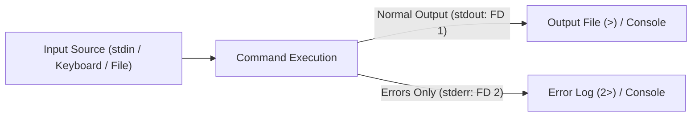
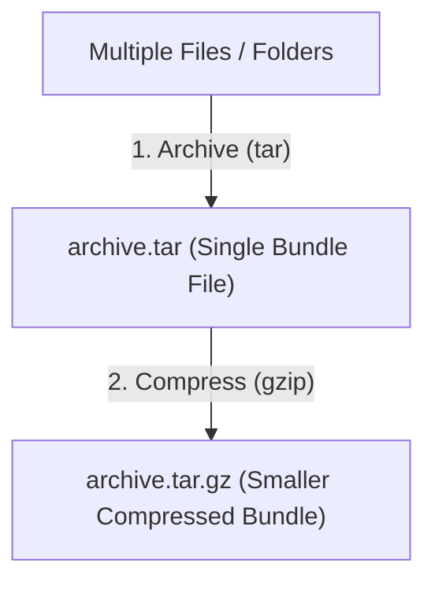

# Week 2 — Streams, Pipelines, Packages, and Basic Automation (Lighter Version)

| Course | Operating System (Linux Essentials - Lighter Version) |
|---|---|
| **Weekly Study Time** | 10 Hours |
| **Schedule** | Saturday: 8:00 AM - 12:00 PM (4h) & 2:00 PM - 4:00 PM (2h) <br> Sunday: 8:00 AM - 12:00 PM (4h) |
| **Syllabus CLOs** | CLO7: Navigate File System & Manage Files/Directories (Streams & Pipelines) <br> CLO10: Install and Manage Software Packages in Linux |

---

## 📅 Session 4: I/O Streams, Redirection & Pipelines (Saturday Morning — 4 Hours)

### 1. OS Concepts
*   **Standard Streams:** When a program runs, the OS provides three standard streams mapped to numeric file descriptors (FDs):
    1.  **Standard Input (stdin - FD 0):** Input data stream. Default is the keyboard.
    2.  **Standard Output (stdout - FD 1):** Normal output text stream. Default is the terminal screen.
    3.  **Standard Error (stderr - FD 2):** Error message text stream. Default is the screen, but FDs allow separation from stdout.
*   **Redirection Operators:** 
    *   `>`: Overwrites standard output to a file.
    *   `>>`: Appends standard output to a file.
    *   `2>`: Overwrites standard error to a file.
    *   `/dev/null`: Virtual black hole. Writing here discards the data.
*   **Pipes (`|`):** Connects the stdout of the left command directly to the stdin of the right command. Allows complex data filters without generating intermediate temporary files.




### 2. Command Reference

| Command | Option | Description | Example |
| :--- | :--- | :--- | :--- |
| `cat` | None | Read file and print to stdout | `cat /etc/passwd` |
| `echo` | None | Print string to stdout | `echo "Hello World"` |
| `head` | `-n [num]`| Display first `n` lines of a stream (default 10) | `head -n 5 file.txt` |
| `tail` | `-n [num]`| Display last `n` lines of a stream (default 10) | `tail -n 5 file.txt` |
| `wc` | `-l` | Display count of lines in a stream | `wc -l /etc/services` |
| `grep` | `-i` | Case-insensitive search of matching lines | `grep -i "ssh" /etc/services` |

### 3. Session 4 Exercises (To Do)
1. Use `cat` with output redirection to write a file named `os_list.txt` directly from your console containing the names: `Ubuntu`, `Debian`, `CentOS`, `Fedora`, and `Arch`.
2. Append `RedHat` and `Alpine` to `os_list.txt` in separate commands and verify the file content.
3. Extract lines 15 to 20 of `/etc/services` using a pipeline of `head` and `tail`, and write the output to `services_range.txt`.
4. Count the number of lines in `/etc/passwd` containing the word `nologin` using `grep` and `wc -l` via a pipe, and record the command and result.

---

## 📅 Session 5: Package Management & Archiving (Saturday Afternoon — 2 Hours)

### 1. OS Concepts
*   **Package Management:**
    Linux systems install pre-built software from online repositories using **Package Managers**.
    - **APT (`apt`/`apt-get`):** The standard package frontend on Debian/Ubuntu systems, resolving dependencies automatically.
    - **Snap (`snap`):** A universal package manager designed by Canonical that packages applications with all their dependencies inside sandboxed environments.
*   **Archiving vs. Compression:**
    - *Archiving (`tar`):* Bundles multiple files and folders into a single file (tarball) without changing size.
    - *Compression (`gzip`):* Reduces storage size using mathematical algorithms. Linux typically combines these steps to produce compressed archive files (`.tar.gz`).
    - *Zip (`zip`/`unzip`):* A common compression format widely compatible across Windows and Linux systems.




### 2. Command Reference

| Command | Option/Args | Description | Example |
| :--- | :--- | :--- | :--- |
| `apt-get update` | None | Refresh local database cache of available packages | `sudo apt-get update` |
| `apt-get install`| `[pkg]` | Download and install package with dependencies | `sudo apt-get install tmux` |
| `snap install` | `[pkg]` | Install a universal sandboxed Snap package | `sudo snap install vlc` |
| `tar` | `-czvf` | Create a gzip-compressed archive | `tar -czvf archive.tar.gz src/` |
| | `-xzvf` | Extract gzip-compressed archive contents | `tar -xzvf archive.tar.gz` |
| `zip` / `unzip` | `-r` | Zip / Unzip directories recursively | `zip -r web.zip html/` |

### 3. Session 5 Exercises (To Do)
1. Search and install the locomotive package `sl` (or another simple package like `fortune`) using your package manager.
2. Create a folder named `backup_test/` and copy `os_list.txt` inside it.
3. Create a compressed tarball named `backup.tar.gz` of the `backup_test/` folder.
4. Extract the contents of `backup.tar.gz` into a new folder named `extracted_backup/` and verify the file content.
5. Create a `backup.zip` file of the `backup_test/` folder and list its size compared to the `.tar.gz` file.

---

## 📅 Session 6: Basic Shell Scripting (Sunday Morning — 4 Hours)

### 1. OS Concepts
*   **Shell Scripts:** A shell script is a text file containing a sequence of commands executed by the shell interpreter. It is used to automate repetitive administrative tasks.
*   **The Shebang (`#!/bin/bash`):** Placed on the very first line of a script. It tells the kernel to use the bash shell to execute the script commands.
*   **Script Permissions:** By default, new files do not have execute permissions. You must modify the file using `chmod +x script.sh` to allow execution (`./script.sh`).
*   **Variables:** Used to store data. In bash, no spaces are allowed around the assignment operator (e.g. `NAME="Alice"`). Access variables using the `$` prefix (e.g. `$NAME`).
*   **User Input (`read`):** Pauses execution and waits for the user to type input from standard input, saving it to a variable.
*   **Conditionals (`if-else`):** Executes commands based on test evaluations. Syntax uses square brackets `[ ]` which must contain spaces around the arguments.

### 2. Command/Syntax Reference

| Command/Syntax | Description | Example |
| :--- | :--- | :--- |
| `chmod +x [file]` | Add execution permission to script file | `chmod +x audit.sh` |
| `read [var]` | Read input from stdin and store in variable | `read server_name` |
| `if [ cond ]; then` | Conditional check block | *See Hands-on Examples* |

### 3. Hands-on Examples

#### A. Interactive Shell Script with Conditionals
Create a script named `sys_check.sh`:
```bash
#!/bin/bash
# Simple System Check Script

echo "=== System Check Panel ==="
echo "Enter your access username: "
read username

if [ "$username" == "admin" ]; then
    echo "[SUCCESS] Access granted to administrator."
    echo "Current system release info:"
    uname -r
else
    echo "[WARNING] Access denied: normal user '$username' cannot perform system checks."
fi
```
Execute and test:
```bash
# Make script executable
chmod +x sys_check.sh

# Run the script
./sys_check.sh
```

#### B. Check File Existence
Create a script named `check_log.sh`:
```bash
#!/bin/bash
# Simple log check

echo "Checking if system audit log exists..."
if [ -f "/var/log/syslog" ]; then
    echo "[FOUND] Syslog file exists on this system."
else
    echo "[NOT FOUND] syslog not found in /var/log/."
fi
```

### 4. Session 6 Exercises (To Do)
1. Write a shell script named `check_file.sh` that prompts the user to enter a filename.
2. The script must check if that file exists in the current directory.
    *   *Tip:* Use the condition `if [ -f "$filename" ]; then` to check file existence.
3. If it exists, print "File exists." and run `ls -lh $filename`.
4. If it does not exist, print "File not found. Creating empty file..." and use `touch` to create it.
5. Make the script executable, run it twice (once for a existing file, once for a non-existing file), and record the inputs/outputs.

---

## 🧩 Week 2 Challenge Scenario: "Automated Log Rotation & Audit Script"

### Background
You are a Junior System Administrator at **Apex Systems**. The staging server access logs have grown, and your supervisor assigns you to:
1. Audit the server's web access logs for security threats.
2. Write a simple automated shell script that backs up configuration files, archives them, and logs the deployment actions.

### Mission Steps
1.  **Simulate Logs Setup:** Setup the simulation environments by running:
    ```bash
    # Part A: Log Setup
    sudo mkdir -p /var/tmp/apex_logs
    cat << 'EOF' | sudo tee /var/tmp/apex_logs/web_access.log
    192.168.1.15 - - [27/May/2026:10:01:02] "GET /index.html HTTP/1.1" 200 1024
    192.168.1.100 - - [27/May/2026:10:01:05] "GET /login.php HTTP/1.1" 401 320
    192.168.1.20 - - [27/May/2026:10:02:10] "GET /about.html HTTP/1.1" 200 450
    192.168.1.100 - - [27/May/2026:10:02:12] "POST /login.php HTTP/1.1" 401 320
    192.168.1.15 - - [27/May/2026:10:02:15] "GET /style.css HTTP/1.1" 200 2340
    192.168.1.100 - - [27/May/2026:10:02:18] "POST /login.php HTTP/1.1" 401 320
    192.168.1.30 - - [27/May/2026:10:03:01] "GET /index.html HTTP/1.1" 200 1024
    192.168.1.100 - - [27/May/2026:10:03:05] "GET /admin/config.php HTTP/1.1" 404 150
    192.168.1.20 - - [27/May/2026:10:03:22] "GET /contact.html HTTP/1.1" 200 680
    192.168.1.100 - - [27/May/2026:10:03:45] "GET /etc/passwd HTTP/1.1" 404 150
    192.168.1.15 - - [27/May/2026:10:04:10] "GET /index.html HTTP/1.1" 200 1024
    192.168.1.100 - - [27/May/2026:10:04:12] "POST /login.php HTTP/1.1" 200 1800
    192.168.1.45 - - [27/May/2026:10:05:00] "GET /images/logo.png HTTP/1.1" 200 4500
    EOF
    sudo chmod 644 /var/tmp/apex_logs/web_access.log
    ```
2.  **Audit Staging Web Logs:**
    *   Count the total log entries in `/var/tmp/apex_logs/web_access.log`.
    *   Filter out all failed requests (HTTP status codes `401` or `404`) and write them to `failed_attempts.txt`.
    *   Search for lines containing search patterns for `/etc/passwd` and save matching lines to `attack_signatures.txt`.
3.  **Write the Automated Audit Script:**
    Create a shell script named `auto_audit.sh`. The script must perform the following actions sequentially:
    *   Create a temporary workspace directory named `audit_area/`.
    *   Copy `/var/tmp/apex_logs/web_access.log` to `audit_area/`.
    *   Filter out the failed requests (containing `401` or `404`) from the copied log file and save them to `audit_area/failed_summary.txt`.
    *   Compress the entire `audit_area/` directory into a gzip tarball named `audit_release.tar.gz`.
    *   Create a text file named `deploy.log` and append a timestamped line: `"[$(date)] AUDIT SCRIPT COMPLETE: Release generated"`.
    *   Clean up by deleting the temporary `audit_area/` directory.
4.  **Execute the Script:** Make `auto_audit.sh` executable and run it using `./auto_audit.sh`.

---

## 📝 Submission Checklist & Folder Structure
Your week submission folder `linux-essentials-<YourStudentID>/week2/` must look like this:

```
linux-essentials-<YourStudentID>/
└── week2/
    ├── README.md (Weekly report)
    ├── images/
    │   ├── log_analysis.png (Screenshot showing log diagnostics)
    │   └── script_execution.png (Screenshot showing successful run of auto_audit.sh)
    ├── failed_attempts.txt
    ├── attack_signatures.txt
    ├── audit_release.tar.gz
    ├── deploy.log
    └── auto_audit.sh
```
