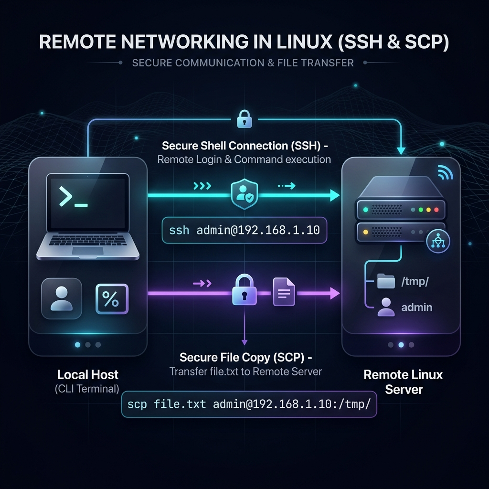
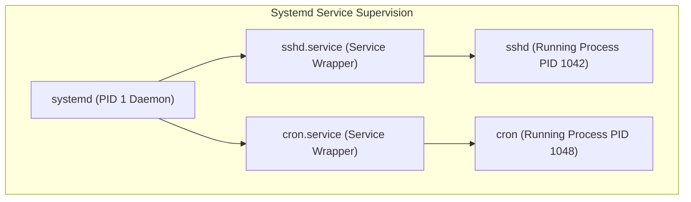
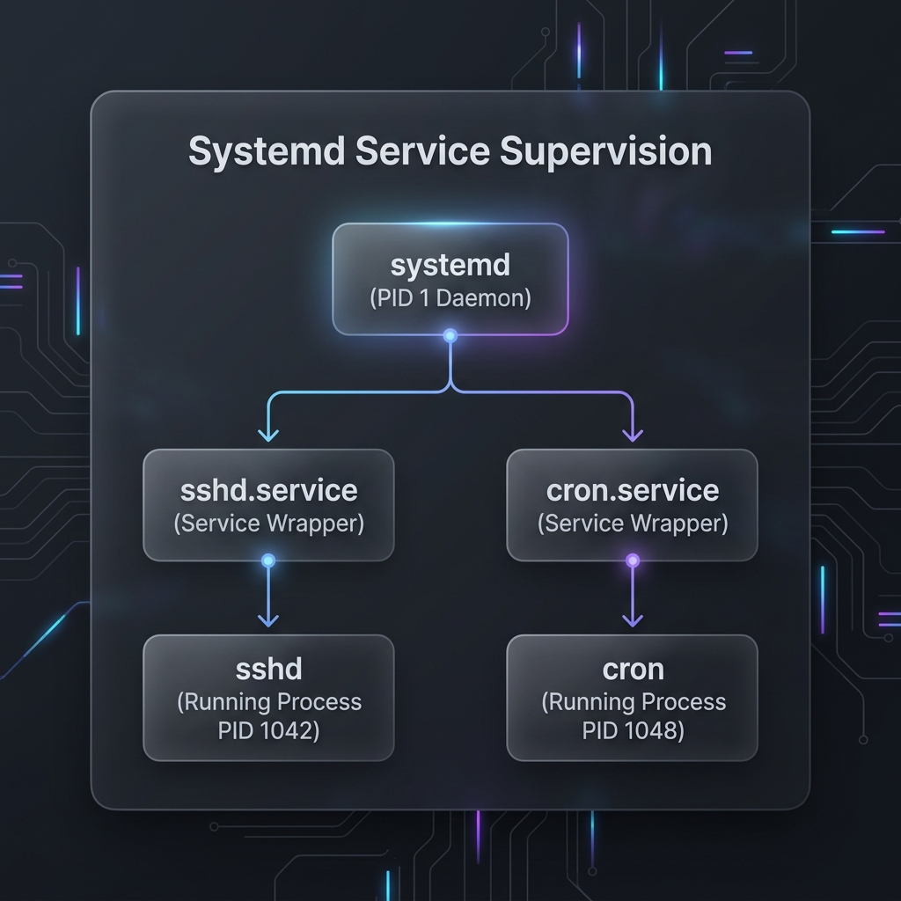

# Week 3 — Resources, Networking, Accounts, Permissions, and Services (Lighter Version)

| Course | Operating System (Linux Essentials - Lighter Version) |
|---|---|
| **Weekly Study Time** | 10 Hours |
| **Schedule** | Saturday: 8:00 AM - 12:00 PM (4h) & 2:00 PM - 4:00 PM (2h) <br> Sunday: 8:00 AM - 12:00 PM (4h) |
| **Syllabus CLOs** | CLO8: Manage Users, Groups, and File Permissions in Linux <br> CLO9: Understand Linux Process Management and System Monitoring |

---

## 📅 Session 7: Resource Monitoring & Basic Networking (Saturday Morning — 4 Hours)

### 1. OS Concepts
*   **System Resource Monitoring:** System administrators must monitor resource utilization to prevent system crashes:
    *   *CPU:* The processor executing instructions. We audit cores and architectures.
    *   *RAM:* Volatile memory holding active application data.
    *   *Disk space:* Persistent storage. Runout blocks file writes.
*   **Basic Networking Concepts:**
    *   *IP Address:* A unique numerical label identifying devices on a network (e.g. `192.168.1.12`).
    *   *Ping:* Tests if a remote host is reachable and measures response time.
    *   *Port Sockets:* Numerical endpoints mapping traffic to applications (e.g., SSH runs on port 22).
    *   **SSH & SCP:** Secure Shell connects you to remote terminals, and Secure Copy transfers files between hosts securely.




### 2. Command Reference

| Command | Option/Args | Description | Example |
| :--- | :--- | :--- | :--- |
| `lscpu` | None | Display information about CPU architecture and cores | `lscpu` |
| `free` | `-h` | Display RAM memory and swap utilization metrics | `free -h` |
| `df` | `-h` | Display free disk space on mounted file systems | `df -h` |
| `du` | `-sh [dir]` | Show total disk space used by a directory | `du -sh /var/log` |
| `ip` | `addr` | Show network interfaces and configured IP addresses | `ip addr` |
| `ping` | `-c [num]` | Send packets to verify host connectivity | `ping -c 4 8.8.8.8` |
| `ss` | `-tulpn` | Display active listening ports and processes | `sudo ss -tulpn` |
| `ssh` | `[user]@[host]`| Connect to a remote host securely | `ssh admin@192.168.1.10` |
| `scp` | `[src] [dest]` | Copy files between local and remote hosts securely | `scp file.txt admin@192.168.1.10:/tmp` |

### 3. Part 7 — Hands-on Examples

#### A. Auditing System Resources
```bash
# Check CPU cores
lscpu

# View RAM details in human-readable format (MB/GB)
free -h

# Check overall disk space
df -h
```

#### B. Network Connectivity Diagnostics
```bash
# Check your IP address
ip addr

# Check listening network ports and their PIDs
sudo ss -tulpn

# Test internet connectivity
ping -c 3 8.8.8.8
```

### 4. Session 7 Exercises (To Do)
1. Run `lscpu` and find the CPU model name. Write it to `hw_audit.txt`.
2. Append the total RAM size (from `free -h`) and disk space information (from `df -h`) to `hw_audit.txt`.
3. Check your system's network IP addresses and append the output of `ip addr` to `hw_audit.txt`.
4. Ping the loopback address `127.0.0.1` 4 times and save the output to `ping_audit.txt`.

---

## 📅 Session 8: Account Administration & Security (Saturday Afternoon — 2 Hours)

### 1. OS Concepts
*   **Multi-User Isolation:** Linux isolates user environments to ensure safety. Users belong to **Groups** that share access.
*   **User Databases:**
    *   `/etc/passwd`: List of accounts, home directories, and shells.
    *   `/etc/group`: List of groups and their memberships.
*   **Privilege Escalation:**
    *   `sudo`: SuperUser Do. Runs commands with administrative root privileges.

### 2. Command Reference

| Command | Option | Description | Example |
| :--- | :--- | :--- | :--- |
| `groupadd` | None | Create a new system group | `sudo groupadd tech` |
| `useradd` | `-m` | Create user and generate default home directory | `sudo useradd -m alice` |
| `passwd` | None | Set or change user's password | `sudo passwd alice` |
| `userdel` | `-r` | Delete user and remove their home folder | `sudo userdel -r alice` |
| `groupdel` | None | Delete group | `sudo groupdel tech` |
| `id` | None | Show current UID, GID, and groups for a user | `id student` |
| `sudo` | None | Execute target command with root privileges | `sudo cat /etc/passwd` |
| `whoami` | None | Show current active username | `whoami` |

### 3. Session 8 Exercises (To Do)
1. Inspect the first 5 entries of `/etc/passwd` and save the list to `passwd_head.txt`.
2. Create a group named `study_group` and a user named `learner` with `study_group` as their primary group.
3. Verify GID and group settings of `learner` using `id` and redirect the output to `learner_id.txt`.
4. Delete the user `learner` and group `study_group` from the system using cleanup commands.

---

## 📅 Session 9: File Permissions, Processes, & Services (Sunday Morning — 4 Hours)

### 1. OS Concepts
*   **Permissions Bits (`rwx`):**
    *   `r` (Read = 4): View file contents / list directory files.
    *   `w` (Write = 2): Modify file contents / create or delete files in a directory.
    *   `x` (Execute = 1): Run file as binary/script / enter directory using `cd`.
*   **Modes:**
    *   *Symbolic Mode:* Modify bits using symbols (e.g. `chmod u+x file.sh`).
    *   *Octal Mode:* Assign absolute values from sums (e.g. `chmod 755 file.sh` -> Owner: 7 (rwx), Group: 5 (r-x), Others: 5 (r-x)).
*   **Processes:** Running instances of program binaries in memory, identified by a **Process ID (PID)**.
*   **Systemd Services:** Daemon processes managed centrally via `systemctl`.





### 2. Command Reference

| Command | Usage | Description | Example |
| :--- | :--- | :--- | :--- |
| `chmod` | `chmod [mode] [file]` | Modify file/directory permissions | `chmod 755 script.sh` |
| `chown` | `chown [owner] [file]`| Change file owner | `sudo chown root file.conf` |
| `chgrp` | `chgrp [group] [file]`| Change group ownership | `sudo chgrp devs file.txt` |
| `ps` | `aux` | List all running processes on the system | `ps aux` |
| `kill` | `[PID]` / `-9 [PID]` | Terminate a process via its PID (force kill with `-9`) | `kill -9 5829` |
| `systemctl`| `status` / `start` / `stop` | Manage Systemd service daemons | `systemctl status cron` |

### 3. Session 9 Exercises (To Do)
1. Find a running process named `bash` using `ps aux | grep bash` and identify its PID.
2. Create a folder named `secure_workspace/` and change its permission to `700` using octal mode.
3. List the directory properties using `ls -ld secure_workspace` and redirect the output to `permissions_check.txt`.
4. Check the running status of the cron daemon using `systemctl status cron` and redirect it to `cron_status.txt`.

---

## 🧩 Week 3 Challenge Scenario: "Collaborative Server Provisioning & Rogue Resource Recovery"

### Background
You are a Junior Systems Administrator at **Apex Systems**. The staging web server has slowed down, and developers suspect a runaway script loop is hogging resources. In addition, the management office requires a secure, collaborative workspace for Project **"Mercury"**.

### Mission Steps
1.  **Simulate Setup Environments:** Run the following preparation script:
    ```bash
    # Part A: Project Mercury Accounts
    sudo groupadd -f mercury_team
    sudo id -u engineer_alice &>/dev/null || sudo useradd -m -g mercury_team engineer_alice
    sudo id -u engineer_bob &>/dev/null || sudo useradd -m -g mercury_team engineer_bob
    sudo mkdir -p /var/tmp/mercury_dev
    sudo chmod 777 /var/tmp/mercury_dev

    # Part B: Rogue Process Setup
    cat << 'EOF' > rogue_loop.sh
    #!/bin/bash
    while true; do
        sleep 2
    done
    EOF
    chmod +x rogue_loop.sh
    ./rogue_loop.sh &
    ```
2.  **Audit Hardware Specifications:**
    *   Audit the machine's hardware to report specifications. Inspect CPU cores and total memory.
    *   Write the hardware specs summary to `sys_spec.txt`.
3.  **Check Open Port Bindings:**
    *   Locate active open listening network sockets and ports on the machine.
    *   Write the open port socket listing to `ports_active.txt`.
4.  **Configure Project Mercury Workspace:**
    *   The folder `/var/tmp/mercury_dev` must be configured for the group `mercury_team`.
    *   Set the folder owner to `engineer_alice` and group to `mercury_team`.
    *   Modify permissions of `/var/tmp/mercury_dev` using octal mode so that:
        *   The owner has read, write, and execute (`rwx` = 7).
        *   The group has read, write, and execute (`rwx` = 7).
        *   Others have no permissions (`---` = 0).
    *   Verify the folder permissions and group ownership using `ls -ld` and redirect output to `mercury_permissions.txt`.
5.  **Diagnose and Recover Rogue Server:**
    *   Use `ps aux` to locate the rogue background script named `./rogue_loop.sh` and identify its PID.
    *   Kill the runaway process using `kill` (use force kill `-9` if necessary).
    *   Verify the process is gone. Check system memory availability and write the output status to `system_recovery.txt`.
    *   Verify loopback ping connectivity. Ping `127.0.0.1` 4 times and append the results to `system_recovery.txt`.
    *   Clean up by deleting `rogue_loop.sh` from your directory.

---

## 📝 Submission Checklist & Folder Structure
Your week submission folder `linux-essentials-<YourStudentID>/week3/` must look like this:

```
linux-essentials-<YourStudentID>/
└── week3/
    ├── README.md (Weekly report)
    ├── images/
    │   ├── permissions_setup.png (Screenshot showing ls -ld of mercury_dev)
    │   └── system_monitoring.png (Screenshot showing ps output after process kill)
    ├── passwd_head.txt
    ├── learner_id.txt
    ├── hw_audit.txt
    ├── ping_audit.txt
    ├── permissions_check.txt
    ├── cron_status.txt
    ├── sys_spec.txt
    ├── ports_active.txt
    ├── mercury_permissions.txt
    └── system_recovery.txt
```
